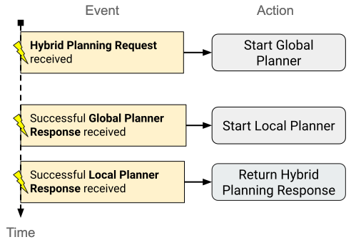

===============
Hybrid Planning
===============

MoveIt’s motion planning architecture follows the “Sense-Plan-Act” approach. In order for motions to get planned and executed, the environment and the robot state are first perceived (“Sense”), then the robot trajectory is computed by the planner (“Plan”) and finally executed in a single run using a trajectory controller (“Act”).

While this solution works well for global motion planning in well-known static environments, the approach is not applicable in many real-world applications, in particular in unstable or dynamic environments. Tasks like serving a glass of water to a person on a table or writing on an uneven chalkboard require more sophisticated methods that allow reacting to unpredictable changes. For instance, the environment of the robot could change dynamically, or there could be certain uncertainties in the task itself, e.g. writing with chalk requires adapting the pressure on the board while the chalk also gets shorter by being used up. 

Solving these challenges requires a method that is able to adapt the executed motion to the immediate conditions or even to react by replanning in case of unforeseen changes in the environment. The Hybrid Planning architecture attempts to solve this problem by combining a pair of recurrent global and local planners.

What is Hybrid Planning?
------------------------

Hybrid Planning is a term for a motion planning method that combines heterogeneous motion planners to produce more robust or reactive solutions. The general approach is already very established in the Navigation community and successfully implemented in popular projects like navigation2.

MoveIt’s Hybrid Planning architecture combines a pair of global and local planners that run in parallel and recurrently with different planning speeds and problem scopes.

The global planner has the task to solve a global motion planning problem very akin to the planners used in a “Sense-Plan-Act” application. The used planner algorithm should be complete and is therefore assumed to be relatively slow in terms of computation time. Furthermore, the global planner is not required to be real-time safe, meaning that there are no guarantees that the planner finds a solution within a specific deadline. Depending on the planner implementation, the global planner may generate one initial solution or iteratively optimized solutions during the execution.

The local planner is running continuously during execution and produces iterative robot commands for following the global trajectory. In a way, the local planner resembles a controller, only that the architecture allows for solving more complicated problems and constraints. The idea is that the planner is able to reason about the world and to have an internal state. That property makes it very versatile and as it can be used for solving combinations of arbitrary local planning problems, as for example:

* Unwinding, blending, or splicing of subsequent global reference trajectories
* Dynamically avoiding close-by collisions while following the global path
* Adapting the global trajectory to local constraints (e.g. desired force pressure on uneven surface, readjusting a tool based on visual feedback)
* Local trajectory optimization and time parameterization (it is computationally cheaper and quicker to optimize a trajectory in a local environment)

In order to enable solving these local problems the local planner must be fast, able to react to sensor feedback and in many cases real-time safe. Also, it should be deterministic in order to avoid jerky or unpredictable motions.

In general, the local planner relies on the reference trajectory produced by the global planner so that it doesn’t get stuck in a local minimum. Since local minima sometimes still can’t be ruled out, it can be required that the global planner is triggered for a replan in order to still reach the desired goal. This behavior requires a certain way to communicate planner events and to process them accordingly. For that purpose the Hybrid Planning architecture allows implementing an event-based logic that can be customized for the specific use case and planner types.

+-------------------------------------------+-------------------------------------------+
| Global Planner                            | Local Planner                             |
+===========================================+===========================================+
| * Solve global solution trajectory        | * Follow global reference trajectory      |
| * Optimize trajectory path (continuously) | * Solve local problem constraints         |
|                                           | * May process sensor input                |
|                                           | * Optimize solution locally               |
|                                           | * Compute controller commands             |
+-------------------------------------------+-------------------------------------------+
| * Complete                                | * Can get stuck in local minima           |
| * No restricted  computation time         | * Low computation time                    |
| * Not real-time safe                      | * Realtime-safe (depends on solver)       |
| * Not necessarily deterministic           | * Deterministic                           |
+-------------------------------------------+-------------------------------------------+
| * OMPL planner                            | * IK solver, Jacobian                     |
| * STOMP                                   | * Potential field planner                 |
| * TrajOpt                                 | * Trajectory optimization algorithm       |
| * Cartesian motion planner                | * Model Predictive Control (MPC)          |
| * Pilz Industrial Motion Planner          | * Sensor-based Optimal Control            |
| * MTC                                     |                                           |
+-------------------------------------------+-------------------------------------------+

Hybrid Planning can be useful in a broad range of use cases. Most of the applications can be grouped into the following three scenarios.

* *Online motion planning*: The global planner creates an initial global solution and continuously optimizes it. Simultaneously, the local planner executes the reference trajectory and blends updated trajectory segments into it. 
* *Reactive Motion*: The global planner is used to fix invalidated solutions (replanning) while the local planner slows down or halts before collisions
* *Adaptive Motion*: The local planner is used to adapt a global solution to dynamic conditions like keeping steady tool contact with an uneven surface

The Hybrid Planning Architecture
--------------------------------

The diagram below depicts the fundamental plugin types and ROS interfaces that make up the Hybrid Planning architecture.

.. image:: hybrid_planning_architecture.png
   :width: 700px
   :align: center

The architecture is structured in three ROS component nodes:

* **Hybrid Planning Manager**

  * Provides a ROS action for Hybrid Planning requests
  * Runs the planning logic and coordinates the planners

* **Global Planner**

  * Solves the global planning problem and publishes the solution trajectory

* **Local Planner**

  * Processes incoming global trajectory updates
  * Solves the local planning problem based on robot state, world and reference trajectory
  * Sends position/velocity commands to the robot driver

The architecture components are designed to be generic and highly customizable. Since the components only interact via ROS 2 message interfaces, it’s very easy to replace implementations of each of the architecture’s components or plugins. The plugin interfaces are designed to be minimal and to abstract from the actual algorithm implementation as much as possible. That allows the developer to fully focus on the isolated logic or solvers without having to implement any parts of the infrastructure. This also allows reusing the same components for different setups or planning problems.

Hybrid Planning Manager
^^^^^^^^^^^^^^^^^^^^^^^

This component is “The Brain” of the architecture. Its main purpose is to process HybridPlanner action  requests and to coordinate the motion planning and execution process based on the planning logic plugin. The planning logic is implemented in the PlanningLogic plugin and is event-driven by design. Events are defined by string identifiers and may trigger action calls or cancellations targeting the global or local planners. An example event log for a simple planning logic is shown in the diagram below:

Events are triggered by the Hybrid Planning action request and by both of the global and local planners action feedback messages. In this example, the Hybrid Planning Manager starts the global planner after the hybrid planning request is received. Upon arrival of the global trajectory the local planner is started and when the local planner is finished the Hybrid Planning Manager returns a Hybrid Planning response. 

A custom implementation of the Planning Logic plugin supports mapping generic events to available actions provided by the architecture like “Start global planning”, “Stop trajectory execution”, or “Switch to local planner constraint x”. With this, the motion planning behavior becomes highly customizable and adaptable.

Global Planner
^^^^^^^^^^^^^^

The Global Planner is the simplest component of the architecture. It provides an action server that processes GlobalPlanner requests. These requests include common MotionPlanRequests, which are processed by the Global Planner plugin. By default, this is simply MoveIt’s planning pipeline, but any kind of planner or even MTC could technically be used here. The planning result is reported using the action feedback and the solution trajectory is published to the Local Planner for further processing.

Local Planner
^^^^^^^^^^^^^

The Local Planner also runs an action server that handles requests from the Hybrid Planning Manager. The action is used for starting and stopping execution and may also configure runtime parameters like constraints or solver types.

.. image:: local_planner_small.png
   :width: 500px
   :align: center

The local planner implementation is based on two plugins:

* **Trajectory Operator**: This plugin maintains the global reference trajectory, handles trajectory updates from the global planner, and monitors the process of the current robot state.
* **Local Constraint Solver**: This plugin implements the iterative solver algorithm that produces the robot commands based on the reference trajectory and the local constraints. It may include additional interfaces for dynamically processing sensor input or event updates.

The diagram below shows an example loop cycle of the Local Planner upon action request by the Hybrid Planning Manager:

.. image:: local_planner_loop.png
   :width: 700px
   :align: center

Each iteration the local planner requests the current planning scene and matches the current robot state within the reference trajectory. If the goal is reached, the local planning action successfully finishes. Otherwise, the current local planning problem is identified based on the current robot state and solved afterwards. Finally, the resulting control commands are published to the robot controller.

How does it work?
^^^^^^^^^^^^^^^^^

The runtime behavior of a Hybrid Planner can best be understood by drawing a workflow diagram that visualizes the communication channels and events of the different components.

Below is a diagram that shows the runtime logic of a successful trajectory execution.

.. image:: hybrid_planner_logic.png
   :width: 700px
   :align: center

The planner is invoked by a hybrid planning request which is also the first event the Hybrid Planning Manager reacts to.
In this example, the planner logic simply runs both planners in sequence. After the initial hybrid planning request, the Hybrid Planning Manager invokes the global planner.
The global planner computes and publishes a trajectory which is received by the Hybrid Planning Manager and the Local Planner Component.
Important to notice is, that the Local Planner Component just processes the new trajectory and does not start executing until it is invoked by the Hybrid Planning Manager. Once requested by the Hybrid Planning Manager, the Local Planner Component starts unwinding the reference trajectory and returns the action response successfully when it reaches the final state. After that, the Hybrid Planning Manager returns a successful HybridPlanningResponse.

Now let's consider a more difficult scenario where the hybrid planner is designed to avoid an obstacle during execution by replanning.
The animation below shows a simple motion that is being fixed at runtime because of changing collision objects.

.. image:: replanning_example.gif
   :width: 500px
   :align: center

Here, the collision object present during the global planning process disappears after the global trajectory is computed. Instead two new collision objects appear that invalidate the initial global trajectory. The local planner detects the imminent collision and pauses the execution until the global planner has provided an updated collision free trajectory.

Below you can see the workflow of the described behavior.

.. image:: hybrid_planner_logic_2.png
   :width: 700px
   :align: center

The startup is the same as in the first example, but during unwinding the reference trajectory the local planner detects a collision. Here, the planner logic reacts by re-invoking the global planner. During the calculation of the new global solution, the local planner must prevent the robot from colliding with the collision object i.e. by keeping its current position. After the global planner finishes its calculation, the new global solution is published to the local planner and the local planner’s Trajectory Operator Plugin blends the update into the reference trajectory. Afterwards, the Local Planner Component continues to follow the reference trajectory as the updated solution enables it to steer around the collision object.

If you want to use Hybrid Planning in your application or just want to experiment with it, check out the :doc:`Hybrid Planning Example Tutorial </doc/examples/hybrid_planning/hybrid_planning_tutorial>`.
