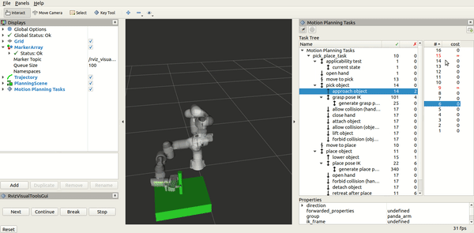

.. _Debugging MTC Task:

###################
Debugging MTC tasks
###################

The Motion Planning Tasks panel in RViz lists all the stages in the MTC task being executed.
Solutions for each stage can be examined by clicking on the stage name.
The failed solutions will contain descriptive reasons for failure.

