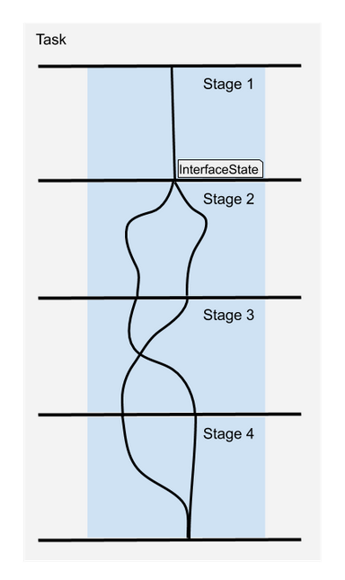

.. _MoveIt Task Constructor:

#######################
MoveIt Task Constructor
#######################

What is MoveIt Task Constructor?
--------------------------------

| The MoveIt Task Constructor (MTC) framework helps break down complex planning tasks to multiple interdependent subtasks.
| MTC uses MoveIt to solve the subtasks. Information from the subtasks are passed through the InterfaceState object.

MTC Stages
-----------
| A MTC stage refers to a component or step in the task execution pipeline.
| Stages can be arranged in any arbitrary order and their hierarchy is only limited by the individual stage types.
| The order in which stages can be arranged is restricted by the direction in which results are passed.

There are three possible stages relating to the result flow:

* Generators

* Propagators

* Connectors

Generator Stage
^^^^^^^^^^^^^^^
.. image:: ./_static/images/generating_stage.png

| Generator stages get no input from adjacent stages. They compute results and pass them in both directions - forward and backward.
| Execution of a MTC task starts with the Generator stages.
| The most important generator stage is ``CurrentState``, which gets the current robot state as the starting point for a planning pipeline.

| Monitoring Generator is a stage that monitors the solution of another stage (not adjacent) to use the solutions for planning.
| Example of Monitoring Generator - ``GeneratePose``. It usually monitors a ``CurrentState`` or ``ModifyPlanningScene`` stage. By monitoring the solutions of ``CurrentState``, the ``GeneratePose`` stage can find the object or frame around which it should generate poses.

| More information on generator stages provided by MTC can be found here - :ref:`Generating Stages`.

Propagating Stage
^^^^^^^^^^^^^^^^^
.. image:: ./_static/images/propagating_stage.png

| Propagators receive solutions from one neighbor state, solve a problem and then propagate the result to the neighbor on the opposite side.
| Depending on the implementation, this stage can pass solutions forward, backward, or in both directions.
| Example of propagating stage - ``Move Relative`` to a pose. This stage is commonly used to approach close to an object to pick.

| More information on propagating stages provided by MTC can be found here - :ref:`Propagating Stages`.

Connecting Stage
^^^^^^^^^^^^^^^^

| Connectors do not propagate any results but attempt to connect the start and goal inputs provided by adjacent stages.
| A connect stage often solves for a feasible trajectory between the start and goal states.

| More information on connecting stages provided by MTC can be found here - :ref:`Connecting Stages`.

Wrapper
^^^^^^^
| Wrappers encapsulate another stage to modify or filter the results.
| Example of wrapper - ``Compute IK`` for ``Generate Grasp Pose`` stage. A ``Generate Grasp Pose`` stage will produce cartesian pose solutions. By wrapping an ``Compute IK`` stage around ``Generate Pose`` stage, the cartesian pose solutions from ``Generate Pose`` stage can be used to produce IK solutions (i.e) produce joint state configuration of robot to reach the poses.

| More information on wrappers provided by MTC can be found here - :ref:`Wrappers`.

MTC Containers
---------------
| The MTC framework enables the hierarchical organization of stages using containers, allowing for sequential as well as parallel compositions.
| A MTC container helps organize the order of execution of the stages.
| Programmatically, it is possible to add a container within another container.

Currently available containers:

* Serial

* Parallel

Serial Container
^^^^^^^^^^^^^^^^
| Serial containers organize stages linearly and only consider end-to-end solutions as results.
| A MTC Task by default is stored as a serial container.

Parallel Container
^^^^^^^^^^^^^^^^^^
Parallel containers combine a set of stages to allow planning alternate solutions.

| More information on parallel containers can be found here - :ref:`Parallel Containers`.

Initializing a MTC Task
-----------------------

The top-level planning problem is specified as a MTC Task and the subproblems which are specified by Stages are added to the MTC task object.

.. code-block:: c++

  auto node = std::make_shared<rclcpp::Node>();
  auto task = std::make_unique<moveit::task_constructor::Task>();
  task->loadRobotModel(node);
  // Set controllers used to execute robot motion. If not set, MoveIt has controller discovery logic.
  task->setProperty("trajectory_execution_info", "joint_trajectory_controller gripper_controller");

Adding containers and stages to a MTC Task
-------------------------------------------

Adding a stage to MTC task

.. code-block:: c++

  auto current_state = std::make_unique<moveit::task_constructor::stages::CurrentState>("current_state");
  task->add(std::move(current_state));

Containers derive from Stage and hence containers can be added to MTC task similarly

.. code-block:: c++

  auto container = std::make_unique<moveit::task_constructor::SerialContainer>("Pick Object");
  // TODO: Add stages to the container before adding the container to MTC task
  task->add(std::move(container));

Setting planning solvers
------------------------

Stages that do motion planning need solver information.

Solvers available in MTC

* ``PipelinePlanner`` - Uses MoveIt's planning pipeline

* ``JointInterpolation`` - Interpolates between the start and goal joint states. It does not support complex motions.

* ``CartesianPath`` - Moves the end effector in a straight line in Cartesian space.

Code Example on how to initialize the solver

.. code-block:: c++

  const auto mtc_pipeline_planner = std::make_shared<moveit::task_constructor::solvers::PipelinePlanner>(
      node, "ompl", "RRTConnectkConfigDefault");
  const auto mtc_joint_interpolation_planner =
      std::make_shared<moveit::task_constructor::solvers::JointInterpolationPlanner>();
  const auto mtc_cartesian_planner = std::make_shared<moveit::task_constructor::solvers::CartesianPath>();

These solvers will be passed into stages like ``MoveTo``, ``MoveRelative``, and ``Connect``.

Setting Properties
------------------

| Each MTC stage has configurable properties. Example - planning group, timeout, goal state, etc.
| Properties of different types can be set using the function below.

.. code-block:: c++

  void setProperty(const std::string& name, const boost::any& value);

| Children stages can easily inherit properties from their parents, thus reducing the configuration overhead.

Cost calculator for Stages
---------------------------

CostTerm is the basic interface to compute costs for solutions for MTC stages.

CostTerm implementations available in MTC

* ``Constant`` - Adds a constant cost to each solution

* ``PathLength`` - Cost depends on trajectory length with optional weight for different joints

* ``TrajectoryDuration`` - Cost depends on execution duration of the whole trajectory

* ``TrajectoryCostTerm`` - Cost terms that only work on SubTrajectory solutions

* ``LambdaCostTerm`` - Pass in a lambda expression to calculate cost

* ``DistanceToReference`` - Cost depends on weighted joint space distance to a reference point

* ``LinkMotion`` - Cost depends on length of Cartesian trajectory of a link

* ``Clearance`` - Cost is inverse of distance to collision

Example code on how to set CostTerm using ``LambdaCostTerm``

.. code-block:: c++

  stage->setCostTerm(moveit::task_constructor::LambdaCostTerm(
         { return 100 * traj.cost(); }));

All stages provided by MTC have default cost terms. Stages which produce trajectories as solutions usually use path length to calculate cost.

Planning and Executing a MTC Task
---------------------------------

Planning an MTC task will return a ``MoveItErrorCode``.
Refer :moveit_msgs_codedir:`here<msg/MoveItErrorCodes.msg>` to identity the different error types.
If planning succeeds, you can expect the plan function to return ``moveit_msgs::msg::MoveItErrorCodes::SUCCESS``.

.. code-block:: c++

  auto error_code = task.plan()

After planning, extract the first successful solution and pass it to the execute function. This will create an ``execute_task_solution`` action client.
The action server resides in the ``execute_task_solution_capability`` plugin provided by MTC.
The plugin extends ``MoveGroupCapability``. It constructs a ``MotionPlanRequest`` from the MTC solution and uses MoveIt's ``PlanExecution`` to actuate the robot.

.. code-block:: c++

  auto result = task.execute(*task.solutions().front());

Links to Additional Information
--------------------------------

Here is a :doc:`tutorial </doc/tutorials/pick_and_place_with_moveit_task_constructor/pick_and_place_with_moveit_task_constructor>` on how to create a Pick and Place pipeline using MTC.

The links listed below contain more information on stages and containers provided by MTC

.. toctree::
    :maxdepth: 1

    generating_stages.rst
    propagating_stages.rst
    connecting_stages.rst
    wrappers.rst
    parallel_containers.rst
    debugging_mtc_task.rst
