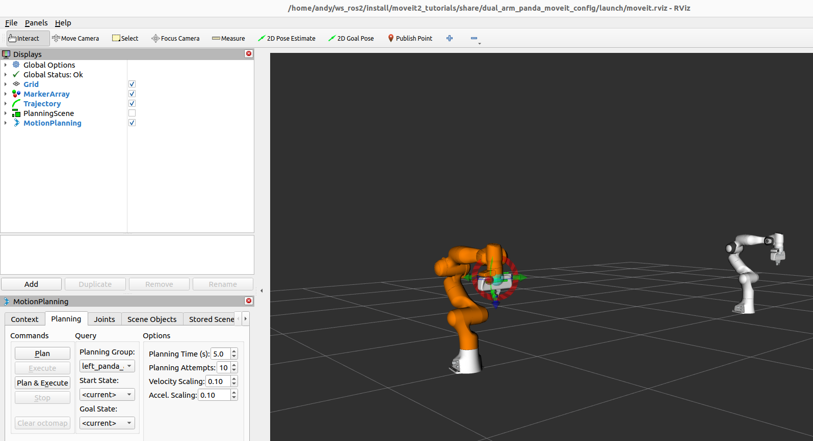

Dual Arms with MoveIt
=====================

There are quite a few configuration steps to control two or more manipulators with MoveIt. Luckily it has gotten easier over time. Here, an example is provided and we list all the changes needed to go from 1 robot to X robots.

The launch and configuration files in this example are available :moveit_resources_codedir:`here. <dual_arm_panda_moveit_config>`

Running the Demo
----------------

Let's jump right in. Run: ::

  ros2 launch dual_arm_panda_moveit_config demo.launch.py

You should see RViz come up with a dual-arm system. In the drop-down menu you can select either ``left_panda_arm`` or ``right_panda_arm``, and you can Plan and Execute motions with either one.

What Changes were required for the Dual-Arm System?
---------------------------------------------------

- A prefix argument was added to the Panda arm xacro, ``panda_arm_macro.urdf.xacro``. Now all links and joints are prepended with ``left_`` or ``right_``.

- Add ``left_initial_positions.yaml`` and ``right_initial_positions.yaml``. (This is only necessary when simulating -- it doesn't apply when a hardware robot is used.) Pass a ``left_`` or ``right_`` prefix to ``panda.ros2_control.xacro`` to select this file.

- Ensure all joints in ``panda.ros2_control.xacro`` are prepended by the ``prefix`` arg so they will be unique for the left and right arms.

- Ensure the name of the ros2_control macro is prepended with ``prefix`` as well, so it is unique: ::

    <ros2_control name="${prefix}${name}" type="system">

- Enumerate the controllers we will need for both arms in the ros2_control config file, ``ros2_controllers.yaml``. Make sure these controllers are launched from ``demo.launch.py``.

- Define joint groups for each arm in ``panda.srdf``. This tells MoveIt which joints constitute each arm. The joint groups are named ``left_panda_arm`` and ``right_panda_arm``. Also define an end effector for each arm.

- Define a kinematics solver for each arm in ``kinematics.yaml``.

- Define the controllers which MoveIt can execute trajectories with in ``moveit_controllers.yaml``. Here we have a trajectory controller for each arm.

- Also in ``moveit_controllers.yaml``, define the controller management strategy MoveIt will use. The simplest option from a configuration standpoint is ``moveit_ros_control_interface/Ros2ControlManager``. You can also use a ``moveit_simple_controller_manager/MoveItSimpleControllerManager`` although it requires additional namespacing and additional enumeration of the joints.
