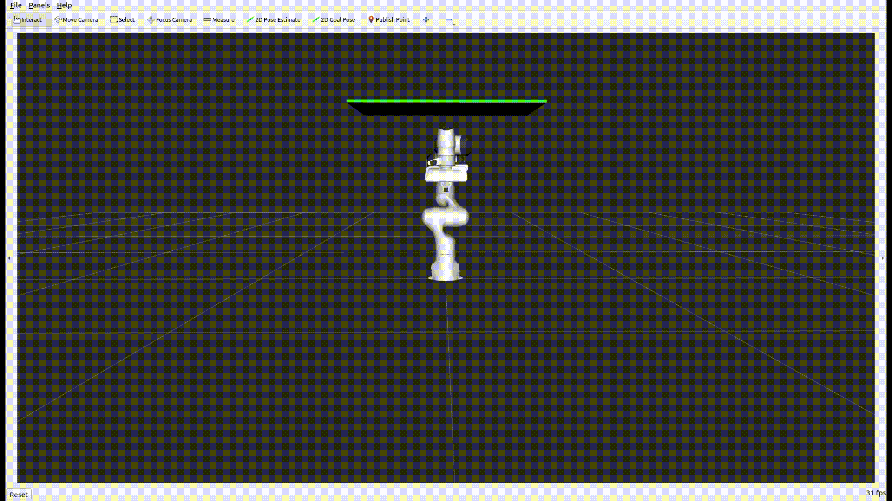

Hybrid Planning
===============

In this section, you will learn how to use MoveIt 2's *Hybrid Planning* feature.

Hybrid Planning enables you to (re)plan and execute robot motions online with MoveIt 2 and to add more planning logic into your robot's motion planning pipeline.

What is Hybrid Planning?
------------------------
Hybrid Planning uses a (slower) global motion planner in combination with a (faster) local motion planner to enable a robot to solve different tasks online and in dynamic environments.
Typically, the global motion planner is used to create an initial motion plan offline and to re-plan it if the global solution gets invalidated. The local planner adapts the global solution to local constraints and reacts immediately to changes in the environment. A more detailed description of the architecture can be found in the :doc:`Hybrid Planning Concepts Page </doc/concepts/hybrid_planning/hybrid_planning>`.

The architecture that enables *Hybrid Planning* in MoveIt 2 can be seen below:

.. image:: images/hybrid_planning_architecture.png
   :width: 700px

The *Hybrid Planning Manager* provides an API for *Hybrid Planning requests*, implements the high-level planning logic and coordinates both planners and their interaction.
Global planning requests are responded by the *Global Planner Component* which solves a given planning problem and publishes the solution. The *Local Planner Component* processes incoming global trajectory updates and solves the local planning problem at each iteration.
The main advantages of using the architecture are:

- Global and local constrained motion planning problems can be handled separately
- Online motion planning is possible with the local planner
- Reactive re-planning in dynamic or unknown environments

Getting Started
---------------
If you haven't already done so, make sure you've completed the steps in :doc:`Getting Started </doc/tutorials/getting_started/getting_started>`.

To start the hybrid planning demo simply run: ::

  ros2 launch moveit_hybrid_planning hybrid_planning_demo.launch.py

You should see a similar behavior as in the example GIF above without the replanning.

To interact with the architecture you simply need to send a *Hybrid Planning Request* to an action server offered by the *Hybrid Planning Manager*.

Let's change this behavior such that the architecture replans the invalidated trajectory. To do so, just change the *planner_logic_plugin* by replacing the plugin name in the :moveit_codedir:`demo configuration <moveit_ros/hybrid_planning/test/config/hybrid_planning_manager.yaml>` with "moveit_hybrid_planning/ReplanInvalidatedTrajectory" and rebuild the package : ::

   colcon build --packages-select moveit2_tutorials

After re-running the launch command from above, you should see that the architecture replans the invalidated trajectory.

To include the Hybrid Planning Architecture into you project you need to add a *Hybrid Planning* component node with the necessary parameters into one of your launch files:

.. code-block:: python

    # Generate launch description with multiple components
    container = ComposableNodeContainer(
        name="hybrid_planning_container",
        namespace="/",
        package="rclcpp_components",
        executable="component_container",
        composable_node_descriptions=[
            ComposableNode(
                package="moveit_hybrid_planning",
                plugin="moveit::hybrid_planning::GlobalPlannerComponent",
                name="global_planner",
                parameters=[
                    global_planner_param,
                    robot_description,
                    robot_description_semantic,
                    kinematics_yaml,
                    ompl_planning_pipeline_config,
                ],
            ),
            ComposableNode(
                package="moveit_hybrid_planning",
                plugin="moveit::hybrid_planning::LocalPlannerComponent",
                name="local_planner",
                parameters=[
                    local_planner_param,
                    robot_description,
                    robot_description_semantic,
                    kinematics_yaml,
                ],
            ),
            ComposableNode(
                package="moveit_hybrid_planning",
                plugin="moveit::hybrid_planning::HybridPlanningManager",
                name="hybrid_planning_manager",
                parameters=[hybrid_planning_manager_param],
            ),
        ],
        output="screen",
    )

Customizing the Hybrid Planning Architecture
--------------------------------------------
As the rest of MoveIt 2, the *Hybrid Planning Architecture* is designed to be highly customizable while also offering the possibility to easily reuse existing solutions. Each of the architecture's components is a ROS 2 node and can be completely replaced by your own custom ROS 2 node as long as it offers the API required by the other nodes. Each component's runtime behavior is defined by plugins. This section focuses on the customization of the *Hybrid Planning Architecture* by implementing your own plugins.

Global and Local Motion Planning
^^^^^^^^^^^^^^^^^^^^^^^^^^^^^^^^
To get a global motion planning solution, the *Global Planner Component* needs to be activated via the *Global Planning Action Server*. When it receives a *MotionPlanRequest* the component computes a motion plan with the *Global Planner Plugin* and publishes the solution to the other components.
The dataflow within the component can be seen in the picture below:

.. image:: images/global_planner_dataflow.png
   :width: 500pt

The *Global Planner Plugin* can be used to implement and customize the global planning algorithm. To implement you own planner you simply need to inherit from the :moveit_codedir:`GlobalPlannerInterface <moveit_ros/hybrid_planning/global_planner/global_planner_component/include/moveit/global_planner/global_planner_interface.h>`:

.. code-block:: c++

   class MySmartPlanner : public GlobalPlannerInterface
   {
   public:
     // Constructor and Destructor - Don't forget to define it!
     MySmartPlanner() = default;
     ~MySmartPlanner() = default;

     // This function is called when your plugin is loaded
     bool initialize(const rclcpp::Node::SharedPtr& node) override;

     // Defines how the planner solves the motion planning problem
     moveit_msgs::msg::MotionPlanResponse
     plan(const std::shared_ptr<rclcpp_action::ServerGoalHandle<moveit_msgs::action::GlobalPlanner>> global_goal_handle) override;

     // This is called when global planning is aborted or finished
     bool reset() override;
   };

*Global Planner* example implementations can be found :moveit_codedir:`here <moveit_ros/hybrid_planning/global_planner/global_planner_plugins/>`.

More complex is the behavior of the *Local Planner Component*. The data flow is displayed below:

.. image:: images/local_planner_dataflow.png
   :width: 500pt

The local planner is started and stopped via the *Local Planning Action Server*. After the component is started it performs each iteration the following tasks:

1. Fetch the local planning problem based on the current state by calling *getLocalTrajectory()*
2. Solve the local planning problem defined by the desired local trajectory and optional additional constraints as defined by the *Local Solver Plugin*
3. Publish the local solution as *JointTrajectory* or *Float64MultiArray* message

Via the *Global Solution Subscriber* the *Local Planner Component* receives global planning updates which are processed and blended into the reference trajectory. Based on this reference trajectory the local planner identifies and solves local planning problems once it is started. How the global trajectory updates are processed and included into the reference trajectory is defined by the *Trajectory Operator* 's *addTrajectorySegment()* function.

The behavior of the *Local Planner Component* can be customized via the *Trajectory Operator Plugin* and the local *Solver Plugin*:

The *Trajectory Operator Plugin* handles the reference trajectory. To create your own operator you need to create a plugin class which inherits from the :moveit_codedir:`TrajectoryOperatorInterface <moveit_ros/hybrid_planning/local_planner/local_planner_component/include/moveit/local_planner/trajectory_operator_interface.h>`:

.. code-block:: c++

   class MyAwesomeOperator : public TrajectoryOperatorInterface
   {
   public:
     // Constructor and Destructor - Don't forget to define it!
     MyAwesomeOperator() = default;
     ~MyAwesomeOperator() = default;

     // This function is called when your plugin is loaded
     bool initialize(const rclcpp::Node::SharedPtr& node, const moveit::core::RobotModelConstPtr& robot_model,
                     const std::string& group_name) override;
     moveit_msgs::action::LocalPlanner::Feedback

     // Process global trajectory updates
     moveit_msgs::action::LocalPlanner::Feedback
     addTrajectorySegment(const robot_trajectory::RobotTrajectory& new_trajectory) override;

     // Sample the local planning problem from the reference trajectory
     moveit_msgs::action::LocalPlanner::Feedback
     getLocalTrajectory(const moveit::core::RobotState& current_state,
                        robot_trajectory::RobotTrajectory& local_trajectory) override;

     // Optional but can be useful for the algorithm you're using
     double getTrajectoryProgress(const moveit::core::RobotState& current_state) override;

     // This is called when local planning is aborted or re-invoked
     bool reset() override;
   };

*Trajectory Operator* example implementations can be found :moveit_codedir:`here <moveit_ros/hybrid_planning/local_planner/trajectory_operator_plugins/>`.

The *Local Solver Plugin* implements the algorithm to solve the local planning problem each iteration. To implement your solution you need to inherit from the :moveit_codedir:`LocalConstraintSolverInterface <moveit_ros/hybrid_planning/local_planner/local_planner_component/include/moveit/local_planner/local_constraint_solver_interface.h>`:

.. code-block:: c++

   class MyAwesomeSolver : public LocalConstraintSolverInterface
   {
   public:
     // Constructor and Destructor - Don't forget to define it!
     MyAwesomeSolver() = default;
     ~MyAwesomeSolver() = default;

     // This function is called when your plugin is loaded
     bool initialize(const rclcpp::Node::SharedPtr& node,
                     const planning_scene_monitor::PlanningSceneMonitorPtr& planning_scene_monitor,
                     const std::string& group_name) override;

     // This is called when the local planning is aborted or re-invoked
     bool reset() override;

     // Within this function the local planning problem is solved.
     // Conversation into the configured msg type is handled by the local planner component
     moveit_msgs::action::LocalPlanner::Feedback
     solve(const robot_trajectory::RobotTrajectory& local_trajectory,
           const std::shared_ptr<const moveit_msgs::action::LocalPlanner::Goal> local_goal,
           trajectory_msgs::msg::JointTrajectory& local_solution) override;
   };

*Local Constraint Solver* example implementations can be found :moveit_codedir:`here <moveit_ros/hybrid_planning/local_planner/local_constraint_solver_plugins/>`.

Both plugins receive a shared pointer to the ROS 2 node when they get initialized which can be used to create additional custom ROS 2 communication interfaces for example to subscribe to an additional sensor source.

Planning Logic and Reactive Behavior
^^^^^^^^^^^^^^^^^^^^^^^^^^^^^^^^^^^^
Besides the possibility to combine global and local motion planner, this architecture enables the robot to react online to events. You can customize this behavior with the *Planning Logic Plugin*. A simple example for a *Hybrid Planner Logic* can be seen in the next figure:

.. image:: images/logical_flow.png
   :width: 500pt

Events are discrete signals that trigger a callback function within the *Hybrid Planning Manager*. ROS 2 action feedback, action results and topics are used as event channels. Important to mention is, that the action feedback from the planner nodes to the *Hybrid Planning Manager* is **not** used to return feedback but to trigger reactions to events that occur while an action is active.
An example would be an unforeseen collision object during the online local planning: The *Local Planner Component* sends a "collision object ahead" event message via the action feedback channel to the *Hybrid Planning Manager* but whether the current local planning action is aborted or just the reference trajectory updated is decided by the *Planner Logic Plugin* in the *Hybrid Planning Manager*.

The callback function an event channel in the *Hybrid Planning Manager* looks like this:

.. code-block:: c++

  // Local planner action feedback callback
  local_goal_options.feedback_callback =
      [this](rclcpp_action::ClientGoalHandle<moveit_msgs::action::LocalPlanner>::SharedPtr /*unused*/,
             const std::shared_ptr<const moveit_msgs::action::LocalPlanner::Feedback> local_planner_feedback) {

        // Call the planner plugin's react function with a given event string
        ReactionResult reaction_result = planner_logic_instance_->react(local_planner_feedback->feedback);

        // If the reaction is not successful, the whole hybrid planning action is aborted
        if (reaction_result.error_code.val != moveit_msgs::msg::MoveItErrorCodes::SUCCESS)
        {
          auto result = std::make_shared<moveit_msgs::action::HybridPlanning::Result>();
          result->error_code.val = reaction_result.error_code.val;
          result->error_message = reaction_result.error_message;
          hybrid_planning_goal_handle_->abort(result);
          RCLCPP_ERROR(LOGGER, "Hybrid Planning Manager failed to react to  '%s'", reaction_result.event.c_str());
        }
      };

To create you own *Planner Logic Plugin* you need inherit from the :moveit_codedir:`PlannerLogicInterface <moveit_ros/hybrid_planning/hybrid_planning_manager/hybrid_planning_manager_component/include/moveit/hybrid_planning_manager/planner_logic_interface.h>`:

.. code-block:: c++

   class MyCunningLogic : public PlannerLogicInterface
   {
   public:
     // Brief constructor and destructor
     MyCunningLogic() = default;
     ~MyCunningLogic() = default;

     // The plugin needs a shared pointer to the hybrid planning manager to access its member functions like planGlobalTrajectory()
     bool initialize(const std::shared_ptr<moveit_hybrid_planning::HybridPlanningManager>& hybrid_planning_manager) override;

     // This function can be used to implement reaction to some default Hybrid Planning events
     ReactionResult react(const BasicHybridPlanningEvent& event) override;

     // Here are reactions to custom events encoded as string implemented
     ReactionResult react(const std::string& event) override;
   };

A possible implementation of the *react()* function could contain a switch-case statement that maps events to actions like in the :moveit_codedir:`example logic plugins<moveit_ros/hybrid_planning/hybrid_planning_manager/hybrid_planning_manager_component/include/moveit/hybrid_planning_manager/planner_logic_interface.h>`.
