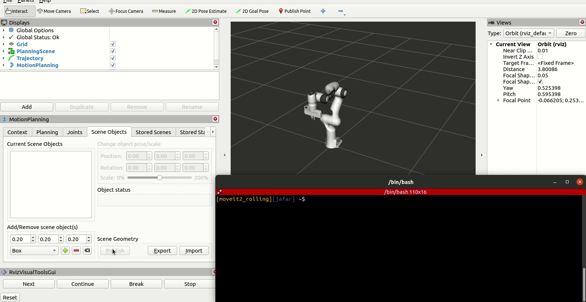

Creating a new MoveGroup capability
===================================

In :doc:`Move Group C++ Interface </doc/examples/move_group_interface/move_group_interface_tutorial>` we saw how MoveGroup node make it easy to use MoveIt through ROS interfaces, this node have a list of `default capabilities <https://github.com/ros-planning/moveit2/blob/main/moveit_ros/move_group/default_capabilities_plugin_description.xml>`_ that provide common used action/services to interact with its internal components, sometimes we need to extend it for our own specific applications which could be done easily by creating MoveGroup capability.

Getting Started
---------------
If you haven't already done so, make sure you've completed the steps in :doc:`Getting Started </doc/tutorials/getting_started/getting_started>`.

You should also have gone through the steps in :doc:`Visualization with MoveIt RViz Plugin </doc/tutorials/quickstart_in_rviz/quickstart_in_rviz_tutorial>`

Creating a MoveGroup Capability
-------------------------------
`This Page <http://wiki.ros.org/pluginlib>`_ gives a detailed explanation of how to add plugins in ROS in general. The two necessary elements are base and plugin classes. The plugin class inherits from the base class and overrides its virtual functions. The main library used for this purpose is pluginlib.

In this section, we will show how to add a new MoveGroup capability. For demonstration purposes, we will create a capability which provide a service to query the collision objects in MoveGroup's planning scene. The final source files designed in this tutorial are available :codedir:`here <move_group_capabilities/src>`.

First we start by creating a class GetCollisionObjects by inheriting from move_group::MoveGroupCapability, to do so we create a file named ``get_collision_objects_service_capability.cpp`` in src folder. the minimal requirement is to pass the plugin name to the base class constructor ``MoveGroupCapability``, override the ``initialize`` function, and register the class as a plugin by using ``PLUGINLIB_EXPORT_CLASS``.

.. tutorial-formatter:: ./src/get_collision_objects_service_capability.cpp

Exporting the capability
^^^^^^^^^^^^^^^^^^^^^^^^
To export the plugin we create a plugin description xml file ``plugin_description.xml``

.. code-block:: xml

  <library path="move_group_tool_changing_capability">
    <class name="move_group/ToolChangingCapability" type="move_group::ToolChangingCapability" base_class_type="move_group::MoveGroupCapability">
        <description>
            MoveGroup capability to get a list of collision objects in the planning scene
        </description>
    </class>
  </library>

The ``plugin_description.xml`` need to be added to the ament index to be found at runtime, in ``CMakeLists.txt`` add

**NOTE** Make sure to add it to the top-level ``CMakeLists.txt`` file otherwise it will not be detected bu ROS

.. code-block:: cmake

  pluginlib_export_plugin_description_file(moveit_ros_move_group doc/examples/move_group_capabilities/plugin_description.xml)

Checking the capability
^^^^^^^^^^^^^^^^^^^^^^^
To get a list of the all available capabilities run

.. code-block:: bash

  ros2 run moveit_ros_move_group list_move_group_capabilities

you should see ``move_group/GetCollisionObjectsCapability`` as a capability

Capability usage
^^^^^^^^^^^^^^^^
To use the capability we need first to tell move_group to use it as follow

.. code-block:: python

  run_move_group_node = Node(
      package="moveit_ros_move_group",
      executable="move_group",
      parameters=[
          ...
          {"capabilities": """move_group/GetCollisionObjects"""},
      ],
  )

Now launch move_group

.. code-block:: bash

  ros2 launch moveit2_tutorials move_group.launch.py

To use the new capability run the following line, it should return empty list of objects

.. code-block:: bash

  ros2 service call /move_group/get_collision_objects moveit2_tutorials/srv/GetCollisionObjects {}

Now try to add different objects and use the capability again

