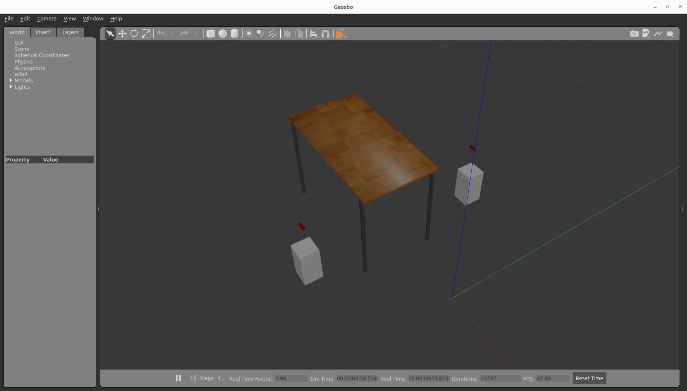
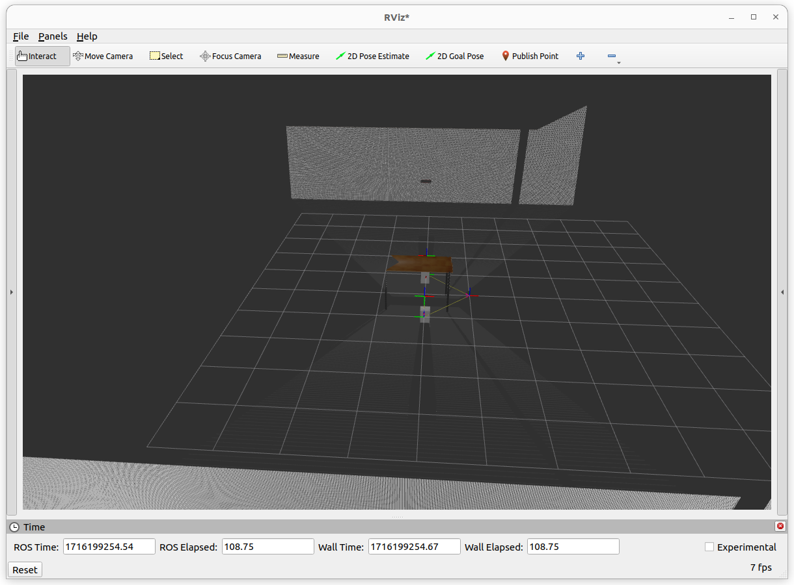

Perception Pipeline Tutorial
============================

Introduction
------------
MoveIt allows for seamless integration of 3D sensors using `Octomap <http://octomap.github.io/>`_.

Once properly configured, you should see something like this in rviz:

.. raw:: html

        <video width="700px" controls="true" autoplay="true" loop="true">
            <source src="../../../_static/videos/perception_pipeline_demo.webm" type="video/webm">
            MoveIt Perception Pipeline Demo
        </video>

Getting Started
---------------
Even though you haven't completed :doc:`Getting Started </doc/tutorials/getting_started/getting_started>` ever, you can still run this tutorial's demo. But, it is suggested to start with steps in :doc:`Getting Started </doc/tutorials/getting_started/getting_started>` for better understanding what's going on in this tutorial. In this section, we will walk through configuring the 3D sensors on your robot with MoveIt. The primary component in MoveIt that deals with 3D perception is the Occupancy Map Updater. The updater uses a plugin architecture to process different types of input. The currently available plugins in MoveIt are:

* The PointCloud Occupancy Map Updater: which can take as input point clouds (``sensor_msgs/msg/PointCloud2``)
* The Depth Image Occupancy Map Updater: which can take as input Depth Images (``sensor_msgs/msg/Image``)

Connecting to the storage backend
---------------------------------

To run the demo you need to install git lfs by running ``git lfs install`` and clone `moveit_benchmark_resources <https://github.com/moveit/moveit_benchmark_resources.git>`_ into your workspace.

How to create 3D Pointcloud Data for Octomap Creation
-----------------------------------------------------
In this tutorial, you can use `previously recorded 3D pointcloud data inside moveit_benchmark_resources <https://github.com/moveit/moveit_benchmark_resources/tree/main/moveit_benchmark_resources/bag_files/depth_camera_bag>`_ or you can record your own bag file. For recording bag, firstly, we can run ``depth_camera_envrionment.launch.py`` file and then record the bag using following commands.

In shell 1, run this command: ::

    ros2 launch moveit2_tutorials depth_camera_environment.launch.py

In shell 2, run this command: ::

    ros2 bag record /camera_1/points /camera_1/depth/image_raw /camera_1/depth/camera_info /camera_2/points /camera_2/depth/image_raw /camera_2/depth/camera_info /tf /tf_static

When the command in shell 1 is executed, it is opened a gazebo environment which contains two depth camera and a table in the middle of those cameras. This gazebo environment is used for getting 3d sensor data. Gazebo environment should be looked like following image.

For more explanation of ``depth_camera_environment.launch.py``, you can look at comments in :codedir:`depth_camera_environment.launch.py <examples/perception_pipeline/launch/depth_camera_environment.launch.py>` on GitHub.

.. tutorial-formatter:: ./launch/depth_camera_environment.launch.py

For the commands in Shell 2, we must save both camera topics and tf topics due to the fact that MoveIt perception pipeline needs to listen TF's in order to convert the coordinates of pointcloud points according to ``world`` frame. Moreover, the reason of publishing static tf from world to camera frames in ``depth_camera_environment.launch.py`` is that it's necessary to determine transformation between robot and poincloud and that MoveIt's sensor plugins uses this transformation later.

By the way, you can also use :codedir:`this rviz file <examples/perception_pipeline/rviz2/depth_camera_environment.rviz>` on Github to visualize poincloud topics in rviz.

In next step, we will use the recorded bag file to create an octomap.

Configuration For 3D Sensors
----------------------------
MoveIt uses an octree-based framework to represent the world around it. The *Octomap* parameters above are configuration parameters for this representation:
    * *octomap_frame*: specifies the coordinate frame in which this representation will be stored. If you are working with a mobile robot, this frame should be a fixed frame in the world. We can set this frame for plugin by frame_id field of ros messages like pointcloud and image topic.
    * *octomap_resolution*: specifies the resolution at which this representation is maintained (in meters).
    * *max_range*: specifies the maximum range value to be applied for any sensor input to this node.

Now we will see ``/camera_1/points``, ``/camera_1/depth/image_raw``, ``/camera_1/depth/camera_info``, ``/camera_2/points``, ``/camera_1/depth/image_raw``, ``/camera_1/depth/camera_info``, ``/tf`` and ``/tf_static`` when playing bag file. We should create the following config file for MoveIt to process these pointcloud topics in planning pipeline. You can also go to :codedir:`here <examples/perception_pipeline/config/sensors_3d.yaml>` to see all ``sensors_3d.yaml`` config file on Github.

.. tutorial-formatter:: config/sensors_3d.yaml

sensors_3d.yaml: ::

    sensors:
      - camera_1_pointcloud
      - camera_2_depth_image
    camera_1_pointcloud:
        sensor_plugin: occupancy_map_monitor/PointCloudOctomapUpdater
        point_cloud_topic: /camera_1/points
        max_range: 5.0
        point_subsample: 1
        padding_offset: 0.1
        padding_scale: 1.0
        max_update_rate: 1.0
        filtered_cloud_topic: /camera_1/filtered_points
    camera_2_depth_image:
        sensor_plugin: occupancy_map_monitor/DepthImageOctomapUpdater
        image_topic: /camera_2/depth/image_raw
        queue_size: 5
        near_clipping_plane_distance: 0.3
        far_clipping_plane_distance: 5.0
        shadow_threshold: 0.2
        padding_scale: 1.0
        max_update_rate: 1.0
        filtered_cloud_topic: /camera_2/filtered_points

Configurations for Point Cloud
^^^^^^^^^^^^^^^^^^^^^^^^^^^^^^

The general parameters are:

* *sensor_plugin*: The name of the plugin that we are using.

* *max_update_rate*: The octomap representation will be updated at rate less than or equal to this value.

Parameters specific to the Point cloud updater are:

* *point_cloud_topic*: This specifies the topic to listen on for a point cloud.

* *max_range*: (in m) Points further than this will not be used.

* *point_subsample*: Choose one of every point_subsample points.

* *padding_offset*: The size of the padding (in cm).

* *padding_scale*: The scale of the padding.

* *filtered_cloud_topic*: The topic on which the filtered cloud will be published (mainly for debugging). The filtering cloud is the resultant cloud after self-filtering has been performed.

Configurations for Depth Image
^^^^^^^^^^^^^^^^^^^^^^^^^^^^^^

**The general parameters are:**

* *sensor_plugin*: The name of the plugin that we are using.
* *max_update_rate*: The octomap representation will be updated at rate less than or equal to this value.

**Parameters specific to the Depth Map updater are:**

* *image_topic*: This specifies the topic to listen on for a depth image.

* *queue_size*: The number of images to queue up.

* *near_clipping_plane_distance*: The minimum distance before lack of visibility.

* *far_clipping_plane_distance*: The maximum distance before lack of visibility.

* *shadow_threshold*: The minimum brightness of the shadow map below an entity for its dynamic shadow to be visible

* *padding_offset*: The size of the padding (in cm).

* *padding_scale*: The scale of the padding.

* *filtered_cloud_topic*: The topic on which the filtered cloud will be published (mainly for debugging). The filtering cloud is the resultant cloud after self-filtering has been performed.

Running Demo
------------
The last step is to run ``perception_pipeline_demo.launch.py`` and play the bag file we recorded previously. You can apply these substeps using following commands.

In Shell 3: ::

    ros2 launch moveit2_tutorials perception_pipeline_demo.launch.py

In Shell 4: ::

    ros2 bag play -r 5 <your_bag_file> --loop

:codedir:`perception_pipeline_demo.launch.py <examples/perception_pipeline/launch/perception_pipeline_demo.launch.py>` is similar to :codedir:`demo.launch.py </doc/tutorials/quickstart_in_rviz/launch/demo.launch.py>` inside :doc:`MoveIt Quickstart in RViz </doc/tutorials/quickstart_in_rviz/quickstart_in_rviz_tutorial>` except a couple of details. For ``perception_pipeline_demo.launch.py``, following lines is added to ``moveit_config``.

You can find these additional lines in line 51, 52 and 53 inside ``perception_pipeline_demo.launch.py``: ::

    .sensors_3d(file_path = os.path.join(
                get_package_share_directory("moveit2_tutorials"),
                "config/sensors_3d.yaml"))

Finally, all demo codes can be found in :codedir:`perception_pipeline's directory <examples/perception_pipeline>` on Github.
