MoveIt Setup Assistant
========================

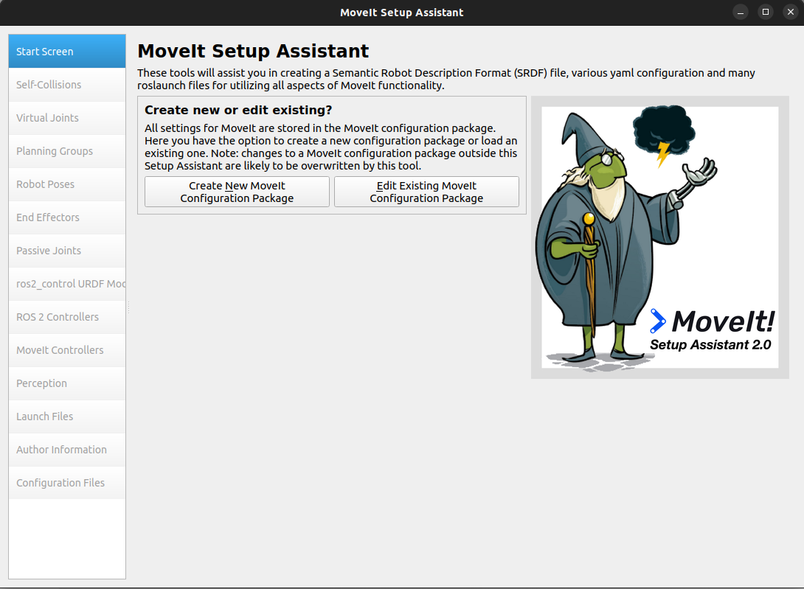

Overview
--------
The MoveIt Setup Assistant is a graphical user interface for configuring any robot for use with MoveIt.
Its primary function is generating a Semantic Robot Description Format (SRDF) file for your robot,
which specifies additional information required by MoveIt such as planning groups, end effectors, and various kinematic parameters.
Additionally, it generates other necessary configuration files for use with the MoveIt pipeline.
To use the MoveIt Setup Assistant, you will need to have a URDF file for your robot.

Once you have a URDF file, you can open the MoveIt Setup Assistant and import your URDF.
This tutorial will guide you through a series of steps to configure various aspects of your robot,
such as defining its kinematic structure, specifying planning groups and end effectors, and collision checking related settings.
To learn more about the URDF and SRDF, you can refer to the :doc:`URDF and SRDF Overview </doc/examples/urdf_srdf/urdf_srdf_tutorial>` page.

Getting Started
---------------

MoveIt and ROS 2

* Follow the :doc:`instructions for installing MoveIt </doc/tutorials/getting_started/getting_started>`
  first if you have not already done that.

* We use the `moveit_resources_panda_description <https://github.com/moveit/moveit_resources/tree/humble/panda_description>`_
  package. This package should already be included in your workspace if you've completed the MoveIt installation instructions.

Step 1: Start
-------------

* To start the MoveIt Setup Assistant: ::

   ros2 launch moveit_setup_assistant setup_assistant.launch.py

* This will bring up the start screen with two choices: **Create New
  MoveIt Configuration Package** or **Edit Existing MoveIt
  Configuration Package**.

* Click on the **Create New MoveIt Configuration Package** button to
  bring up the following screen:

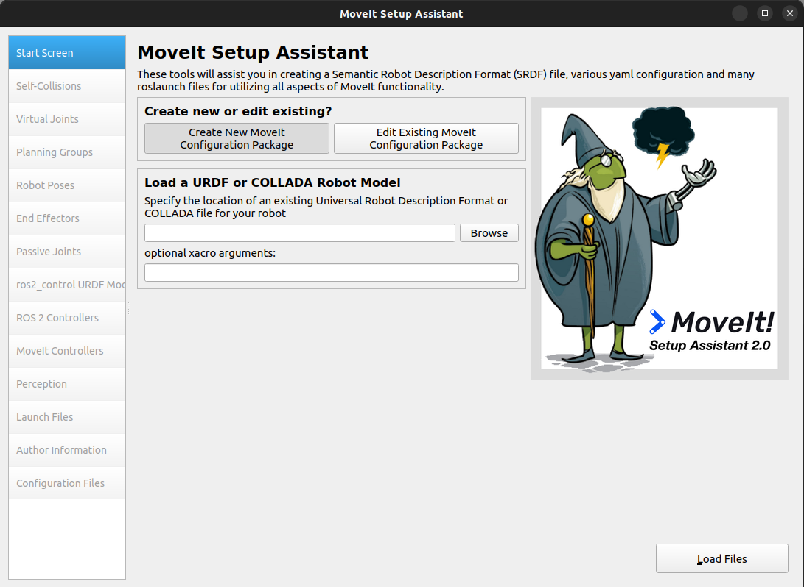

* Click on the **Browse** button and navigate to the ``panda.urdf`` file
  from the ``moveit_resources_panda_description package`` available in the following path: ::

   ~/ws_moveit2/src/moveit_resources/panda_description/urdf/panda.urdf

  Choose that file and then click **Load Files**. The
  Setup Assistant will load the files (this might take a few seconds)
  and present you with this screen:

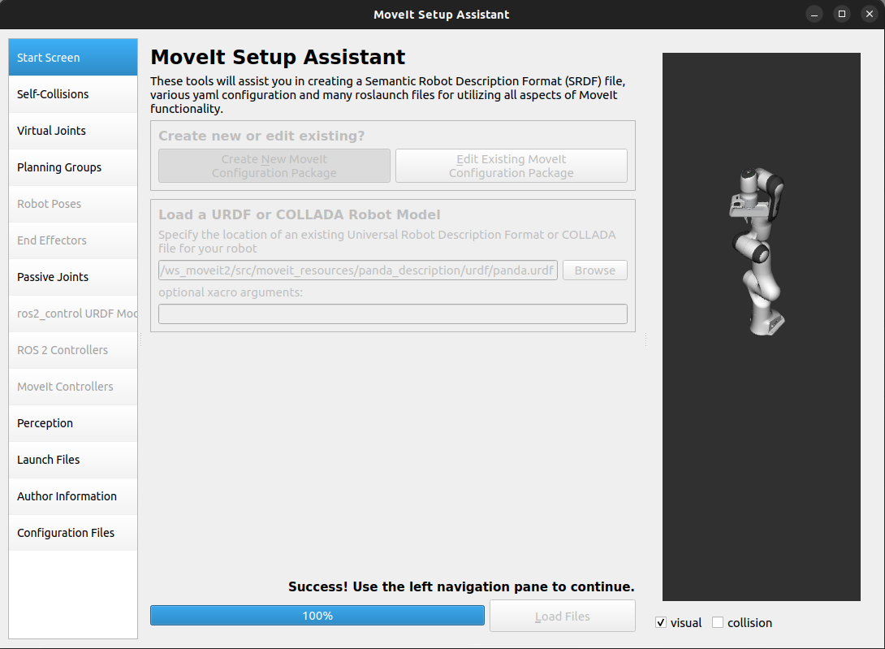

Step 2: Generate Self-Collision Matrix
--------------------------------------

The default Self-Collision matrix generator can help reduce motion planning time
by disabling collision checking for pairs of links on the robot that are known to be safe.
This is achieved by determining which pairs of links are always in collision, never in collision,
in collision in the robot's default position, or adjacent to each other on the kinematic chain.

You can set the sampling density, which determines how many random robot positions are checked for self-collision.
Although the generator checks 10,000 random positions by default, using maximum values for sampling density is
recommended to ensure more accurate results. The collision checking is done in parallel to reduce the overall
processing time for generating the collision matrix.

To generate the collision matrix, select the **Self-Collisions** pane on the left-hand side of the MoveIt Setup Assistant
and adjust the self-collision sampling density. Then, click on the **Generate Collision Matrix** button to initiate the computation.
The Setup Assistant will take a few seconds to compute the self-collision matrix, which involves checking for pairs
of links that can be safely disabled from collision checking.

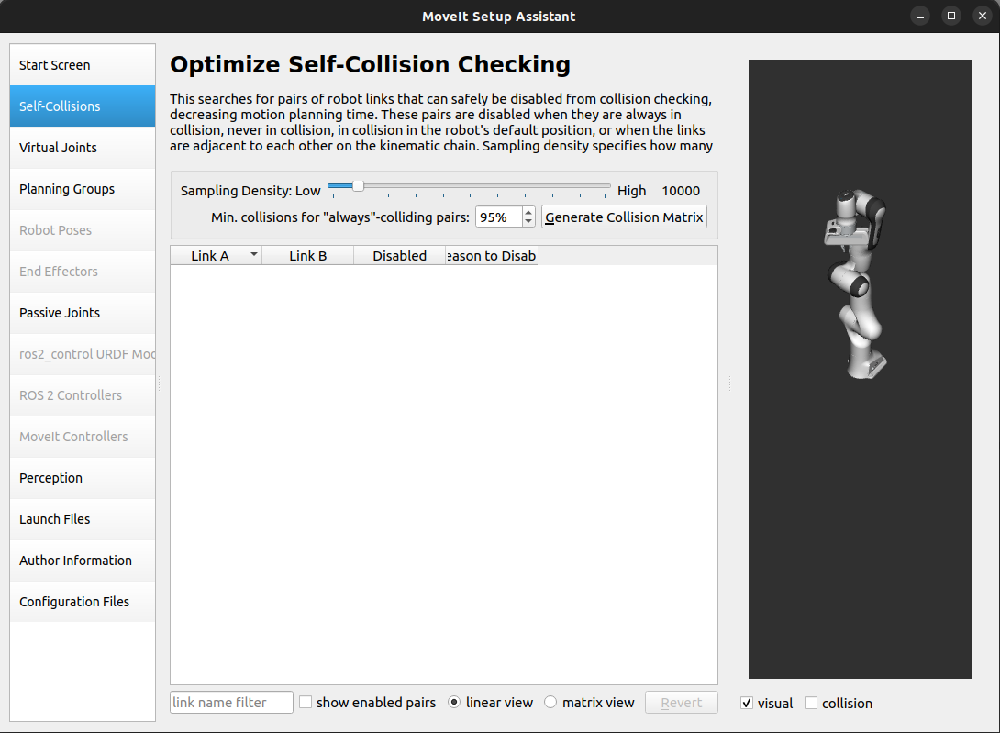

Once the computation is complete, the results will be presented in the main table.
The table shows the pairs of links that have been identified as either safe or unsafe to disable from collision checking.
Links that are safe to disable are marked with a checkmark. You can manually adjust the checkmarks as needed to
enable or disable self-collision checking for specific link pairs.

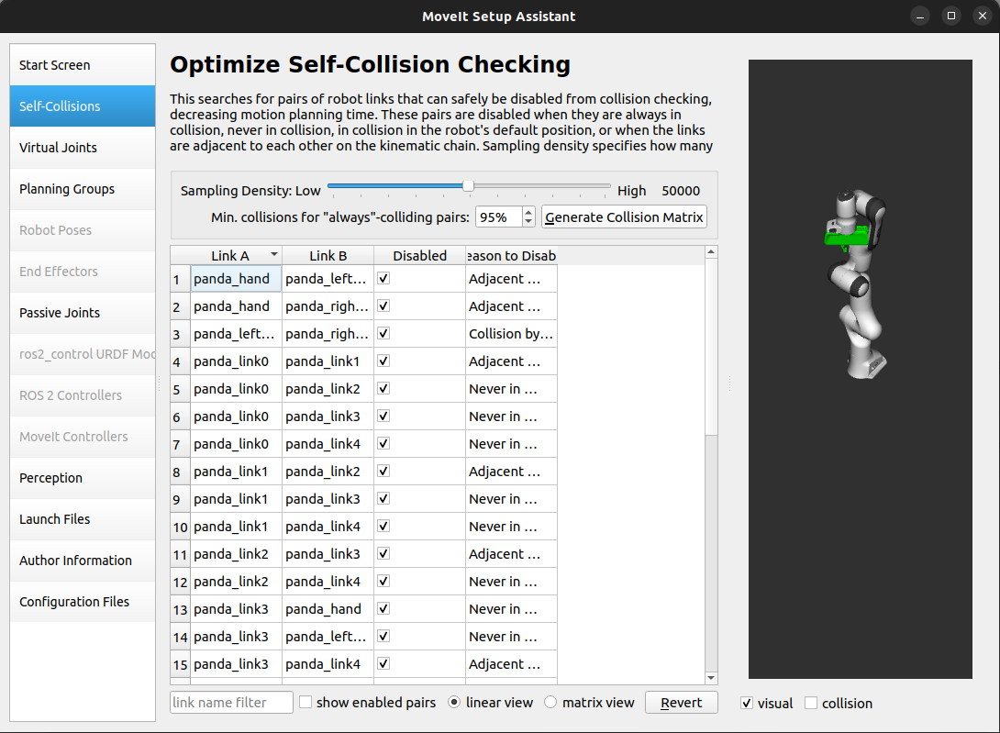

Step 3: Add Virtual Joints
--------------------------
Virtual joints are primarily used to connect robots to the world.
In the case of the Panda arm, which is a fixed base manipulator, defining a fixed virtual joint
is optional. However, we will define a ``fixed`` virtual joint that attaches the ``panda_link0``
of the arm to the ``world`` frame. This virtual joint signifies that the base of the arm
remains stationary in the world frame.

* Click on the **Virtual Joints** pane selector. Click on **Add Virtual Joint**.

* Set the joint name as ``virtual_joint``.

* Set the child link as ``panda_link0`` and the parent frame name as ``world``.

* Set the Joint Type as ``fixed``.

* Click **Save** and you should see this screen:

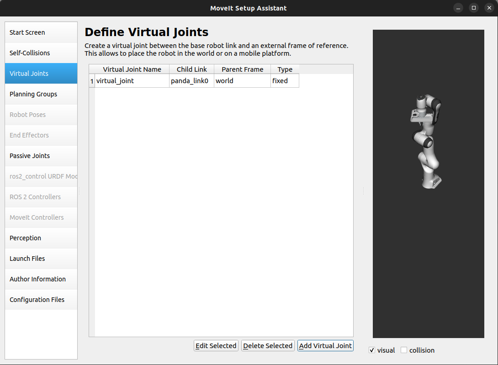

.. note:: Virtual joints are particularly beneficial for robots with mobile bases,
   such as mobile manipulators. They enable modeling the motion of the robot's base,
   which is essential for motion planning and control. For instance, a virtual planar
   joint can be used to connect the robot base frame to the odometry frame,
   effectively representing the robot's movement in the environment.

Step 4: Add Planning Groups
---------------------------

Planning groups in MoveIt semantically describe different parts of the robot,
such as the arm or end effector, to facilitate motion planning.

A move group can be configured to correspond to a specific kinematic chain on the robot,
which is a set of links and joints that define a sequence of transformations
from the base of the robot to the end effector. For example, a move group might be defined to
represent the arm of a robot, which would consist of all the links and joints necessary to move the arm.

Move groups can also be represented by sets of links or joints corresponding on the robot.
For example, a move group might be defined to represent the gripper of a robot,
which would consist of all the links or joints necessary to move together to realize a gripper opening or closing motion.

* Click on the **Planning Groups** pane selector.

* Click on **Add Group** and you should see the following screen:

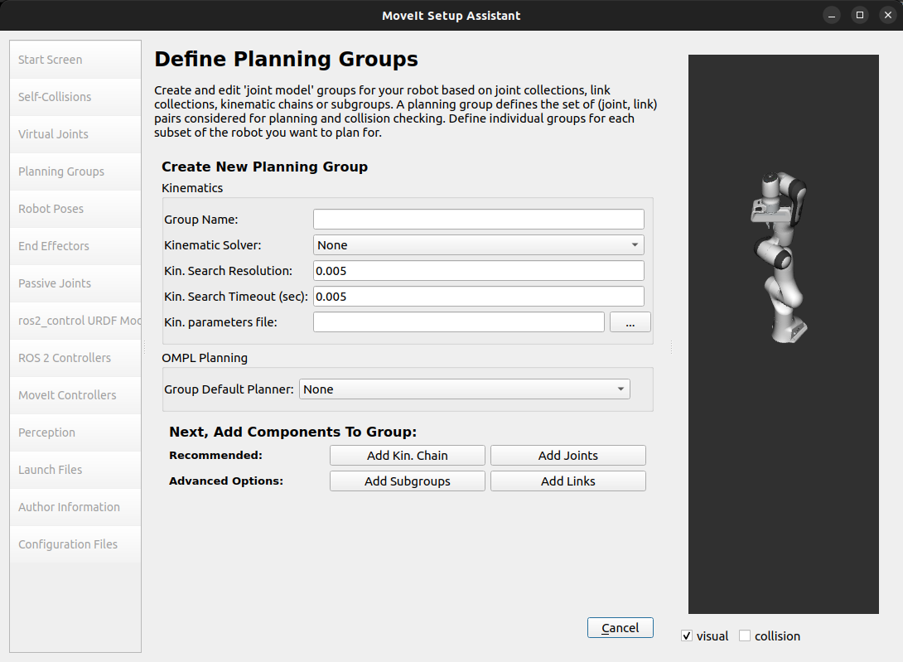

Add the arm group

* We will first add Panda arm as a planning group

  * Enter **Group Name** as ``panda_arm``.

  * Choose **kdl_kinematics_plugin/KDLKinematicsPlugin** as the kinematics solver, as this is the default for MoveIt.
    Alternatively, you can use other plugins such as :doc:`IKFast </doc/examples/ikfast/ikfast_tutorial>` or `pick_ik <https://github.com/PickNikRobotics/pick_ik>`_.

  * Let **Kin. Search Resolution** and **Kin. Search Timeout** stay at
    their default values.

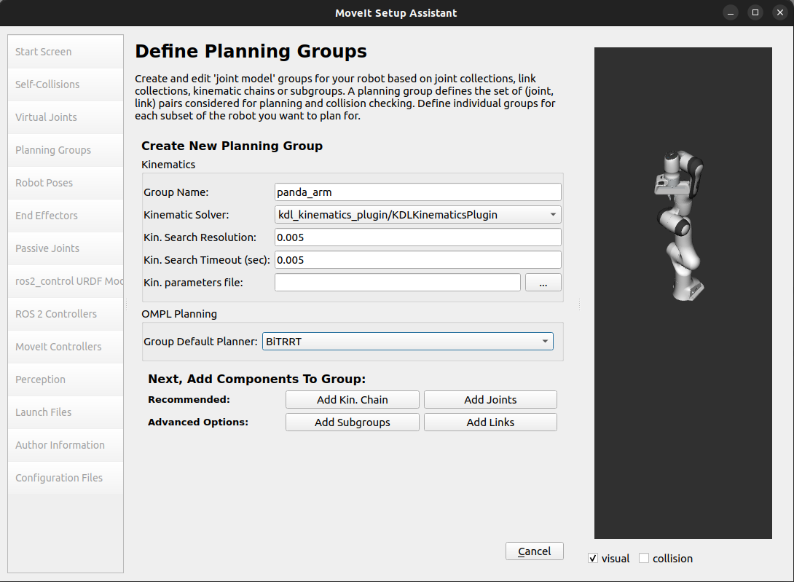

* Now, click on the **Add Joints** button. You will see a
  list of joints on the left-hand side. You need to choose all the
  joints that belong to the arm and add them to the right-hand
  side. The joints are arranged in the order that they are stored in
  an internal tree structure. This makes it easy to select a serial
  chain of joints.

  * Click on ``virtual_joint``, hold down the **Shift**
    button on your keyboard and then click on the
    ``panda_joint8``. Now click on the **>** button to add these
    joints into the list of **Selected Joints** on the right.

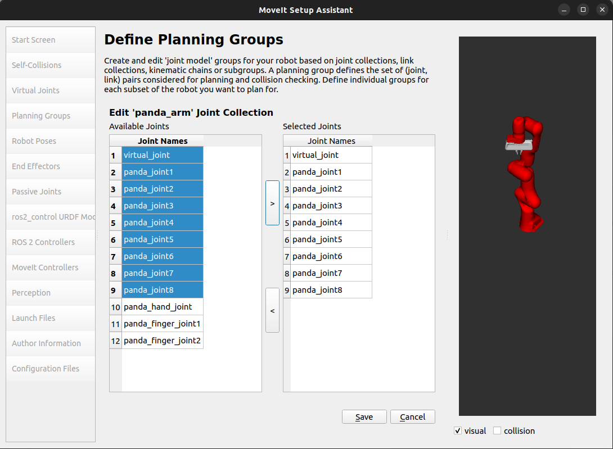

* Click **Save** to save the selected group.

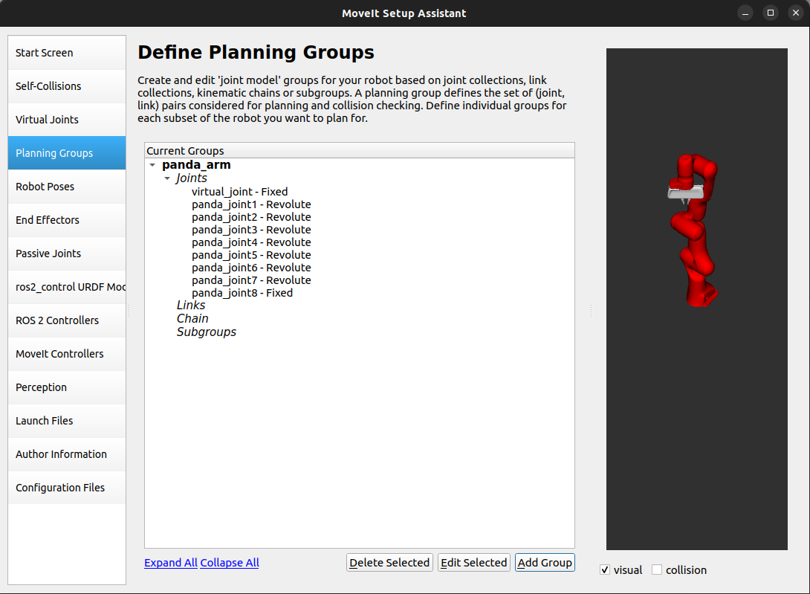

Add the end effector group

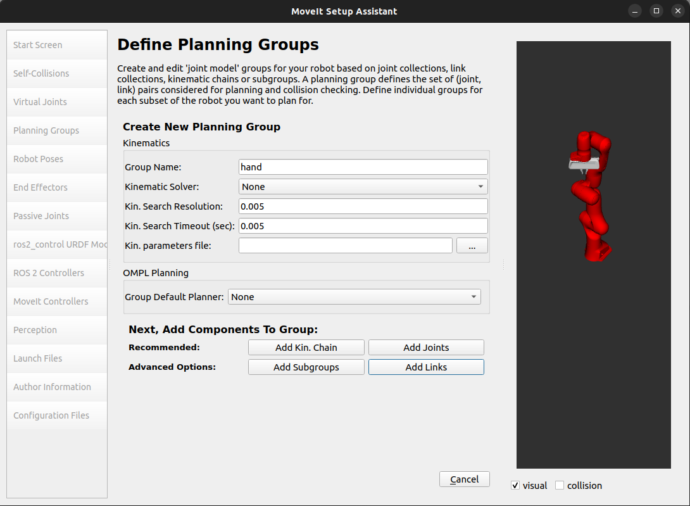

.. note:: The end effector is not made of links attached in a serial chain.
   Therefore, the group's **Kinematic Solver** should be set to **None**.

* Proceed with the following steps.

  * Click on the **Add Group** button.

  * Enter **Group Name** as ``hand``.

  * Let **Kinematic Solver** stay at its default value, which is **None**.

  * Let **Kin. Search Resolution** and **Kin. Search Timeout** stay at their default values.

  * Click on the **Add Links** button.

  * Choose ``panda_hand``, ``panda_leftfinger``, and ``panda_rightfinger`` and add them
    to the list of **Selected Links** on the right-hand side.

  * Click **Save**.

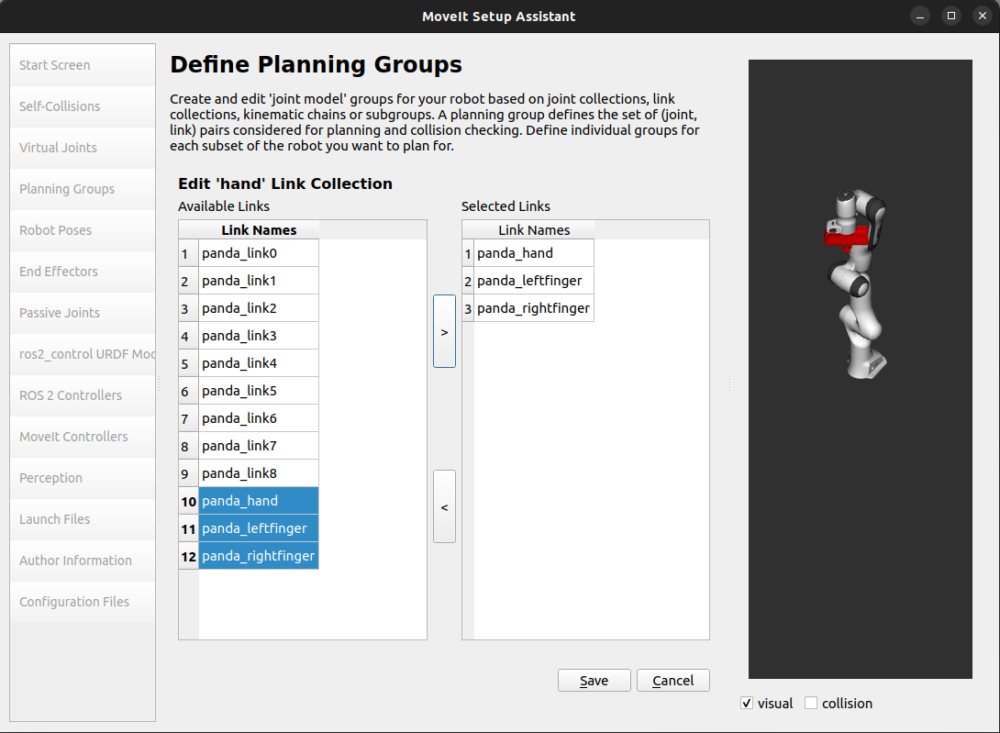

After both arm and hand groups are added, the custom groups list should look as follows.

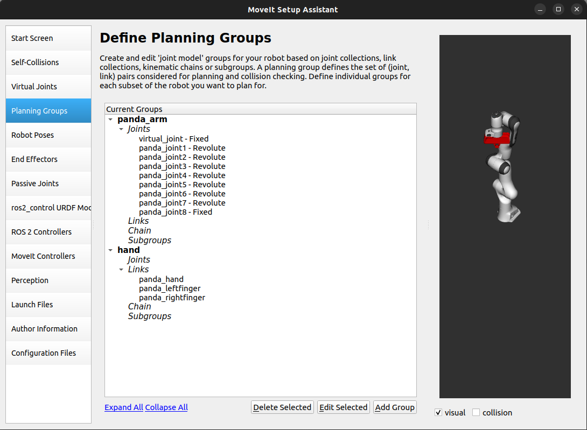

.. note:: It is possible to build move groups composed of other move groups with the **Add Subgroup** option.
   This can be beneficial in cases where multiple move groups need to be controlled together,
   such as when planning for simultaneous motions of multi-arm systems.

Step 5: Add Robot Poses
-----------------------

The Setup Assistant allows you to add predefined poses to the robot's configuration,
which can be useful for defining specific initial or ready poses.
Later, the robot can be commanded to move to these poses using the MoveIt API.

Add ready pose for the arm

* Click on the **Robot Poses** pane.

* Click **Add Pose**. Choose a name for the pose. The robot will be
  in the default pose, with all joints set to their zero values.
  Move the individual joints around until you are happy and then
  **Save** the pose. Note how poses are associated with particular
  groups. You can save individual poses for each group.

* Select the ``panda_arm`` and define a ``ready`` pose for it with the following joint values ``{0.0, -0.785, 0.0, -2.356, 0.0, 1.571, 0.785}``.

* **IMPORTANT TIP**: Try to move all the joints around. If there is
  something wrong with the joint limits in your URDF, you should be able
  to see it immediately here.

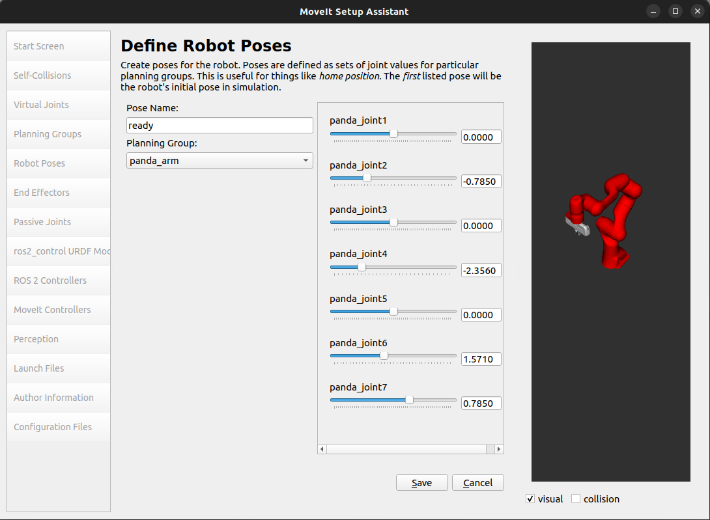

Add open and close poses for the gripper

* Follow the same steps for defining a pose for the arm, but select the ``hand`` group.

* Add an ``open`` pose for the ``hand`` group with joint value ``0.035``.

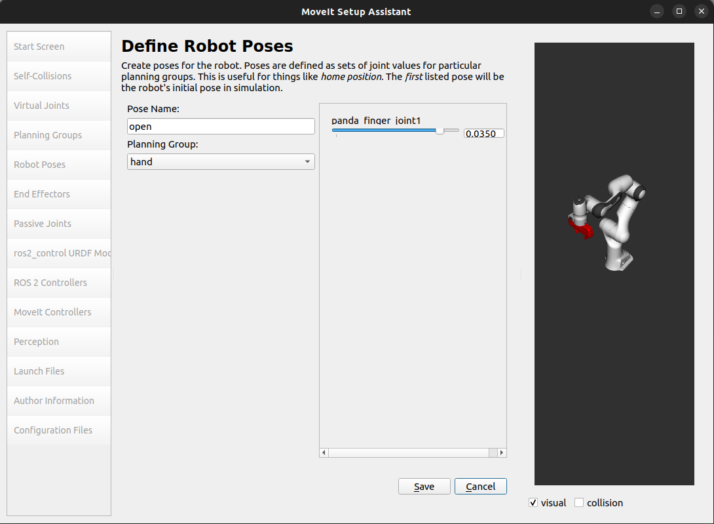

* Add a ``close`` pose for the ``hand`` group with joint value ``0.0``.

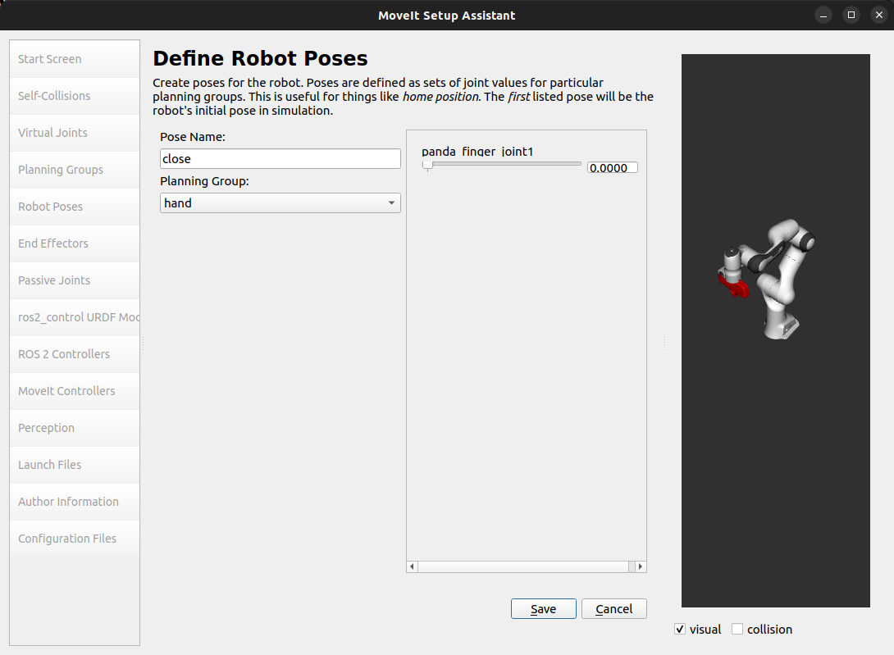

.. note:: Only ``panda_finger_joint1`` appears in the list as ``panda_finger_joint2`` mimics its values.

After the previous steps, the following set of robot poses should be defined for the ``panda_arm`` and ``hand`` groups.

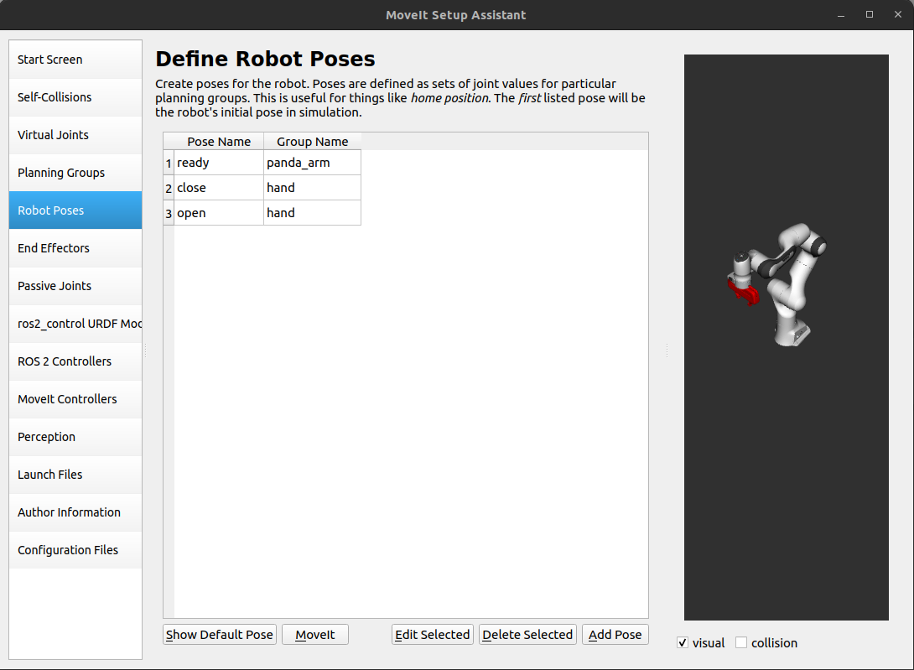

Step 6: Label End Effectors
---------------------------

Now that we have added the hand of the Panda as a move group, we can designate it
as an end effector. By designating a group as an end effector, MoveIt can perform certain special operations on it.
For example, end effectors can be used for attaching objects to the arm while carrying out pick-and-place tasks.

* Click on the **End Effectors** pane.

* Click **Add End Effector**.

* Choose ``hand`` as the **End Effector Name** for the gripper.

* Select ``hand`` as the **End Effector Group**.

* Select ``panda_link8`` as the **Parent Link** for this end-effector.

* Leave **Parent Group** blank.

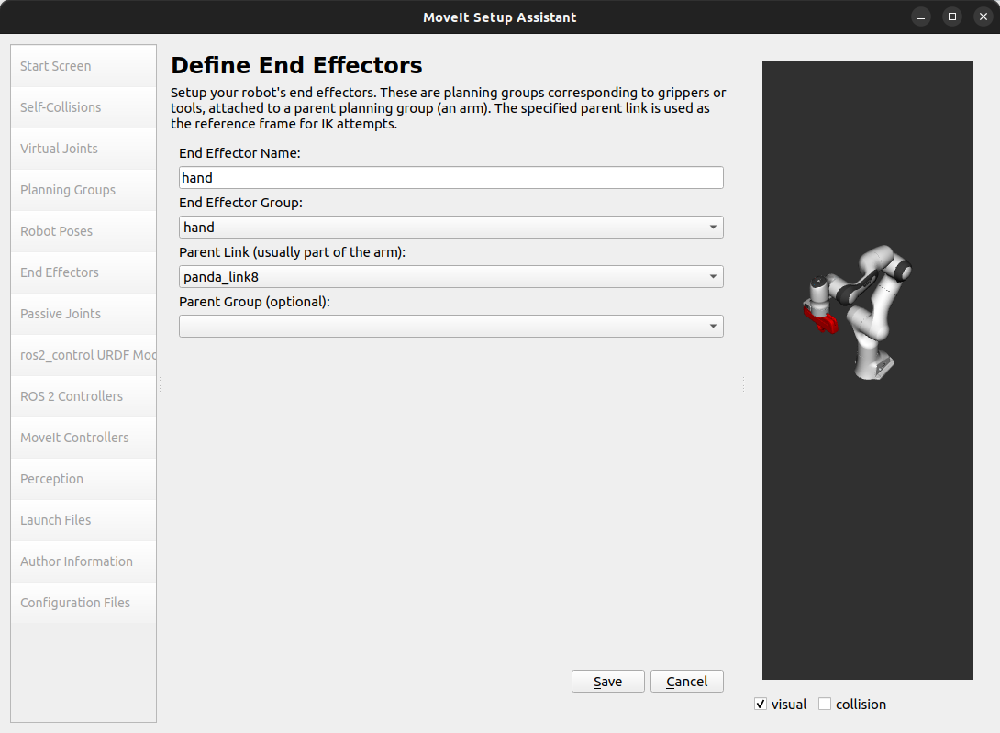

Step 7: Add Passive Joints
--------------------------

The **Passive Joints** pane is meant to allow specification of any passive
joints that might exist in a robot. These are joints that are unactuated,
meaning that they cannot be directly controlled. It's important to specify
passive joints so that the planners are aware of their existence and can avoid
planning for them. If the planners do not know about the passive joints, they
might try to plan trajectories that involve moving the passive joints, which would
result in invalid plans. The Panda robot arm does not have any passive joints so we will skip this step.

Step 8: ros2_control URDF Modification
--------------------------------------

The **ros2_control URDF Modification** pane helps modify the robot URDF to work with
`ros2_control <https://control.ros.org/master/index.html>`_.

.. note:: If your robot's URDF/xacro already includes a ``ros2_control.xacro``, you can skip this step.

This modification adds tags for command and state interfaces for each joint in the defined move groups.
The ``command_interface`` tags define the types of commands that can be sent to control the joint.
The ``state_interface`` tags define the types of state information that can be read from the joint.

By default the MoveIt Setup Assistant assumes **position** command interface
and **position** and **velocity** state interfaces, and we will proceed with this setting.

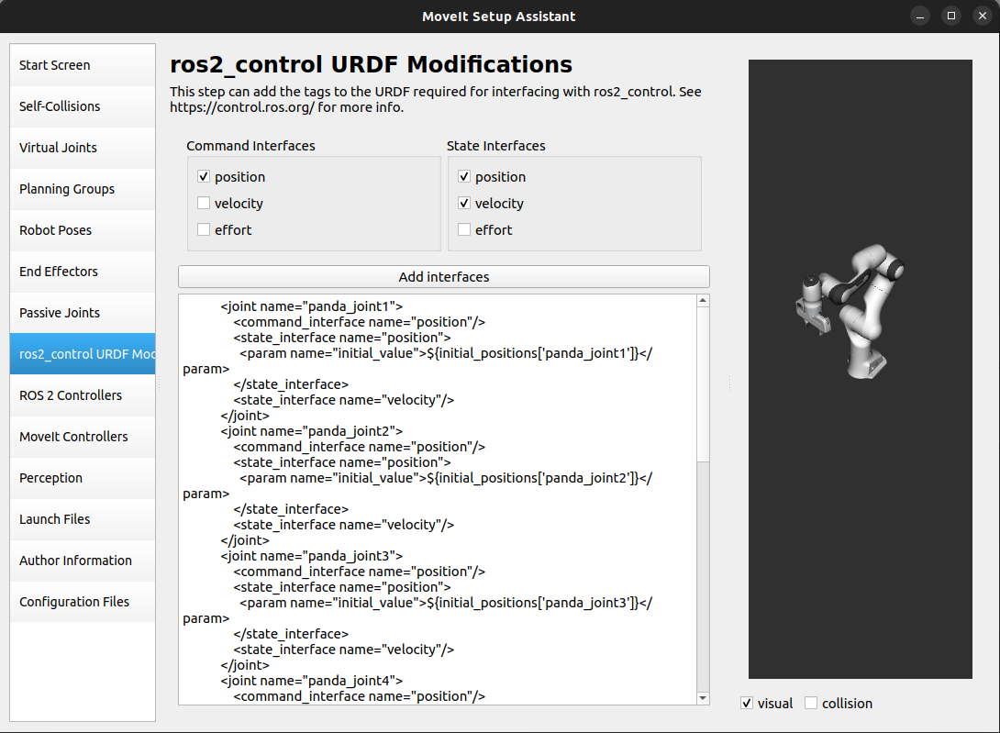

If necessary, select the desired command or state interfaces for your robot joints and
then click the **Add Interfaces** button.

Step 9: ROS 2 Controllers
-------------------------

ROS 2 Control is a framework for real-time control of robots,
designed to manage and simplify the integration of new robot hardware.
For more details, please look at `ros2_control <https://control.ros.org/master/index.html>`_ documentation.

**ROS 2 Controllers** pane can be used to auto generate simulated controllers to actuate the robot joints.

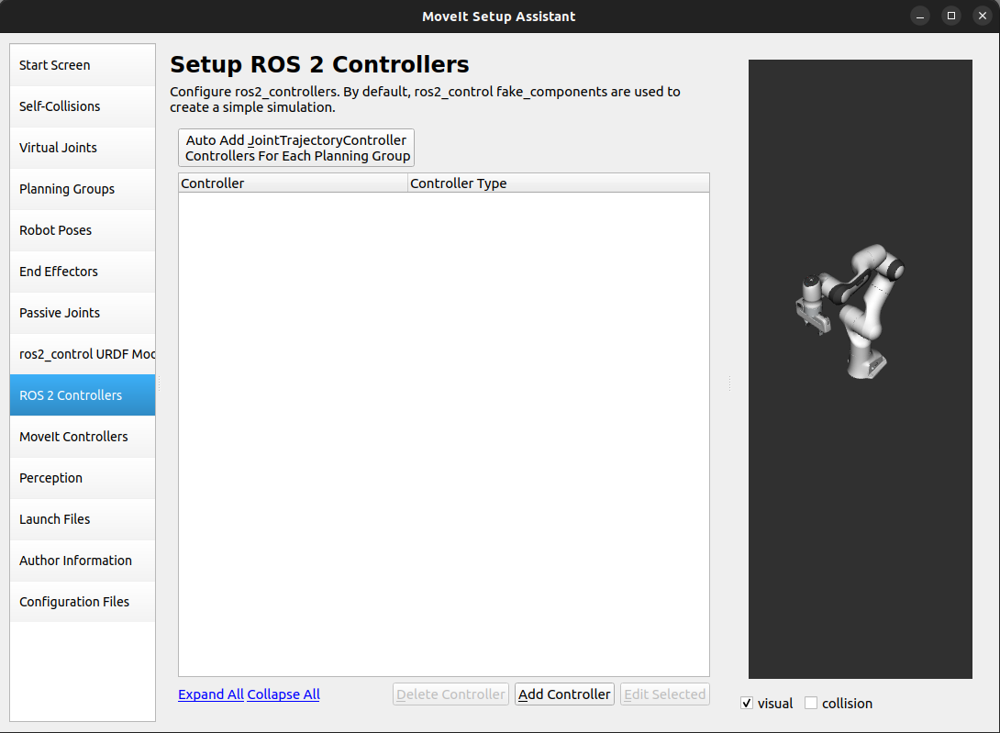

Add the arm controllers

* Click on the **ROS 2 Controllers** pane selector.

* Click on **Add Controller** and you should see the following screen:

* We will first add Panda arm joint trajectory controller.

* Enter **Controller Name** as ``panda_arm_controller``.

* Choose **joint_trajectory_controller/JointTrajectoryController** as the controller type

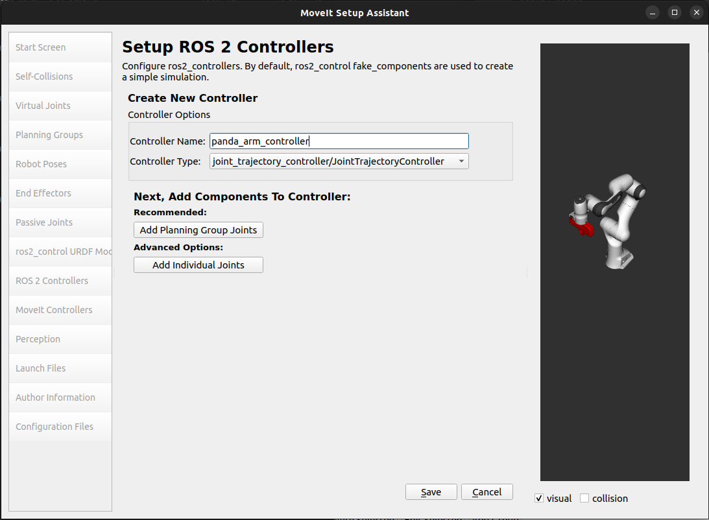

* Next, we need to choose the controller joints. Joints can be added individually or by move group.

* Now, click on **Add Planning Group Joints**.

* Choose the ``panda_arm`` group from the **Available Groups** tab and add it to the **Selected Groups**.

* Click **Save** to save the selected controller.

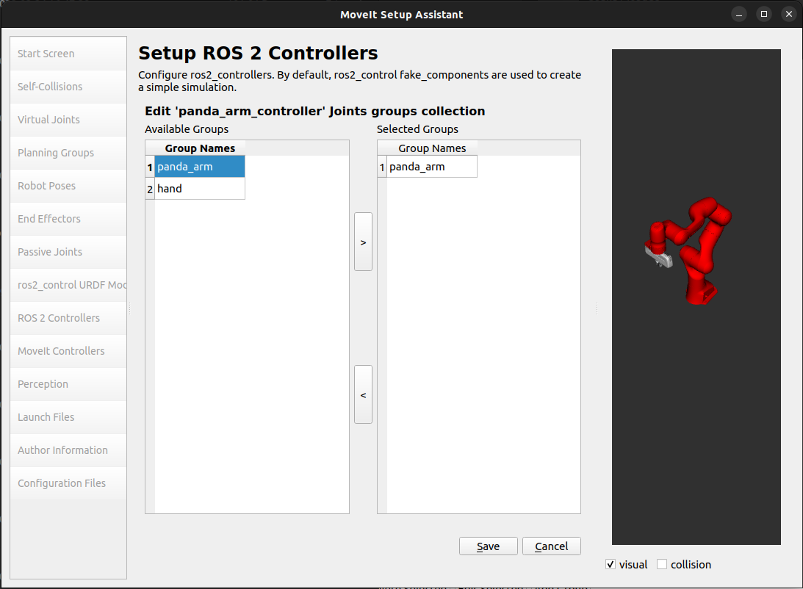

Add the hand controllers

* Follow the same steps for the arm, but choose **position_controllers/GripperActionController**

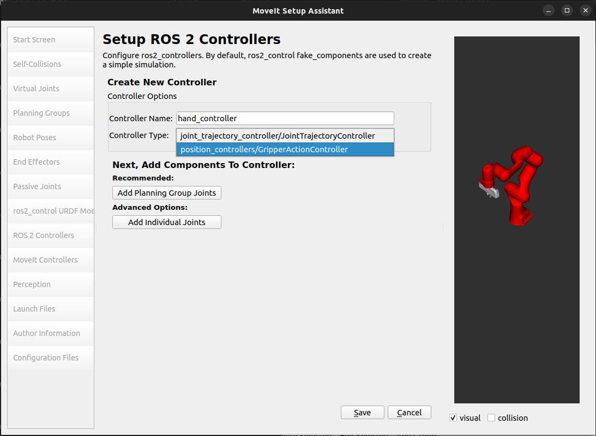

* Choose ``hand`` group from the **Available Groups** tab and add it to the **Selected Groups**.

* Click **Save** to save the selected controller.

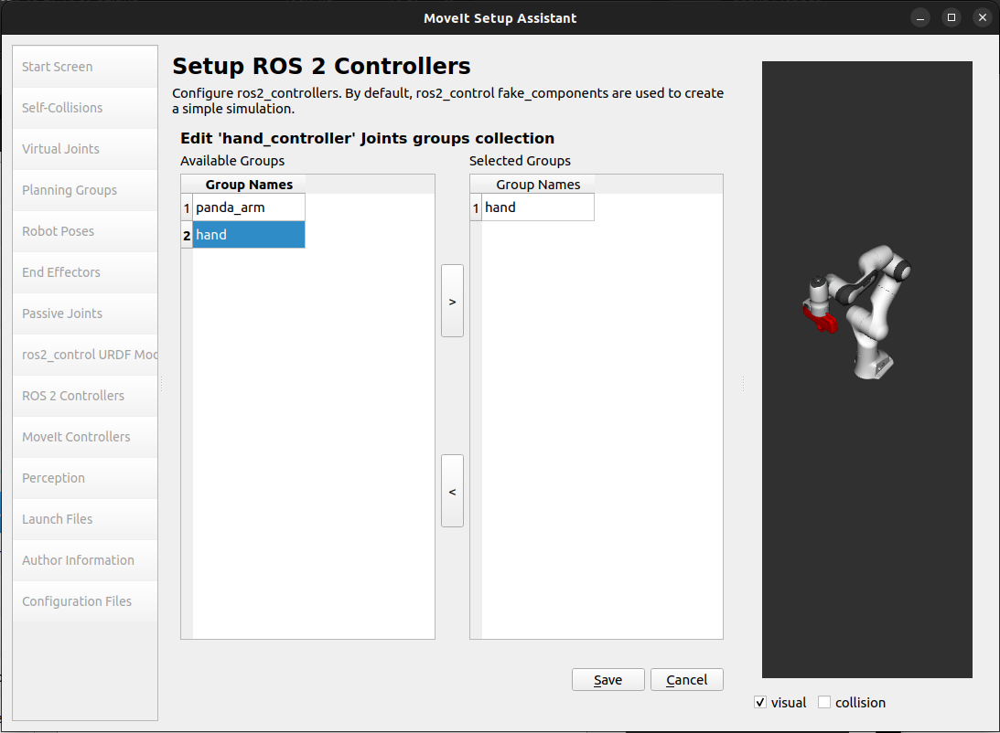

After selecting the arm and hand controllers, the controllers list should be as follows.

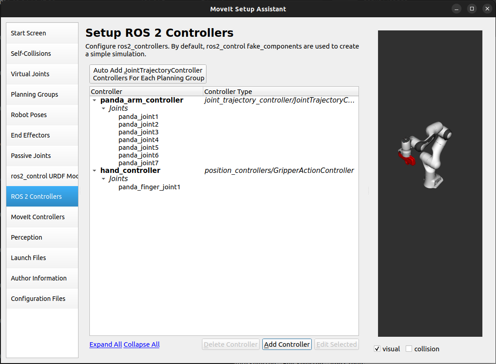

Step 10: MoveIt Controllers
---------------------------

MoveIt requires trajectory controllers with a ``FollowJointTrajectoryAction`` interface for
executing planned trajectories. This interface sends the generated trajectory to the robot ROS 2 Controllers.

The **MoveIt Controllers** pane can be used to auto-generate the controllers to be used by the MoveIt controller manager.
Ensure that the controller names match those configured in the previous ROS 2 controller step.
The user interface for this step is similar to the previous one.

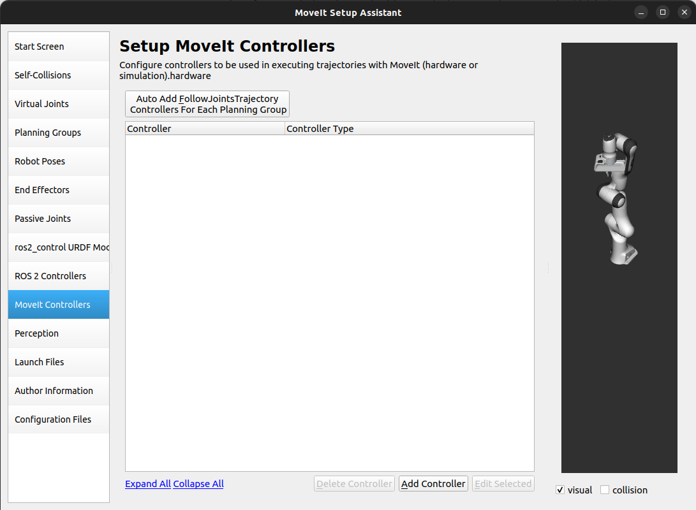

Add the arm MoveIt controllers

* Click on the **MoveIt Controllers** pane selector.

* Click on **Add Controller** to create a new arm controller.

* Enter **Controller Name** as ``panda_arm_controller``.

* Choose **FollowJointTrajectory** Controller Type.

* Choose the controller joints with the ``panda_arm`` planning group.

* Save the controller.

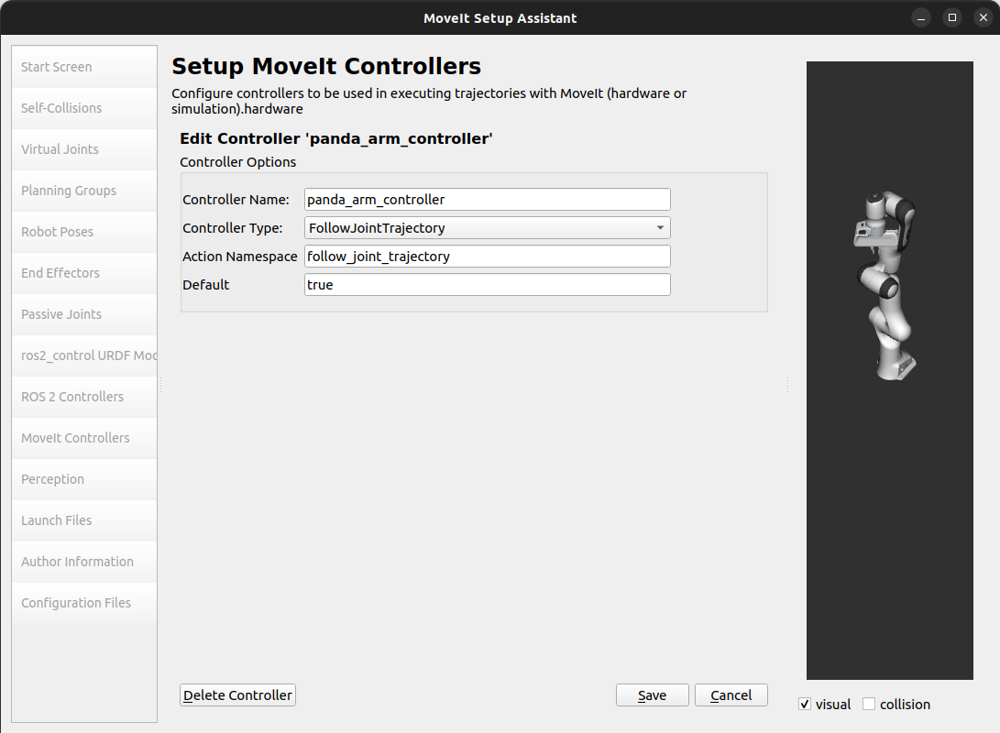

Add the hand MoveIt controllers

* Click on **Add Controller** to create a new controller.

* Enter **Controller Name** as ``hand_controller``.

* Choose **Gripper Command** Controller Type.

* Choose the controller joints with the ``hand`` planning group.

* Save the controller.

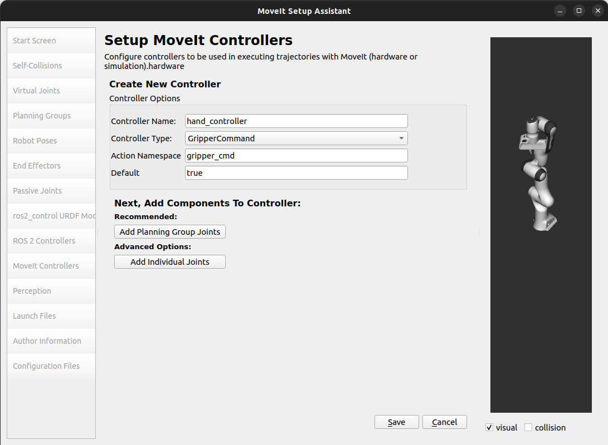

After completing the previous steps, the MoveIt Controllers list for the arm and hand should appear as follows.

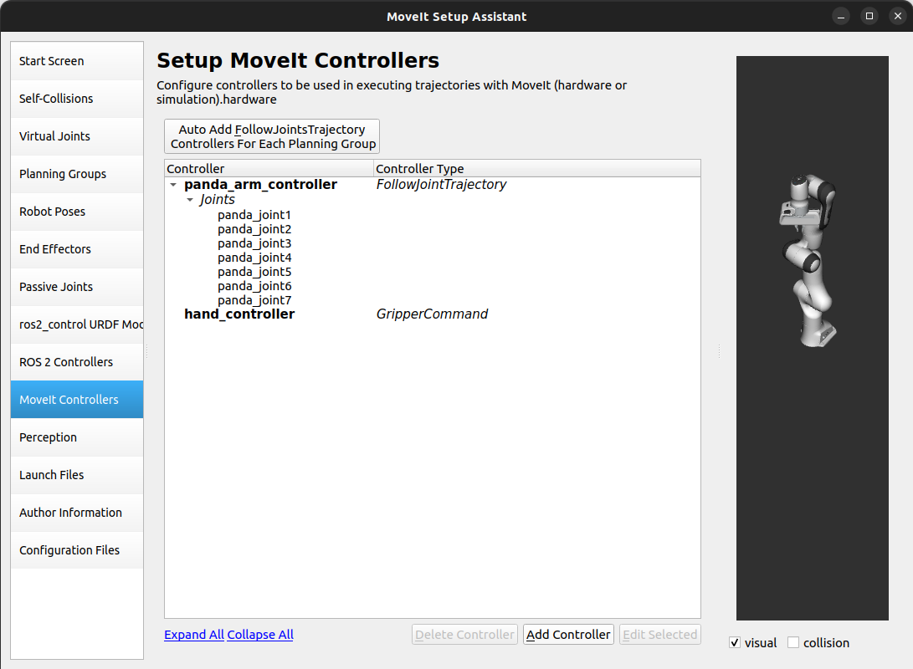

Step 11: Perception
-------------------

The Perception tab in the Setup Assistant is used to configure the settings
for 3D sensors used by the robot. These settings are saved in a YAML configuration file named **sensors_3d.yaml**.

In case of **sensors_3d.yaml** was not needed, choose **None** and proceed to the next step.

.. image:: perception/setup_assistant_panda_3d_perception.png
   :width: 700px

To generate **point_cloud** configuration parameters, see the following example:

.. note:: This configuration is not valid for the Panda robot arm because it does not have a ``head_mounted_kinect`` camera.

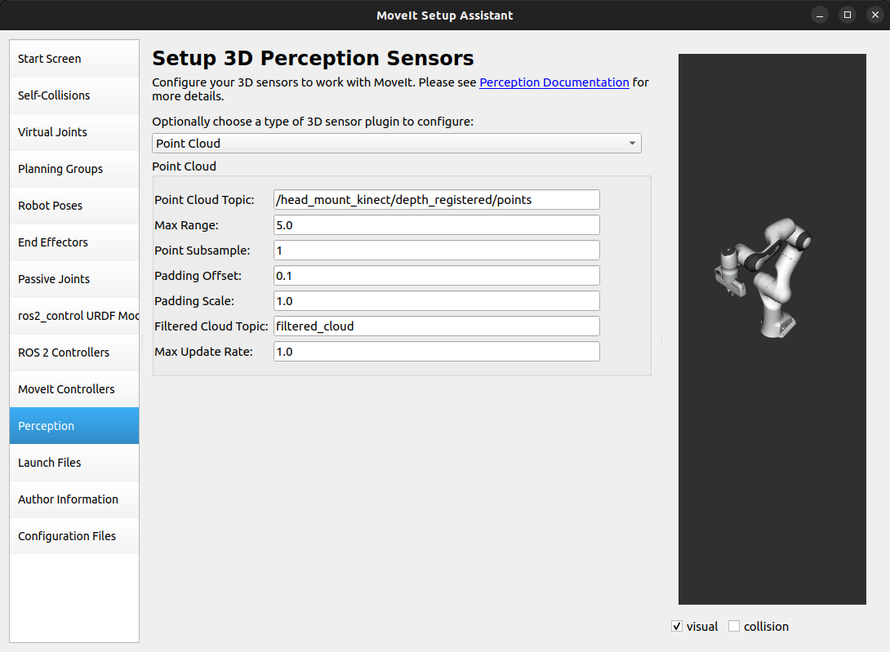

For more details about those parameters please refer to the :doc:`Perception Pipeline tutorial </doc/examples/perception_pipeline/perception_pipeline_tutorial>`.

Step 12: Launch Files
---------------------

In the **Launch Files** pane, you can view the list of launch files that will be generated.
The default options are usually sufficient, but if you have specific requirements for your application,
you can make changes as necessary. Click on each of the files to view a summary of their functionality.

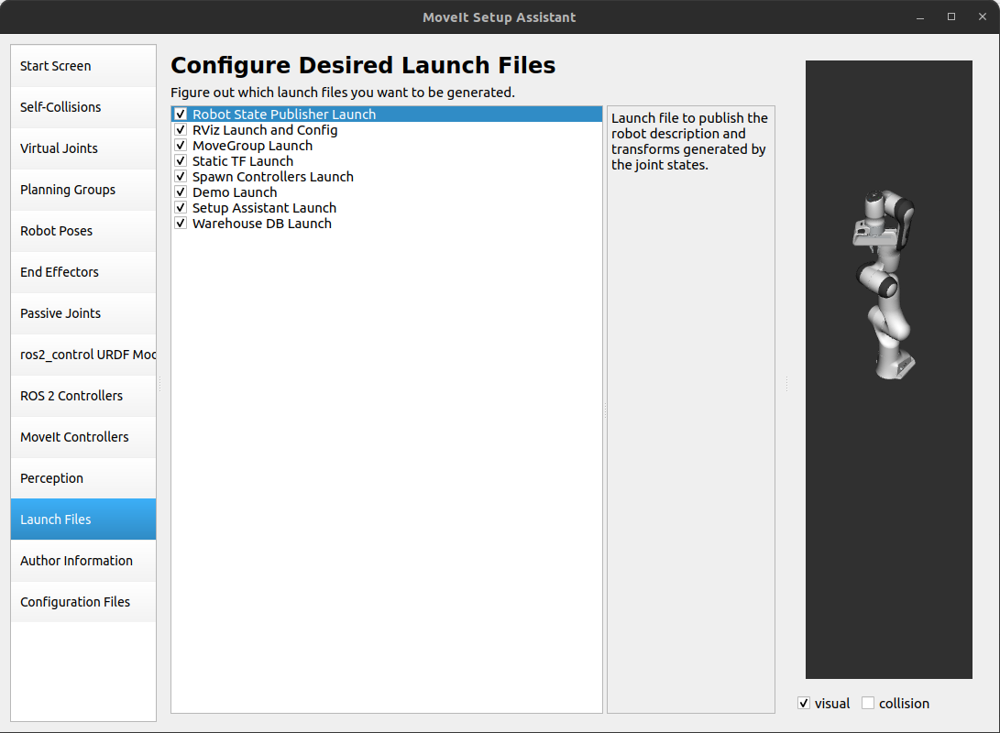

Step 13: Add Author Information
--------------------------------

Colcon requires author information for publishing purposes.

* Click on the **Author Information** pane.
* Enter your name and email address.

Step 14: Generate Configuration Files
--------------------------------------

You are almost there. One last step - generating all the configuration
files that you will need to start using MoveIt.

* Click on the **Configuration Files** pane. Choose a location and
  name for the ROS 2 package that will be generated containing your new
  set of configuration files. Click **Browse**, select a good
  location (for example, your ROS 2 workspace's src directory), click **Create Folder**, call it
  ``panda_moveit_config``, and click **Open**. All generated files will go directly into the
  directory you have chosen.

* Click on the **Generate Package** button. The Setup Assistant will
  now generate a set of launch and config files into the
  directory of your choice. All the generated files will appear in the
  files to be generated tab and you can click on each of them for a
  description of what they do. For more information on the generated files,
  see :doc:`the Configuration section in the documentation </doc/examples/examples>`.

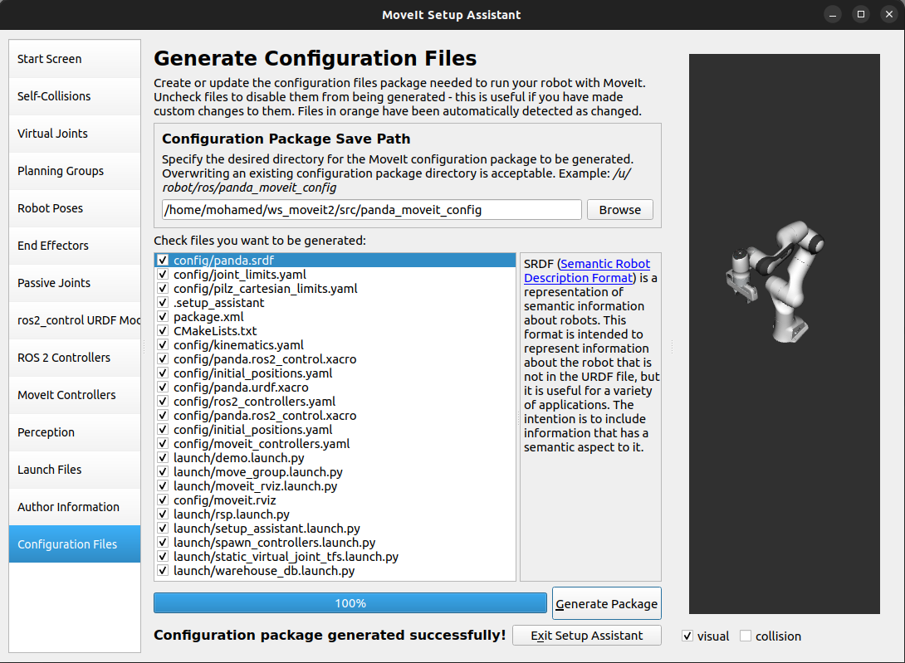

Congratulations! You are now done generating the configuration files you need for MoveIt.

Build the panda_moveit_config package and run the demo
------------------------------------------------------
To build only the generated ``panda_moveit_config`` package and run the demo, follow these steps. ::

   cd ~/ws_moveit2
   colcon build --packages-select panda_moveit_config
   source install/setup.bash

Start the MoveIt demo to interactively plan and execute motions for the robot in RViz. ::

   ros2 launch panda_moveit_config demo.launch.py

Check out this `brief YouTube video <https://youtu.be/f__udZlnTdM>`_ for an example of how to
command the robot to move to the pre-defined ``ready`` pose and execute ``open`` and ``close`` motions on the hand.

What's Next
-----------

Get Started with MoveIt Motion Planning using RViz

* Learn how to use the generated configuration files to plan and visualize motion with MoveIt in RViz.
  Check out the :doc:`MoveIt Quickstart in Rviz tutorial </doc/tutorials/quickstart_in_rviz/quickstart_in_rviz_tutorial>` for a step-by-step guide.

Write Your First C++ MoveIt Application

* Write your first C++ application using MoveIt with :doc:`this tutorial </doc/tutorials/your_first_project/your_first_project>`,
  and familiarize yourself with the ``MoveGroupInterface`` and use it to plan, execute, and visualize motion plans for your robot from :doc:`this example </doc/examples/move_group_interface/move_group_interface_tutorial>`.

URDF vs SRDF: Understand the Differences

* See the :doc:`URDF and SRDF </doc/examples/urdf_srdf/urdf_srdf_tutorial>` page for more
  details on the components of the URDF and SRDF mentioned in this tutorial.

Explore available Inverse Kinematics Solvers

* Alternative IK solvers to the default KDL solver are available.
  For more information, refer to :doc:`IKFast </doc/examples/ikfast/ikfast_tutorial>` and `pick_ik <https://github.com/PickNikRobotics/pick_ik>`_.
