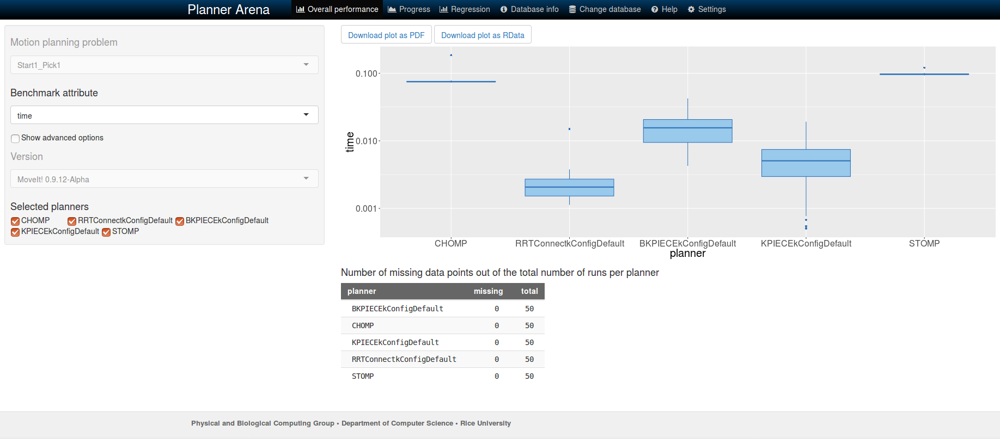

How to benchmark your planning pipeline
=======================================

Getting Started
---------------
If you haven't already done so, make sure you've completed the steps in :doc:`Getting Started </doc/tutorials/getting_started/getting_started>`.

The :moveit_codedir:`benchmarking package <moveit_ros/benchmarks>` provides methods to benchmark a MoveIt planning pipeline and aggregate/plot statistics using the OMPL Planner Arena.
The example below demonstrates how the benchmarking can be run.

Example
-------

To run the example you need to install git lfs by running ``git lfs install`` and clone `moveit_benchmark_resources <https://github.com/moveit/moveit_benchmark_resources.git`_ into your workspace.

Start the benchmarks by running: ::

    ros2 launch moveit2_tutorials run_benchmarks.launch.py

This will take a while depending on the settings in ``benchmarks.yaml``. The benchmark results will be saved in ``/tmp/moveit_benchmarks/``.
To introspect the benchmark data, the log files need to be converted into a database. This can be done using a script provided in the moveit_ros_benchmarks package: ::

    ros2 run moveit_ros_benchmarks moveit_benchmark_statistics.py LOG_FILE_1 ... LOG_FILE_N

This command will create a database containing the data form all benchmark log files included. An easier way to create the database is to create it with all log files from a given repository.
For example, the argument ``/tmp/moveit_benchmarks/*`` can be used to collect all log files in the given directory into a single database. This database is created in the location where the command
above is run in a file names ``benchmark.db``.

The database can be visualized by uploading the the file to `plannerarena.org <http://plannerarena.org>`_ and interactively visualizing the results.

ROS 2 parameters to configure a benchmark
-----------------------------------------

The benchmarks are configured by a set of ROS 2 parameters. You can learn more about these parameters in the :moveit_codedir:`BenchmarkOptions.h <moveit_ros/benchmarks/include/moveit/benchmarks/BenchmarkOptions.h>` file.

The BenchmarkExecutor Class
---------------------------

This class creates a set of ``MotionPlanRequests`` that respect the parameters given in the supplied instance of ``BenchmarkOptions`` and then executes the requests on each of the planners specified.  From the ``BenchmarkOptions``, queries, ``goal_constraints``, and ``trajectory_constraints`` are treated as separate queries.  If a set of ``start_states`` is specified, each query, ``goal_constraint``, and ``trajectory_constraint`` is attempted with each start state (existing start states from a query are ignored).  Similarly, the (optional) set of path constraints is combined combinatorially with the start query and start ``goal_constraint`` pairs (existing ``path_constraint`` from a query are ignored).  The workspace, if specified, overrides any existing workspace parameters.

The benchmarking pipeline does not utilize ``MoveGroup``.
Instead, the planning pipelines are initialized and run directly including all specified ``PlanningRequestAdapters``.
This is especially useful for benchmarking the effects of smoothing adapters.

It is possible to customize a benchmark run by deriving a class from ``BenchmarkExecutor`` and overriding one or more of the virtual functions.
For instance, overriding the functions ``initializeBenchmarks()`` or ``loadBenchmarkQueryData()`` allows to specify the benchmark queries directly and to provide a custom planning scene without using ROS warehouse.

Additionally, a set of functions exists for ease of customization in derived classes:

- ``preRunEvent``: invoked immediately before each call to solve
- ``postRunEvent``: invoked immediately after each call to solve
- ``plannerSwitchEvent``: invoked when the planner changes during benchmarking
- ``querySwitchEvent``: invoked before a new benchmark problem begin execution

Note, in the above, a benchmark is a concrete instance of a ``PlanningScene``, start state, goal constraints / ``trajectory_constraints``, and (optionally) ``path_constraints``.  A run is one attempt by a specific planner to solve the benchmark.
