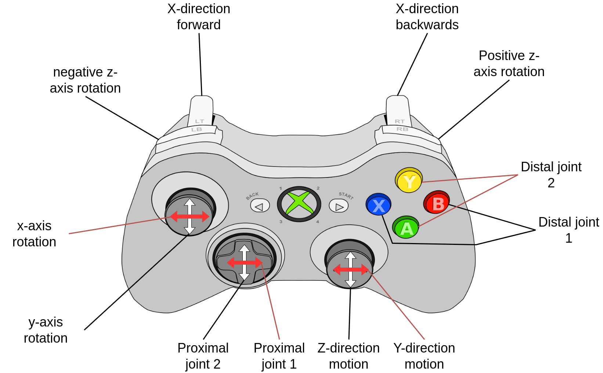

How to Teleoperate a Robotic Arm
================================

This guide shows you how to control the panda arm in real time using MoveIt Servo.
MoveIt Servo accepts velocity commands and handles the inverse kinematics, collision checking,
and singularity management for you.

You can teleoperate the arm with the built-in keyboard interface or connect your own input
device (such as a gamepad) through the ROS API.

Prerequisites
-------------
Make sure you have completed the :doc:`Getting Started </doc/tutorials/getting_started/getting_started>` tutorial
and can successfully launch the MoveIt demo for the panda arm.

For the gamepad section, you also need a controller supported by
`ROS 2 joy <https://index.ros.org/p/joy/>`_. Test it by running
``ros2 run joy joy_node`` and then ``ros2 topic echo /joy`` to confirm your
gamepad is detected.

Keyboard Teleoperation
----------------------

MoveIt Servo ships with a keyboard teleoperation demo that works out of the box.

1. Build the MoveIt 2 workspace.

  ``cd`` to the root of the workspace (``~/ws_moveit/`` if you followed Getting Started),
  then run:

  .. code-block:: bash

      colcon build
      source install/setup.bash

2. Launch the servo demo.

  .. code-block:: bash

      ros2 launch moveit_servo demo_ros_api.launch.py

3. In a second terminal, start the keyboard input node.

  .. code-block:: bash

      ros2 run moveit_servo servo_keyboard_input

4. Use the following keys to move the arm:

  ==================  =====================================================
  Key                 Action
  ==================  =====================================================
  Arrow keys          Cartesian motion (linear X / Y)
  ``.`` / ``;``       Cartesian motion (linear Z down / up)
  ``1`` – ``7``       Jog individual joints (panda_joint1 through panda_joint7)
  ``r``               Reverse joint jog direction
  ``t``               Switch to Twist (Cartesian) command mode
  ``j``               Switch to JointJog command mode
  ``w``               Set reference frame to planning frame
  ``e``               Set reference frame to end-effector frame
  ``q``               Quit
  ==================  =====================================================

Gamepad Teleoperation
---------------------

The previous built-in ``JoyToServoPub`` node was removed during the MoveIt Servo refactoring.
Gamepad teleoperation now works through the same ROS topics that the keyboard demo uses —
you just need a small node that translates ``sensor_msgs/msg/Joy`` messages into the
command messages that Servo expects.

The image above shows a reference controller layout from the previous ``JoyToServoPub`` node.
Your actual button-to-axis mapping depends on your translator code (see the Python example below).
Run ``ros2 topic echo /joy`` to identify which axes and buttons correspond to your gamepad's controls.
The drawio source for the image is `here <https://drive.google.com/file/d/1Hr3ZLvkYo0y0fA3Qb1Nk_y7wag4UO8Al/view?usp=sharing>`__.

How It Works
^^^^^^^^^^^^

MoveIt Servo's ``ServoNode`` subscribes to three command topics and exposes a service for
switching between them:

- ``~/delta_twist_cmds`` — ``geometry_msgs/msg/TwistStamped`` for Cartesian velocity commands.
- ``~/delta_joint_cmds`` — ``control_msgs/msg/JointJog`` for direct joint velocity commands.
- ``~/pose_target_cmds`` — ``geometry_msgs/msg/PoseStamped`` for target pose commands.

The active command type is selected via the ``~/switch_command_type`` service
(``moveit_msgs/srv/ServoCommandType``). Servo only processes one command type at a time.

The ``~/`` prefix means these names are relative to the node's name. In ``demo_ros_api.launch.py``
the node is named ``servo_node``, so the topics resolve to ``/servo_node/delta_twist_cmds``, etc.
If you launch under a different name or namespace, adjust the topic names accordingly.

Any input device that can publish to these topics will work. For a gamepad, the
typical approach is:

1. Run the ``joy`` node to publish raw gamepad state on ``/joy``.
2. Write a translator node that subscribes to ``/joy`` and publishes
   ``TwistStamped`` or ``JointJog`` messages to the Servo topics.
3. Use the ``switch_command_type`` service to select which command type Servo processes.

Steps
^^^^^

1. Launch the servo demo:

  .. code-block:: bash

      ros2 launch moveit_servo demo_ros_api.launch.py

2. In a second terminal, launch the ``joy`` node:

  .. code-block:: bash

      ros2 run joy joy_node

3. Switch Servo to Twist command mode (it may not be the default):

  .. code-block:: bash

      ros2 service call /servo_node/switch_command_type \
        moveit_msgs/srv/ServoCommandType "{command_type: 1}"

4. In a third terminal, run your translator node. A minimal Python example:

  .. code-block:: python

      import rclpy
      from rclpy.node import Node
      from sensor_msgs.msg import Joy
      from geometry_msgs.msg import TwistStamped

      class JoyToServo(Node):
          # Scaling factors: axes are dimensionless [-1, 1], these convert to m/s and rad/s.
          # Adjust to suit your robot — start low and increase gradually.
          LINEAR_SCALE = 0.2   # m/s at full stick deflection
          ANGULAR_SCALE = 0.5  # rad/s at full stick deflection

          def __init__(self):
              super().__init__("joy_to_servo")
              self.pub = self.create_publisher(
                  TwistStamped, "/servo_node/delta_twist_cmds", 10
              )
              self.create_subscription(Joy, "/joy", self.joy_cb, 10)

          def joy_cb(self, msg):
              twist = TwistStamped()
              twist.header.stamp = self.get_clock().now().to_msg()
              twist.header.frame_id = "panda_link0"  # Change to your robot's planning frame
              # Map left stick to linear X/Y, right stick to linear Z and angular Z
              twist.twist.linear.x = msg.axes[1] * self.LINEAR_SCALE
              twist.twist.linear.y = msg.axes[0] * self.LINEAR_SCALE
              twist.twist.linear.z = msg.axes[4] * self.LINEAR_SCALE
              twist.twist.angular.z = msg.axes[3] * self.ANGULAR_SCALE
              self.pub.publish(twist)

      rclpy.init()
      node = JoyToServo()
      try:
          rclpy.spin(node)
      finally:
          node.destroy_node()
          rclpy.shutdown()

  Adjust the axis indices and scaling to match your gamepad. Run
  ``ros2 topic echo /joy`` to see which axes correspond to which sticks.

Explanation
-----------

The keyboard and gamepad approaches both work the same way under the hood.
``ServoNode`` processes incoming velocity commands regardless of where they
come from. It handles:

- **Inverse kinematics** — converting Cartesian velocity commands into joint motions.
- **Collision checking** — scaling down velocities when the arm is near obstacles or itself.
- **Singularity management** — decelerating when the arm approaches a kinematic singularity.
- **Joint limits** — enforcing position and velocity bounds.

``JointJog`` messages directly specify joint velocities, while ``TwistStamped``
messages specify the desired end-effector velocity and let Servo solve for the
joint motions. If you need to move individual joints precisely, use ``JointJog``.
For intuitive Cartesian control, use ``TwistStamped``.

For a deeper look at MoveIt Servo's architecture, command types, and configuration,
see the :doc:`Realtime Servo </doc/examples/realtime_servo/realtime_servo_tutorial>` tutorial.
