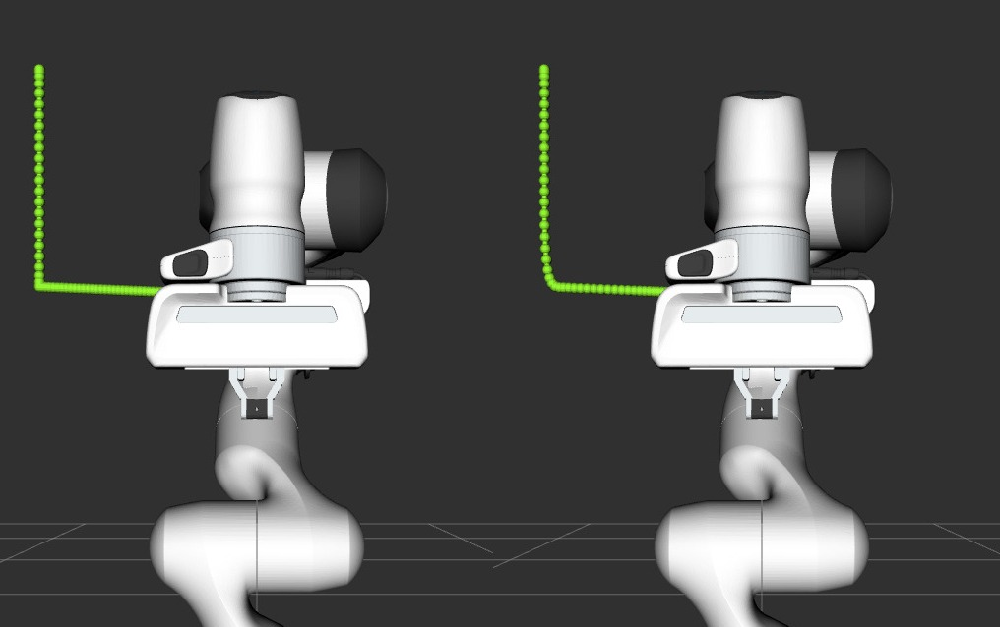

Pilz Industrial Motion Planner
==============================

``pilz_industrial_motion_planner`` provides a trajectory generator to plan standard robot
motions like point-to-point, linear, and circular with MoveIt.

By loading the corresponding planning pipeline
(``pilz_industrial_motion_planner_planning_planner.yaml`` in your
``*_moveit_config`` package), the trajectory generation
functionalities can be accessed through the user interface (C++, Python
or RViz) provided by the ``move_group`` node, e.g.
``/plan_kinematic_path`` service and ``/move_action`` action.
For detailed usage tutorials, please refer to
:doc:`/doc/examples/moveit_cpp/moveitcpp_tutorial` and
:doc:`/doc/examples/move_group_interface/move_group_interface_tutorial`.

Joint Limits
------------

The planner uses maximum velocities and accelerations from the
parameters of the ROS node that is operating the Pilz planning pipeline.
Using the MoveIt Setup Assistant the file ``joint_limits.yaml``
is auto-generated with proper defaults and loaded during startup.

The specified limits override the limits from the URDF robot description.
Note that while setting position limits and velocity limits is possible
in both the URDF and a parameter file, setting acceleration limits is
only possible using a parameter file. In addition to the common
``has_acceleration`` and ``max_acceleration`` parameters, we added the
ability to also set ``has_deceleration`` and ``max_deceleration``\ (<0.0).

The limits are merged under the premise that the limits from the
node parameters must be stricter or at least equal to the parameters
set in the URDF.

Currently, the calculated trajectory will respect the limits by using the
strictest combination of all limits as a common limit for all joints.

Cartesian Limits
----------------

For Cartesian trajectory generation (LIN/CIRC), the planner needs
information about the maximum speed in 3D Cartesian space. Namely,
translational/rotational velocity/acceleration/deceleration need to be
set in the node parameters like this:

.. code:: yaml

    cartesian_limits:
      max_trans_vel: 1
      max_trans_acc: 2.25
      max_trans_dec: -5
      max_rot_vel: 1.57

You can specify Cartesian velocity and acceleration limits in a file named
``pilz_cartesian_limits.yaml`` in your ``*_moveit_config`` package.

The planners assume the same acceleration ratio for translational and
rotational trapezoidal shapes. The rotational acceleration is
calculated as ``max_trans_acc / max_trans_vel * max_rot_vel``
(and for deceleration accordingly).

Planning Interface
------------------

This package uses ``moveit_msgs::msgs::MotionPlanRequest`` and ``moveit_msgs::msg::MotionPlanResponse``
as input and output for motion planning. The parameters needed for each planning algorithm
are explained below.

For a general introduction on how to fill a ``MotionPlanRequest``, see
:ref:`move_group_interface-planning-to-pose-goal`.

You can specify ``"PTP"``, ``"LIN"`` or ``"CIRC"`` as the ``planner_id`` of the ``MotionPlanRequest``.

The PTP motion command
----------------------

This planner generates fully synchronized point-to-point trajectories
with trapezoidal joint velocity profiles. All joints are assumed to have
the same maximal joint velocity/acceleration/deceleration limits. If
not, the strictest limits are adopted. The axis with the longest time to
reach the goal is selected as the lead axis. Other axes are decelerated
so that they share the same acceleration/constant velocity/deceleration
phases as the lead axis.

.. image:: ptp.png
   :alt: PTP velocity profile with trapezoidal ramps - the axis with the longest duration
         determines the maximum velocity

PTP Input Parameters in ``moveit_msgs::MotionPlanRequest``
~~~~~~~~~~~~~~~~~~~~~~~~~~~~~~~~~~~~~~~~~~~~~~~~~~~~~~~~~~

- ``planner_id``: ``"PTP"``
- ``group_name``: the name of the planning group
- ``max_velocity_scaling_factor``: scaling factor of maximal joint velocity
- ``max_acceleration_scaling_factor``: scaling factor of maximal joint acceleration/deceleration
- ``start_state/joint_state/(name, position and velocity)``: joint name/position/velocity (optional) of the start state.
- ``goal_constraints``: (goal can be given in joint space or Cartesian space)
- for a goal in joint space
    - ``goal_constraints/joint_constraints/joint_name``: goal joint name
    - ``goal_constraints/joint_constraints/position``: goal joint position
- for a goal in Cartesian space
    - ``goal_constraints/position_constraints/header/frame_id``: frame this data is associated with
    - ``goal_constraints/position_constraints/link_name``: target link name
    - ``goal_constraints/position_constraints/constraint_region``: bounding volume of the target point
    - ``goal_constraints/position_constraints/target_point_offset``: offset (in the link frame) for the target point on
      the target link (optional)

PTP Planning Result in ``moveit_msg::MotionPlanResponse``
~~~~~~~~~~~~~~~~~~~~~~~~~~~~~~~~~~~~~~~~~~~~~~~~~~~~~~~~~~

-  ``trajectory_start``: first robot state of the planned trajectory
-  ``trajectory/joint_trajectory/joint_names``: a list of the joint
   names of the generated joint trajectory
-  ``trajectory/joint_trajectory/points/(positions,velocities,accelerations,time_from_start)``:
   a list of generated way points. Each point has
   positions/velocities/accelerations of all joints (same order as the
   joint names) and time from start. The last point will have zero
   velocity and acceleration.
-  ``group_name``: the name of the planning group
-  ``error_code/val``: error code of the motion planning

The LIN motion command
----------------------

This planner generates a linear Cartesian trajectory between goal and
start poses. The planner uses the Cartesian limits to generate a
trapezoidal velocity profile in Cartesian space. The translational
motion is a linear interpolation between start and goal position vector.
The rotational motion is quaternion slerp between start and goal
orientation. The translational and rotational motion is synchronized in
time. This planner only accepts start state with zero velocity. Planning
result is a joint trajectory. The user needs to adapt the Cartesian
velocity/acceleration scaling factor if the motion plan fails due to
violation of joint space limits.

LIN Input Parameters in ``moveit_msgs::MotionPlanRequest``
~~~~~~~~~~~~~~~~~~~~~~~~~~~~~~~~~~~~~~~~~~~~~~~~~~~~~~~~~~

-  ``planner_id``: ``"LIN"``
-  ``group_name``: the name of the planning group
-  ``max_velocity_scaling_factor``: scaling factor of maximal Cartesian
   translational/rotational velocity
-  ``max_acceleration_scaling_factor``: scaling factor of maximal
   Cartesian translational/rotational acceleration/deceleration
-  ``start_state/joint_state/(name, position and velocity``: joint
   name/position of the start state.
-  ``goal_constraints`` (goal can be given in joint space or Cartesian
   space)

   -  for a goal in joint space

      -  ``goal_constraints/joint_constraints/joint_name``: goal joint
         name
      -  ``goal_constraints/joint_constraints/position``: goal joint
         position

   -  for a goal in Cartesian space

      -  ``goal_constraints/position_constraints/header/frame_id``:
         frame this data is associated with
      -  ``goal_constraints/position_constraints/link_name``: target
         link name
      -  ``goal_constraints/position_constraints/constraint_region``:
         bounding volume of the target point
      -  ``goal_constraints/position_constraints/target_point_offset``:
         offset (in the link frame) for the target point on the target
         link (optional)

LIN Planning Result in ``moveit_msg::MotionPlanResponse``
~~~~~~~~~~~~~~~~~~~~~~~~~~~~~~~~~~~~~~~~~~~~~~~~~~~~~~~~~

-  ``trajectory_start``: first robot state of the planned trajectory
-  ``trajectory/joint_trajectory/joint_names``: a list of the joint
   names of the generated joint trajectory
-  ``trajectory/joint_trajectory/points/(positions,velocities,accelerations,time_from_start)``:
   a list of generated way points. Each point has
   positions/velocities/accelerations of all joints (same order as the
   joint names) and time from start. The last point will have zero
   velocity and acceleration.
-  ``group_name``: the name of the planning group
-  ``error_code/val``: error code of the motion planning

The CIRC motion command
-----------------------

This planner generates a circular arc trajectory in Cartesian space
between goal and start poses. There are two options for giving a path
constraint:

- the *center* point of the circle: The planner always
  generates the shorter arc between start and goal and cannot generate a
  half circle,
- an *interim* point on the arc: The generated trajectory
  always goes through the interim point. The planner cannot generate a
  full circle.

The Cartesian limits, namely translational/rotational
velocity/acceleration/deceleration need to be set and the planner uses
these limits to generate a trapezoidal velocity profile in Cartesian
space. The rotational motion is quaternion slerp between start and goal
orientation. The translational and rotational motion is synchronized in
time. This planner only accepts start state with zero velocity. The planning
result is a joint trajectory. The user needs to adapt the Cartesian
velocity/acceleration scaling factor if motion plan fails due to
violation of joint limits.

CIRC Input Parameters in ``moveit_msgs::MotionPlanRequest``
~~~~~~~~~~~~~~~~~~~~~~~~~~~~~~~~~~~~~~~~~~~~~~~~~~~~~~~~~~~

-  ``planner_id``: ``"CIRC"``
-  ``group_name``: the name of the planning group
-  ``max_velocity_scaling_factor``: scaling factor of maximal Cartesian
   translational/rotational velocity
-  ``max_acceleration_scaling_factor``: scaling factor of maximal
   Cartesian translational/rotational acceleration/deceleration
-  ``start_state/joint_state/(name, position and velocity``: joint
   name/position of the start state.
-  ``goal_constraints`` (goal can be given in joint space or Cartesian
   space)

   -  for a goal in joint space

      -  ``goal_constraints/joint_constraints/joint_name``: goal joint
         name
      -  ``goal_constraints/joint_constraints/position``: goal joint
         position

   -  for a goal in Cartesian space

      -  ``goal_constraints/position_constraints/header/frame_id``:
         frame this data is associated with
      -  ``goal_constraints/position_constraints/link_name``: target
         link name
      -  ``goal_constraints/position_constraints/constraint_region``:
         bounding volume of the target point
      -  ``goal_constraints/position_constraints/target_point_offset``:
         offset (in the link frame) for the target point on the target
         link (optional)

-  ``path_constraints`` (position of the interim/center point)

   -  ``path_constraints/name``: interim or center
   -  ``path_constraints/position_constraints/constraint_region/primitive_poses/point``:
      position of the point

CIRC Planning Result in ``moveit_msg::MotionPlanResponse``
~~~~~~~~~~~~~~~~~~~~~~~~~~~~~~~~~~~~~~~~~~~~~~~~~~~~~~~~~~

-  ``trajectory_start``: first robot state of the planned trajectory
-  ``trajectory/joint_trajectory/joint_names``: a list of the joint
   names of the generated joint trajectory
-  ``trajectory/joint_trajectory/points/(positions,velocities,accelerations,time_from_start)``:
   a list of generated way points. Each point has
   positions/velocities/accelerations of all joints (same order as the
   joint names) and time from start. The last point will have zero
   velocity and acceleration.
-  ``group_name``: the name of the planning group
-  ``error_code/val``: error code of the motion planning

Examples
--------

By running

::

    ros2 launch moveit_resources_panda_moveit_config demo.launch.py

you can interact with the planner through the RViz MotionPlanning panel.

.. figure:: rviz_planner.png
   :alt: rviz figure

To use the planner through the MoveGroup Interface, refer to
:codedir:`the MoveGroup Interface C++ example <how_to_guides/pilz_industrial_motion_planner/src/pilz_move_group.cpp>`.
To run this, execute the following commands in separate Terminals:

::

    ros2 launch moveit2_tutorials pilz_moveit.launch.py
    ros2 run moveit2_tutorials pilz_move_group

To use the planner using MoveIt Task Constructor, refer to
:codedir:`the MoveIt Task Constructor C++ example <how_to_guides/pilz_industrial_motion_planner/src/pilz_mtc.cpp>`.
To run this, execute the following commands in separate Terminals:

::

    ros2 launch moveit2_tutorials mtc_demo.launch.py
    ros2 launch moveit2_tutorials pilz_mtc.launch.py

Using the planner
-----------------

The *pilz_industrial_motion_planner::CommandPlanner* is provided as a MoveIt Motion Planning
Pipeline and, therefore, can be used with all other manipulators using
MoveIt. Loading the plugin requires the param
``/move_group/<pipeline_name>/planning_plugins`` to be set to ``[pilz_industrial_motion_planner/CommandPlanner]``
before the ``move_group`` node is started.
For example, the `panda_moveit_config package
<https://github.com/moveit/moveit_resources/blob/ros2/panda_moveit_config>`_
has a ``pilz_industrial_motion_planner`` pipeline set up as follows:

::

    ros2 param get /move_group pilz_industrial_motion_planner.planning_plugins

    String value is: pilz_industrial_motion_planner/CommandPlanner

To use the command planner, Cartesian limits have to be defined. The
limits are expected to be under the namespace
``<robot_description>_planning``, where ``<robot_description>`` refers
to the parameter name under which the URDF is loaded.
For example, if the URDF was loaded into ``/robot_description`` the
Cartesian limits have to be defined at ``/robot_description_planning``.

You can set these using a ``pilz_cartesian_limits.yaml`` file in your
``*_moveit_config`` package.
An example showing this file can be found in `panda_moveit_config
<https://github.com/moveit/moveit_resources/blob/ros2/panda_moveit_config/config/pilz_cartesian_limits.yaml>`_.

To verify the limits were set correctly, you can check the parameters for your
``move_group`` node. For example,

::

    ros2 param list /move_group --filter .*cartesian_limits

    /move_group:
        robot_description_planning.cartesian_limits.max_rot_vel
        robot_description_planning.cartesian_limits.max_trans_acc
        robot_description_planning.cartesian_limits.max_trans_dec
        robot_description_planning.cartesian_limits.max_trans_vel

Sequence of multiple segments
-----------------------------

To concatenate multiple trajectories and plan the trajectory at once,
you can use the sequence capability. This reduces the planning overhead
and allows to follow a pre-desribed path without stopping at
intermediate points.

**Please note:** In case the planning of a command in a sequence fails,
non of the commands in the sequence are executed.

**Please note:** Sequences commands are allowed to contain commands for
multiple groups (e.g. "Manipulator", "Gripper")

User interface sequence capability
~~~~~~~~~~~~~~~~~~~~~~~~~~~~~~~~~~

A specialized MoveIt functionality known as the
:moveit_codedir:`command list manager<moveit_planners/pilz_industrial_motion_planner/include/pilz_industrial_motion_planner/command_list_manager.h>`
takes a ``moveit_msgs::msg::MotionSequenceRequest`` as input.
The request contains a list of subsequent goals as described above and an additional
``blend_radius`` parameter. If the given ``blend_radius`` in meter is
greater than zero, the corresponding trajectory is merged together with
the following goal such that the robot does not stop at the current
goal. When the TCP comes closer to the goal than the given
``blend_radius``, it is allowed to travel towards the next goal already.
When leaving a sphere around the current goal, the robot returns onto
the trajectory it would have taken without blending.

.. figure:: blend_radius.png
   :alt: blend figure

Implementation details are available
:moveit_codedir:`as PDF<moveit_planners/pilz_industrial_motion_planner/doc/MotionBlendAlgorithmDescription.pdf>`.

Restrictions for ``MotionSequenceRequest``
~~~~~~~~~~~~~~~~~~~~~~~~~~~~~~~~~~~~~~~~~~

-  Only the first goal may have a start state. Following trajectories
   start at the previous goal.
-  Two subsequent ``blend_radius`` spheres must not overlap.
   ``blend_radius``\ (i) + ``blend_radius``\ (i+1) has to be smaller
   than the distance between the goals.

Service interface
~~~~~~~~~~~~~~~~~

The service ``plan_sequence_path`` allows the user to generate a joint
trajectory for a ``moveit_msgs::msg::MotionSequenceRequest``.
The trajectory is returned and not executed.

To use the ``MoveGroupSequenceService`` and the ``MoveGroupSequenceAction``, refer to the :codedir:`Pilz Motion Planner sequence example <how_to_guides/pilz_industrial_motion_planner/src/pilz_sequence.cpp>`.
To run this, execute the following commands in separate terminals:

::

    ros2 launch moveit2_tutorials pilz_moveit.launch.py
    ros2 run moveit2_tutorials pilz_sequence

For this service and action, the move_group launch file needs to be modified to include these Pilz Motion Planner capabilities.
The new
:codedir:`pilz_moveit.launch.py <how_to_guides/pilz_industrial_motion_planner/launch/pilz_moveit.launch.py>`
is used instead:

::

    moveit_config = (
       MoveItConfigsBuilder("moveit_resources_panda")
       .robot_description(file_path="config/panda.urdf.xacro")
       .trajectory_execution(file_path="config/gripper_moveit_controllers.yaml")
       .planning_scene_monitor(
          publish_robot_description=True, publish_robot_description_semantic=True
       )
       .planning_pipelines(
          pipelines=["pilz_industrial_motion_planner"]
       )
       .to_moveit_configs()
    )

    # Starts Pilz Industrial Motion Planner MoveGroupSequenceAction and MoveGroupSequenceService servers
    move_group_capabilities = {
       "capabilities": "pilz_industrial_motion_planner/MoveGroupSequenceAction pilz_industrial_motion_planner/MoveGroupSequenceService"
    }

The
:codedir:`pilz_sequence.cpp file <how_to_guides/pilz_industrial_motion_planner/src/pilz_sequence.launch.py>`
creates two target poses that will be reached sequentially.

::

    // ----- Motion Sequence Item 1
    // Create a MotionSequenceItem
    moveit_msgs::msg::MotionSequenceItem item1;

    // Set pose blend radius
    item1.blend_radius = 0.1;

    // MotionSequenceItem configuration
    item1.req.group_name = PLANNING_GROUP;
    item1.req.planner_id = "LIN";
    item1.req.allowed_planning_time = 5.0;
    item1.req.max_velocity_scaling_factor = 0.1;
    item1.req.max_acceleration_scaling_factor = 0.1;

    moveit_msgs::msg::Constraints constraints_item1;
    moveit_msgs::msg::PositionConstraint pos_constraint_item1;
    pos_constraint_item1.header.frame_id = "world";
    pos_constraint_item1.link_name = "panda_hand";

    // Set a constraint pose
    auto target_pose_item1 = [] {
       geometry_msgs::msg::PoseStamped msg;
       msg.header.frame_id = "world";
       msg.pose.position.x = 0.3;
       msg.pose.position.y = -0.2;
       msg.pose.position.z = 0.6;
       msg.pose.orientation.x = 1.0;
       msg.pose.orientation.y = 0.0;
       msg.pose.orientation.z = 0.0;
       msg.pose.orientation.w = 0.0;
       return msg;
    } ();
    item1.req.goal_constraints.push_back(kinematic_constraints::constructGoalConstraints("panda_link8", target_pose_item1));

The service client needs to be initialized:

::

    // MoveGroupSequence service client
    using GetMotionSequence = moveit_msgs::srv::GetMotionSequence;
    auto service_client = node->create_client<GetMotionSequence>("/plan_sequence_path");

    // Verify that the action server is up and running
    while (!service_client->wait_for_service(std::chrono::seconds(10)))
    {
       RCLCPP_WARN(LOGGER, "Waiting for service /plan_sequence_path to be available...");
    }

Then, the request is created:

::

    // Create request
    auto service_request = std::make_shared<GetMotionSequence::Request>();
    service_request->request.items.push_back(item1);
    service_request->request.items.push_back(item2);

Once the service call is completed, the method ``future.wait_for(timeout_duration)`` blocks until
a specified ``timeout_duration`` has elapsed or the result becomes available, whichever comes
first. The return value identifies the state of the result. This is performed every second
until the future is ready.

::

    // Call the service and process the result
    auto service_future = service_client->async_send_request(service_request);

    // Function to draw the trajectory
    auto const draw_trajectory_tool_path =
       [&moveit_visual_tools, jmg = move_group_interface.getRobotModel()->getJointModelGroup("panda_arm")](
          auto const& trajectories) {
       for (const auto& trajectory : trajectories) {
          moveit_visual_tools.publishTrajectoryLine(trajectory, jmg);
       }
    };

    // Wait for the result
    std::future_status service_status;
    do
    {
       switch (service_status = service_future.wait_for(std::chrono::seconds(1)); service_status)
       {
          case std::future_status::deferred:
          RCLCPP_ERROR(LOGGER, "Deferred");
          break;
          case std::future_status::timeout:
          RCLCPP_INFO(LOGGER, "Waiting for trajectory plan...");
          break;
          case std::future_status::ready:
          RCLCPP_INFO(LOGGER, "Service ready!");
          break;
       }
    } while (service_status != std::future_status::ready);

The future response is read with the ``future.get()`` method.

::

    auto service_response = service_future.get();
    if (service_response->response.error_code.val == moveit_msgs::msg::MoveItErrorCodes::SUCCESS)
    {
       RCLCPP_INFO(LOGGER, "Planning successful");

       // Access the planned trajectory
       auto trajectory = service_response->response.planned_trajectories;
       draw_trajectory_tool_path(trajectory);
       moveit_visual_tools.trigger();
    }
    else
    {
       RCLCPP_ERROR(LOGGER, "Planning failed with error code: %d", service_response->response.error_code.val);

       rclcpp::shutdown();
       return 0;
    }

In this case, the planned trajectory is drawn. Here is a comparison of a blend radius of 0 and 0.1 for the first and second trajectory, respectively.

Action interface
~~~~~~~~~~~~~~~~

In analogy to the ``MoveGroup`` action interface, the user can plan and
execute a ``moveit_msgs::MotionSequenceRequest`` through the action server
at ``/sequence_move_group``.

In one point the ``MoveGroupSequenceAction`` differs from the standard
MoveGroup capability: If the robot is already at the goal position, the
path is still executed. The underlying PlannerManager can check, if the
constraints of an individual ``moveit_msgs::msg::MotionPlanRequest`` are
already satisfied but the ``MoveGroupSequenceAction`` capability doesn't
implement such a check to allow moving on a circular or comparable path.

The action client needs to be initialized:

::

    // MoveGroupSequence action client
    using MoveGroupSequence = moveit_msgs::action::MoveGroupSequence;
    auto action_client = rclcpp_action::create_client<MoveGroupSequence>(node, "/sequence_move_group");

    // Verify that the action server is up and running
    if (!action_client->wait_for_action_server(std::chrono::seconds(10)))
    {
       RCLCPP_ERROR(LOGGER, "Error waiting for action server /sequence_move_group");
       return -1;
    }

Then, the request is created:

::

    // Create a MotionSequenceRequest
    moveit_msgs::msg::MotionSequenceRequest sequence_request;
    sequence_request.items.push_back(item1);
    sequence_request.items.push_back(item2);

The goal and planning options are configured. A goal response callback and result callback can be included as well.

::

    // Create action goal
    auto goal_msg = MoveGroupSequence::Goal();
    goal_msg.request = sequence_request;

    // Planning options
    goal_msg.planning_options.planning_scene_diff.is_diff = true;
    goal_msg.planning_options.planning_scene_diff.robot_state.is_diff = true;
    // goal_msg.planning_options.plan_only = true; // Uncomment to only plan the trajectory

Finally, send the goal request and wait for the response:

::

    // Send the action goal
    auto goal_handle_future = action_client->async_send_goal(goal_msg, send_goal_options);

    // Get result
    auto action_result_future = action_client->async_get_result(goal_handle_future.get());

    // Wait for the result
    std::future_status action_status;
    do
    {
       switch (action_status = action_result_future.wait_for(std::chrono::seconds(1)); action_status)
       {
          case std::future_status::deferred:
          RCLCPP_ERROR(LOGGER, "Deferred");
          break;
          case std::future_status::timeout:
          RCLCPP_INFO(LOGGER, "Executing trajectory...");
          break;
          case std::future_status::ready:
          RCLCPP_INFO(LOGGER, "Action ready!");
          break;
       }
    } while (action_status != std::future_status::ready);

    if (action_result_future.valid())
    {
       auto result = action_result_future.get();
       RCLCPP_INFO(LOGGER, "Action completed. Result: %d", static_cast<int>(result.code));
    }
    else
    {
       RCLCPP_ERROR(LOGGER, "Action couldn't be completed.");
    }

If the motion needs to be stopped mid-execution, the action can be canceled with:

::

    auto future_cancel_motion = client->async_cancel_goal(goal_handle_future_new.get());
