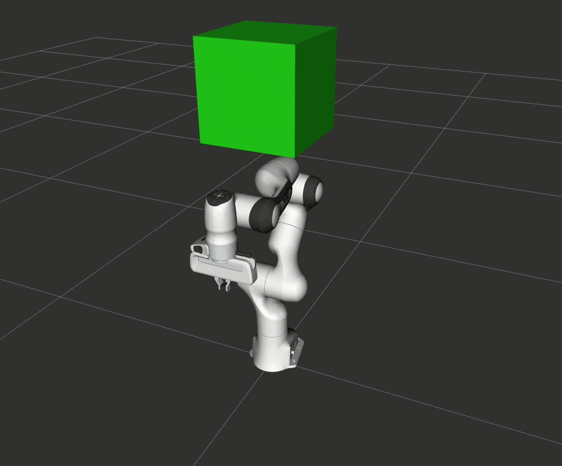

STOMP Motion Planner
====================

Stochastic Trajectory Optimization for Motion Planning (STOMP) is a probabilistic optimization framework (`Kalakrishnan et al. 2011 <https://www.researchgate.net/publication/221078155_STOMP_Stochastic_trajectory_optimization_for_motion_planning>`_).
STOMP produces smooth well-behaved collision free paths within reasonable planning times.
The approach relies on generating randomized noisy trajectories to explore the space around an initial (possibly infeasible) reference trajectory to produce a newly combined trajectory with lower cost.
Trajectory costs are computed by problem-specific cost functions that compute waypoint cost penalties for collisions, waypoint constraint violations, smoothness, and control properties.
The optimization process is run iteratively, so that the reference trajectory is continuously improved without introducing jumps.

STOMP doesn't require gradient information for its optimization algorithm which even allows including cost functions that don't support computation of derivatives (e.g. costs corresponding to constraints and motor torques).
The main advantage of STOMP is that it enables incorporating additional objective functions such as torque limits, energy and tool constraints.
Support for passing custom cost functions via MoveIt's planning plugin API is currently being investigated.

Getting Started
---------------
If you haven't already done so, make sure you've completed the steps in :doc:`Getting Started </doc/tutorials/getting_started/getting_started>`.

You should also have gone through the steps in :doc:`Visualization with MoveIt RViz Plugin </doc/tutorials/quickstart_in_rviz/quickstart_in_rviz_tutorial>`

Prerequisites
-------------
 1. A recent build of MoveIt ``main`` for your ROS 2 distribution. The STOMP library is provided as a separate ROS package for supported ROS 2 distributions and should be installed by ``rosdep``.
 2. To use STOMP with your robot it's best to start with a functional MoveIt configuration package for your robot. For testing, you can also start with the Panda robot from `moveit/panda_moveit_config <https://github.com/moveit/panda_moveit_config>`_ like described in this tutorial.

Using STOMP with Your Robot
---------------------------
**Note:** if you are following this demo using the ``panda_moveit_config`` from the `moveit/panda_moveit_config <https://github.com/moveit/panda_moveit_config>`_ repository, these steps are already done for you and you can directly launch the demo for testing STOMP in RViZ.

#. Simply add the `stomp_planning.yaml <https://github.com/moveit/moveit_resources/blob/ros2/panda_moveit_config/config/stomp_planning.yaml>`__ configuration file into the config directory of your MoveIt config package. It contains the plugin identifier, a planning pipeline adapter list, and the STOMP planning parameters. The config file should look like example below: ::

    planning_plugins:
      - stomp_moveit/StompPlanner
    request_adapters:
      - default_planning_request_adapters/ResolveConstraintFrames
      - default_planning_request_adapters/ValidateWorkspaceBounds
      - default_planning_request_adapters/CheckStartStateBounds
      - default_planning_request_adapters/CheckStartStateCollision
    response_adapters:
      - default_planning_response_adapters/AddTimeOptimalParameterization
      - default_planning_response_adapters/ValidateSolution
      - default_planning_response_adapters/DisplayMotionPath

    stomp_moveit:
      num_timesteps: 60
      num_iterations: 40
      num_iterations_after_valid: 0
      num_rollouts: 30
      max_rollouts: 30
      exponentiated_cost_sensitivity: 0.5
      control_cost_weight: 0.1
      delta_t: 0.1

#. Configure MoveIt to load the STOMP planning pipeline by adding "stomp" to your MoveItConfiguration launch statement next to "ompl" and the other planners. You can find an example for this in the `demo.launch.py <https://github.com/moveit/moveit_resources/blob/ros2/panda_moveit_config/launch/demo.launch.py#L42>`_ of the Panda config.

Running the Demo
----------------
If you have the ``panda_moveit_config`` from the `moveit/moveit_resources <https://github.com/moveit/moveit_resources>`_ repository you should be able to simply launch the demo setup and start planning with STOMP in RViZ ::

  ros2 launch moveit_resources_panda_moveit_config demo.launch.py

STOMP Parameters
----------------
STOMP's parameters are configurable using the `stomp_planning.yaml <https://github.com/moveit/moveit_resources/blob/ros2/panda_moveit_config/config/stomp_planning.yaml>`__. All parameters are defined by the `stomp_moveit.yaml <https://github.com/moveit/moveit2/blob/main/moveit_planners/stomp/res/stomp_moveit.yaml>`_ which is used as input for the `generate_parameter_library <https://github.com/PickNikRobotics/generate_parameter_library>`_. In that file you can also find more information like default values and allowable ranges:

**Optimization Parameters**:

- *num_timesteps*: the number of timesteps used for trajectories - this number directly translates to the number of waypoints considered for trajectory initialization, during planning and for the solution output.

- *num_iterations*: this is the total number of iterations that the planner can take to find a good solution while optimization.

- *num_iterations_after_valid*: the number of iterations that the planner continues to optimize after finding an already valid solution.

- *num_rollouts*: this is the number of noisy trajectories generated per iteration.

- *max_rollouts*: the combined maximum number of new and old carry-over rollouts that are considered for optimization at any iteration.

- *exponentiated_cost_sensitivity:* a factor for tweaking the exponentated costs used for probability calculation. Higher factors make STOMP optimize and converge quicker with the drawback of reduced robustness and less repeatable results.

- *control_cost_weight*: this is the factor of the control cost to be applied in the total cost calculation. STOMP attempts to minimize the sum of squared accelerations needed for assumed equal waypoint timesteps to smooth out the resulting trajectory.

- *delta_t*: assumed time change between consecutive points.

- *path_marker_topic*: Name of the topic RViZ subscribes to for optional path visualization. If it is not set, the path won't be visualized.

The provided default parameters should let STOMP perform well in most environments. However you could increase the number of timesteps or number of rollouts for STOMP to perform well under more complicated environments. This might require increasing the allowed planning time for STOMP to terminate.

Difference between plans obtained by STOMP, CHOMP, and OMPL
-----------------------------------------------------------

In this section, a distinction is made between paths obtained from STOMP, CHOMP, and OMPL.
Some of the MoveIt planners tend to produce jerky trajectories and may introduce unnecessary robot movements.
A post processing smoothing step is usually needed.
In contrast, STOMP tends to produce smooth well behaved motion plans in a short time, so there may be no need for a post processing smoothing step as required by some other motion planners.

CHOMP is an optimizing planner that optimizes a given initial naive trajectory based on covariant and functional gradient approaches.

OMPL is an open source library for sampling-based motion planning algorithms which primarily rely on random sampling and graph search.
Sampling-based algorithms are probabilistically complete: a solution will be eventually found if one exists, however non-existence of a solution cannot be reported.
These algorithms are efficient and usually find a solution quickly.

Below is a short overview of planner qualities comparing these different approaches:

- **Local Minima Handling**: STOMP can avoid local minima due to its stochastic nature. CHOMP, however, is prone to and often gets stuck in local minima, thereby failing to find an optimal solution. As per the STOMP and CHOMP papers, STOMP performs better in most cases.

- **Planning Time**: The planning times of STOMP and CHOMP are comparable, even though CHOMP requires more iterations to achieve success than STOMP. This is mainly because each iteration of STOMP requires multiple trajectory cost evaluations, but can make larger steps in a more stable fashion than the CHOMP gradient update rule. OMPL algorithms - at least the ones not optimizing the solution - tend to be quicker in general and will even take comparably less time in difficult planning scenarios while potentially compromising on qualities like path length or smoothness.

- **Parameter Tuning**: CHOMP generally requires additional parameter tuning than STOMP to obtain a successful solutions.
  OMPL does not require a lot of parameter tuning; the default parameters do a good job in most situations.

- **Obstacle Handling**: For scenes containing obstacles, STOMP often is able to successfully avoid obstacles due to its stochastic nature.
  CHOMP however generates paths which do not prefer smooth trajectories by addition of some noise (*ridge_factor*) in the cost function for the dynamical quantities of the robot (like acceleration, velocity). OMPL also generates collision free smooth paths in the presence of obstacles.
