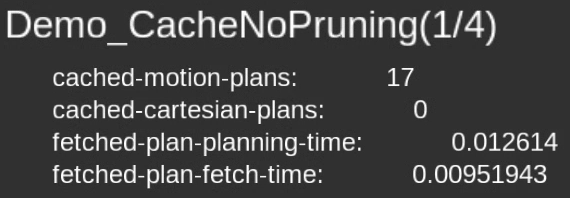
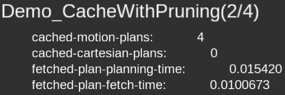
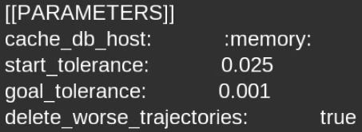
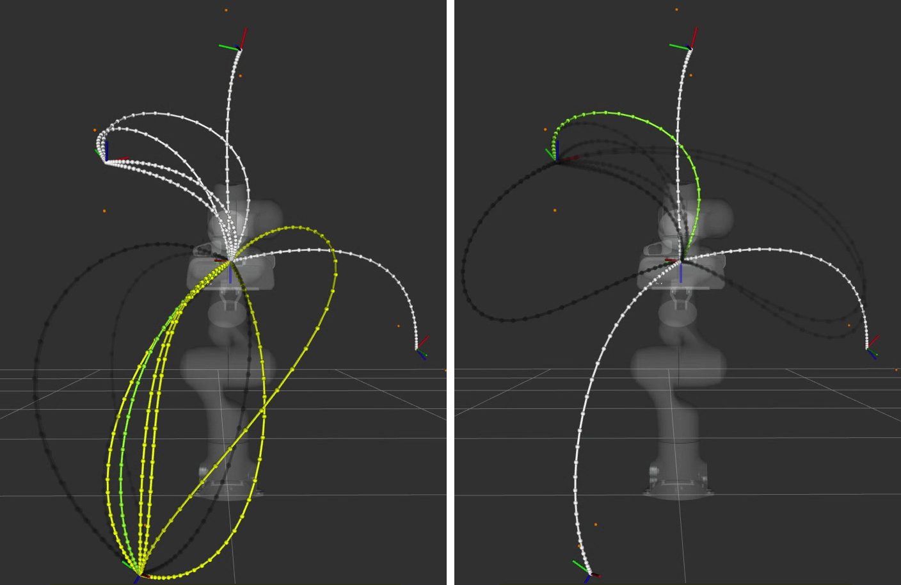
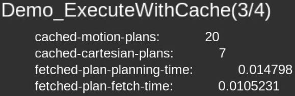
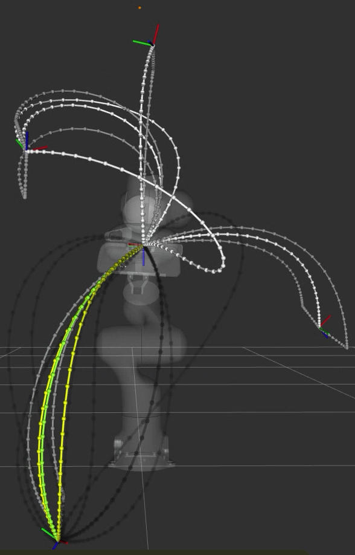
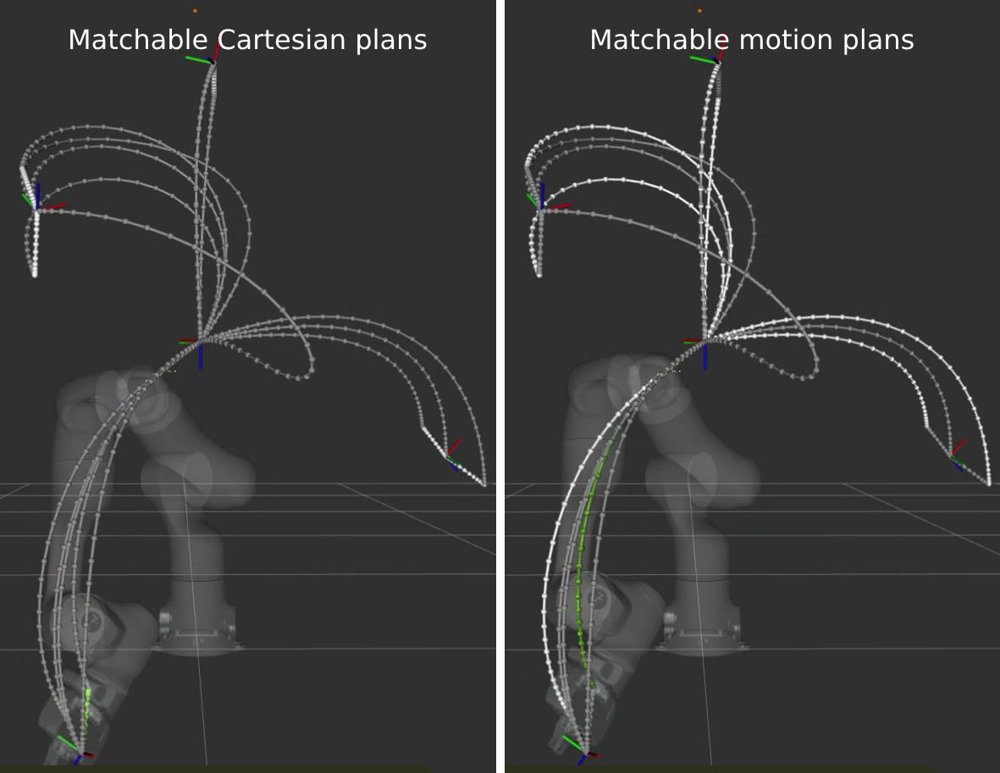
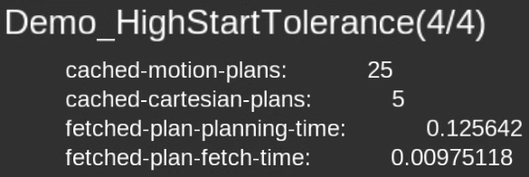
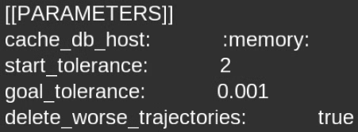
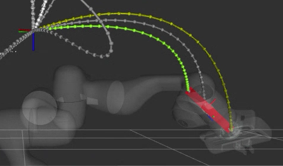

Fuzzy-Matching Trajectory Cache - Quickstart Guide
==================================================

The fuzzy-matching trajectory cache allows you to insert and fetch manipulator trajectories, keyed fuzzily on ``MotionPlanRequest`` and ``GetCartesianPath`` requests and trajectories.

The cache will work on manipulators with an arbitrary number of joints, across any number of move groups.
Furthermore, the cache supports pruning and ranking of fetched trajectories, with extension points for injecting your own feature keying, cache insert, cache prune and cache sorting logic.

.. raw:: html

    <video width="450px" controls="true" autoplay="true" loop="true">
        <source src="../../../_static/videos/trajectory_cache/01_cache_and_execute_loop.webm" type="video/webm">
        Introduction video showing the trajectory cache working.
    </video>

For more info, please see the :moveit_codedir:`package README <moveit_ros/trajectory_cache/README.md>`.
Or check out the `ROSCon 2024 Talk <https://vimeo.com/1024968990>`_ and `slides <https://roscon.ros.org/2024/talks/A_Fuzzy-Matching_Trajectory_Cache_for_MoveIt_2.pdf>`_!

.. warning::
  The cache does NOT support collision detection and some other constraints (e.g. multi-DoF joints, planning scene, constraint regions, and visibility constraints)!

  Plans will be inserted into and fetched from the cache IGNORING collision and those constraints.
  If your planning scene is expected to change significantly between cache lookups, ensure that you validate any fetched plans for collisions.

Quick Example Usage
-------------------

**PRE-REQUISITE**: The ``warehouse_plugin`` ROS parameter must be set to a `warehouse_ros <https://github.com/moveit/warehouse_ros>`_ plugin you have installed, which determines what database backend should be used for the cache.

::

  auto cache = std::make_shared<TrajectoryCache>(node);
  cache->init(/*db_host=*/":memory:", /*db_port=*/0, /*exact_match_precision=*/1e-6);

  auto default_features = TrajectoryCache::getDefaultFeatures(start_tolerance, goal_tolerance);
  std::string TrajectoryCache::getDefaultSortFeature();  // Sorts by planned execution time.

  move_group.setPoseTarget(...);
  moveit_msgs::msg::MotionPlanRequest motion_plan_req_msg;
  move_group.constructMotionPlanRequest(motion_plan_request_msg);

  auto fetched_trajectory =  // Use the cache fetch in place of planning!
      cache->fetchBestMatchingTrajectory(*move_group_interface, robot_name, motion_plan_req_msg,
                                        /*features=*/default_features,
                                        /*sort_by=*/TrajectoryCache::getDefaultSortFeature(),
                                        /*ascending=*/true);

  if (fetched_trajectory)    // Great! We got a cache hit, we can execute it.
  {
    move_group.execute(*fetched_trajectory);
  }
  else                       // Otherwise, plan... And put it for posterity!
  {
    moveit::planning_interface::MoveGroupInterface::Plan plan;
    if (move_group.plan(plan) == moveit::core::MoveItErrorCode::SUCCESS)
    {
      cache->insertTrajectory(
          *interface, robot_name, std::move(plan_req_msg), std::move(plan),
          /*cache_insert_policy=*/BestSeenExecutionTimePolicy(),
          /*prune_worse_trajectories=*/true, /*additional_features=*/{});
    }
  }

Cartesian variants of the methods in the above example exist.

For more information, please read the extensive API documentation for :cpp_api:`moveit_ros::trajectory_cache::TrajectoryCache`.

Why A Cache?
------------

A trajectory cache helps:

- Cut down on planning time
- Allows for consistent predictable behavior of used together with a stochastic planner

  - It effectively allows you to "freeze" a move

To explain this, consider that planners in MoveIt generally fall under two main camps: stochastic/probabilistic, and optimization based.
The probabilistic planners are fast, but usually non-deterministic, whereas the optimization based ones are usually slow, but deterministic.

One way to get around this is to pre-plan and manually select and label robot trajectories to "freeze" in a trajectory database to then replay by name, which avoids needing to spend time to replan, and allows you to ensure that motions are constant and repeatable.
However, this approach is not very flexible and not easily reused.

The trajectory cache improves upon this approach by allowing a user to "freeze" and store successful plans, but **also** look up those plans in a more generalizable and natural way, using the planning request itself to key the cache, effectively allowing the cache to stand in for a planning call.

Furthermore, the specific properties of this trajectory cache provides further unique benefits:

1. With fuzzy matching, "frozen" plans are much easier to look up and reuse, while simultaneously increasing the chances of a cache hit.
2. The ability to rank trajectories will, if used with a stochastic planner over sufficient runs, cause the cache to eventually converge to increasingly optimal plans.

Finally, the cache makes use of pruning to optimize fetch times, and also finds ways to "canonicalize" features of the keying request to increase chances of a cache hit.

Working Principle
-----------------
If a plan request has features (e.g., start, goal, and constraint conditions) that are "close enough" to an entry in the cache, then the cached trajectory should be reusable for that request, allowing us to skip planning.

The cache extracts these features from the planning request and plan response, storing them in the cache database.
When a new planning request is used to attempt to fetch a matching plan, the cache attempts to fuzzily match the request to pre-existing cache entries keyed on similar requests.
Any "close enough" matches are then returned as valid cache hits for plan reuse, with the definition of "close enough" depending on the type of feature that is being extracted.

For more information about how the cache works and what specific features are used to key cache entries with, please see the :moveit_codedir:`package README <moveit_ros/trajectory_cache/README.md>` and the extensive API documentation for :cpp_api:`moveit_ros::trajectory_cache::TrajectoryCache` and its related classes.

Demo
----

.. raw:: html

    <video width="700px" controls="true" autoplay="true" loop="true">
        <source src="../../../_static/videos/trajectory_cache/02_trajectory_cache_demo.webm" type="video/webm">
        Trajectory cache demo.
    </video>

(Video is 4x speed.)

This demo has four phases that can be advanced using the ``rviz_visual_tools`` dialog box, which combined, showcases the highlights of the cache's capabilities.

1. Plan and cache (no pruning)
2. Plan and cache (with pruning)
3. Fetch from cache and execute (while still planning and caching with pruning)
4. Fetch from cache and execute, except with large start tolerances

Additionally, the :codedir:`demo source code itself <how_to_guides/trajectory_cache/src/trajectory_cache_demo.cpp>` is heavily annotated with comments and tutorial notes, should you wish to inspect the code and dive deeper.

Pre-Requisites
++++++++++++++

Make sure you have built the `moveit2_tutorials <https://github.com/moveit/moveit2_tutorials>`_ package and sourced the workspace it is built in to ensure that you can run the demo.

Running the Demo
++++++++++++++++

In one terminal, start the move group:

::

  ros2 launch moveit2_tutorials trajectory_cache_move_group.launch.py

In another, launch the demo:

::

  ros2 launch moveit2_tutorials trajectory_cache_demo.launch.py

You should see something similar to the video, except with a different set of randomly generated goal poses.

Click ``next`` on the rviz window to advance the demo.

.. note::
  Sometimes a randomly generated demo goal pose is unreachable (or the ``move_group`` fails to initialize properly).
  If this happens, the demo will halt in the first phase due to a failed planning call or other issue.

  Just restart the demo, which will generate new demo goal poses, and resolve the issue.

Configuring the Demo
++++++++++++++++++++

Additionally, the demo's launch file exposes launch arguments that allows you to change many aspects of the demo.
Look at the :codedir:`demo's launch file <how_to_guides/trajectory_cache/launch/trajectory_cache_demo.launch.py>` for the full list of configurable launch arguments.

For example, you can specify a disk path for the cache to be saved to and loaded from, instead of memory:

::

  ros2 launch moveit2_tutorials trajectory_cache_demo.launch.py cache_db_host:="<some_directory>/trajectory_cache_demo.db

Then if you had specified a disk path, since the demo uses SQLite by default, you can inspect the cache database file using an `SQLite database browser <https://sqlitebrowser.org/>`_.

1. CacheNoPruning
+++++++++++++++++

The first phase of the demo shows cache insertion and fetching functionality from a single starting point to multiple goal poses, with no pruning.

The text on the top-left contains the name of the demo phase, and useful information about the state of the cache.

In this phase, we are running the planner multiple times per goal, and attempting a cache insert each time.
We also fetch and visualize all matching plans for a particular goal, and also the best matching plan.

To interpret the visualization:

- The **translucent dark grey** trajectory lines are the **planned trajectories** for the current goal
- The **white** trajectory lines are the **trajectories in the cache**
- The **yellow** trajectory lines are the **matching cached trajectories** for the start condition and planning request
- The **green** trajectory line is the **best matching cached trajectory** (in terms of execution time) for the given start condition and planning request

.. image:: images/demo_CacheNoPruning_cache_visualization.png
  :width: 450px

.. note::
  The visualization demonstrates that it is possible to fetch "matching" trajectories for a given goal, and also to rank and determine what is "best" amongst those fetched plans.

.. note::
  You may note how in the visualization that the green trajectory (the best trajectory) appears to be much more optimal than some of the other candidate plans.

  And furthermore, that most of the time, the fetch times are shorter than the planning times, even in this no-obstruction case, showing how the cache is saving the process planning time.

The default cache insert policy inserts a cache plan only if it is the best seen (in terms of execution time) so far.
This is the reason why not every planned trajectory appears to be inserted in the cache.

You should find that the number of cached plans stabilizes over time as the cache saves better and better plans over time.

Leave the demo phase to run for a while to fill up the cache, then hit ``next`` on the ``rviz_visual_tools`` dialogue box to progress the demo to the next phase, where we will prune less optimal cache entries.

2. CacheWithPruning
+++++++++++++++++++

The seconds phase of the demo shows cache insertion and fetching functionality from a single starting point to multiple goal poses, with pruning.

Cache pruning is recommended to keep the number of trajectories in the cache low, saving on cache database storage, and making cache fetches more efficient.

You should also see the ``delete_worse_trajectories`` parameter get set to ``true``.

Immediately, as plans continue to happen, you should see the cache entries get progressively pruned from the cache until eventually, the cache converges to one "best" trajectory per goal.

The reason why it takes multiple planning runs to cause the cache to converge, is because we are only attempting to insert plans that have been obtained from the current planning run.
The cache only prunes exactly matching cache entries that are worse than (by default, in terms of execution time) the current insertion candidate.
So, in order for a plan to get pruned, the planned trajectory has to be better than it.

.. note::
  If you wanted to immediately prune all worse plans, you could fetch the best plan, then re-insert it to trigger a prune that would achieve that.

Hit ``next`` on the ``rviz_visual_tools`` dialogue box to progress the demo to the next phase, where we will start execution.

3. ExecuteWithCache
+++++++++++++++++++

The third phase of the demo begins execution.

We still plan and cache, now **including** cartesian plans too.
You should expect the number of cached plans to increase over time, including cached cartesian plans.

Observe that the executed trajectory is always locked to the best matching trajectory, as indicated by the green trajectory.

Furthermore, notice that the set of matchable trajectories (indicated by white) is an even more constrained set from
This shows that the cache is partitionable and able to filter out unmatchable entries by nature of the constraints that key them.

To interpret the visualization, with the same legend as before:

- **NEW**: The **grey** trajectory lines are the **unmatchable trajectories in the cache**

Hit ``next`` on the ``rviz_visual_tools`` dialogue box to progress the demo to the next phase, where we show the cache's fuzzy matching capability, and the impact of high start tolerance.

4. HighStartTolerance
+++++++++++++++++++++

The final phase of the demo sets an inadvisably high start tolerance to showcase the cache's fuzzy matching capabilities.

We set a start tolerance of 2 (up from 0.025), which means that we allow trajectories up to 2 radians away per starting robot joint state and 2 units away per start constraint to match (for a still strict tolerance on the goals).

To interpret the visualization, with the same legend as before:

- **NEW**: The **red** lines are the **diff of robot state to the matched trajectory**

Notice that the robot, now for certain starting states, will use a different matching trajectory with a start state further away than its current one.
This diff is visualized as a thick red line.

This is because that matched trajectory would have had a shorter execution time and be deemed "best", and is now matchable because of the higher start tolerance we set.
This showcases the ability for the cache to handle fuzzy matching, even though in this case it is with an inadvisably high start tolerance, since it would cause the robot to violently "snap" to the start of the trajectory.

Best Practices
--------------

To end off this how-to-guide, here are some suggestions for how to best use the cache.

**Collisions**

Since the cache does not yet support collisions:

- Ensure the planning scene and obstacles remain static, or,
- Validate the fetched plans separately
- BONUS: Use the ``TrajectoryCache::Options::num_additional_trajectories_to_preserve_when_deleting_worse`` option to preserve multiple trajectories after pruning to hopefully store a large enough variety of plausible trajectories that avoid obstacles, then in order from best to worst, validating each

**Increasing Cache Hits**

- Move the robot to static known poses (e.g., home) before fetching
- Use the cache where repetitive, non-dynamic motion is likely to occur
- Use looser start tolerance, and stricter goal tolerance

Further Reading
---------------

Customizable Behavior
+++++++++++++++++++++

It is possible to extend the cache to key on custom user-defined features, and also to change the cache insertion, sorting, and pruning logic.
You do this by implementing the features and cache insert policy interfaces, then feeding them into the appropriate cache methods.

For example, you may decide to write your own feature extractor to key the cache, and decide when to insert or prune a cache entry on features such as:

- Minimum jerk time
- Path length
- Any other feature not supported by this package!

See:

- :moveit_codedir:`FeaturesInterface<FeatureSourceT <moveit_ros/trajectory_cache/include/moveit/trajectory_cache/features/features_interface.hpp>`
- :moveit_codedir:`CacheInsertPolicyInterface <moveit_ros/trajectory_cache/include/moveit/trajectory_cache/cache_insert_policies/cache_insert_policy_interface.hpp>`
