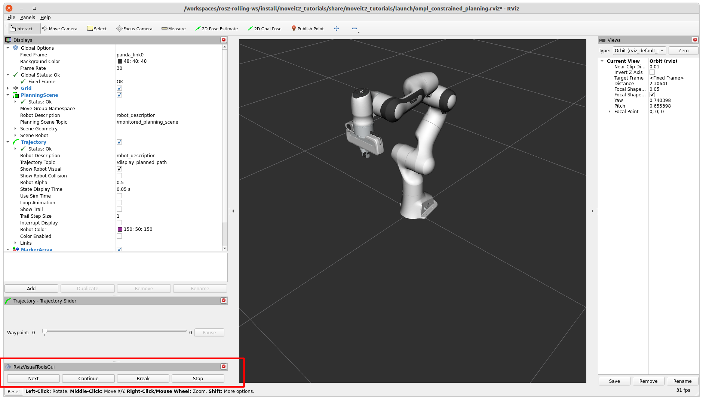

Using OMPL Constrained Planning
===============================

.. image:: ompl_constrained_planning_header.png
   :width: 600px

This tutorial shows you how to use OMPL's `Constrained planning capabilities <http://ompl.kavrakilab.org/constrainedPlanning.html>`_ from MoveIt. To illustrate the capabilities of this planner, four planning problems are solved with different types of path constraints. It will be easier to follow if you have read through the example on how to use the  :doc:`Move Group interface </doc/examples/move_group_interface/move_group_interface_tutorial>`.

When to use this Planner
^^^^^^^^^^^^^^^^^^^^^^^^

The interface currently only supports a single position or orientation constraint on any link of the robot. The planning approach provides an alternative for the `enforce_joint_model_state_space <../../examples/ompl_interface/ompl_interface_tutorial.html#enforce-planning-in-joint-space>`_ option. It is expected to be most valuable for constraints regions that have a small (or zero) volume in Cartesian space, where rejection sampling does not always work. For example, this planner can be used to constrain the robot end-effector on a plane or along a line.

How to Configure OMPL to use Constrained Planning
^^^^^^^^^^^^^^^^^^^^^^^^^^^^^^^^^^^^^^^^^^^^^^^^^

OMPL reads configurations parameters from a file called :code:`ompl_planning.yaml`. This guide adds the required parameters directly in the launch file, but they can also be set in the yaml file. This guide uses the Panda robot, for which this file can be found :moveit_resources_codedir:`here <panda_moveit_config/config/ompl_planning.yaml>`. OMPL's constrained planning will be used by default if you have exactly one position or one orientation constraint. To use the constrained state space in other scenarios, add a parameter to your robot's ``ompl_planning.yaml`` to tell OMPL to plan in a constrained state space by setting :code:`enforce_constrained_state_space` to ``true``. In addition, if the parameter `projection_evaluator <../../examples/ompl_interface/ompl_interface_tutorial.html#projection-evaluator>`_ was not yet specified, we also need to add it. The projection evaluator is used to help with discretizing the state space with high dimensionality by using projections from the state space to a low dimensional Euclidean space. You can read more about it `here <https://ompl.kavrakilab.org/projections.html>`_. In general, using the first couple joints works pretty well.

.. code-block:: yaml

   panda_arm:
      enforce_constrained_state_space: true
      projection_evaluator: joints(panda_joint1,panda_joint2)

This tutorial adds the parameters in the :codedir:`launch file <how_to_guides/using_ompl_constrained_planning/launch/ompl_constrained_planning.launch.py>`. The launch file uses ``moveit_configs_utils`` to simplify the launch file. The ``moveit_config`` is configured with the moveit_resources Panda MoveIt config. We add our OMPL parameters to the ``planning_pipelines`` with the following lines:

.. code-block:: python

    moveit_config.planning_pipelines["ompl"]["panda_arm"]["enforce_constrained_state_space"] = True
    moveit_config.planning_pipelines["ompl"]["panda_arm"]["projection_evaluator"] = "joints(panda_joint1,panda_joint2)"
    moveit_config.planning_pipelines["ompl"]["panda_arm_hand"]["enforce_constrained_state_space"] = True
    moveit_config.planning_pipelines["ompl"]["panda_arm_hand"]["projection_evaluator"] = "joints(panda_joint1,panda_joint2)"

Running the Example
^^^^^^^^^^^^^^^^^^^

Run the following command to launch the example: ::

   ros2 launch moveit2_tutorials ompl_constrained_planning.launch.py

The Panda robot should appear, with the RViz Visual Tools and the Trajectory Slider panel in the bottom-left. You should also see this text in your terminal: ::

   Waiting to continue: Press 'Next' in the RvizVisualToolsGui window to start with the box constraint example

To start the first example, click the Next button.

The first example shows a plan with box constraints. A red and green sphere should appear in RViz to show the start and goal states respectively. In addition, a grey box should appear that represents the position constraint on the link :code:`panda_link8`. If planning succeeds, you should see a preview of the trajectory that was planned. You can use the Trajectory Slider panel to inspect the trajectory.

.. raw:: html

    <video width="300px" controls="true" autoplay="true" loop="true">
        <source src="../../../_static/videos/ompl_constraints_box.webm" type="video/webm">
        OMPL constrained planning box constraint example
    </video>

The following message appears in the terminal: ::

   Waiting to continue: Press 'Next' in the RvizVisualToolsGui window to continue to the planar constraint example

After pressing Next, the next planning problem is solved. This example uses equality constraints to plan a trajectory with the end effector constrained in a plane.

.. raw:: html

    <video width="300px" controls="true" autoplay="true" loop="true">
        <source src="../../../_static/videos/ompl_constraints_plane.webm" type="video/webm">
        OMPL constrained planning plane constraint example
    </video>

Again, if planning succeeds, the trajectory is animated in RViz. Press Next again to move on to the third planning problem, using equality constraints again to plan along a line.

.. raw:: html

    <video width="300px" controls="true" autoplay="true" loop="true">
        <source src="../../../_static/videos/ompl_constraints_line.webm" type="video/webm">
        OMPL constrained planning line constraint example
    </video>

You can see the trajectory animated if planning succeeds. Finally, press Next to move to the orientation constraint example.

.. raw:: html

    <video width="300px" controls="true" autoplay="true" loop="true">
        <source src="../../../_static/videos/ompl_constraints_orientation.webm" type="video/webm">
        OMPL constrained planning orientation constraint example
    </video>

This example may take longer to plan. If planning fails, you can start at the beginning of the section to try again. Press Next to try mixed constraints.

.. raw:: html

    <video width="300px" controls="true" autoplay="true" loop="true">
        <source src="../../../_static/videos/ompl_mixed_constraints.webm" type="video/webm">
        OMPL constrained planning orientation constraint example
    </video>

Press Next to remove all markers and end the example.

How to Set Constraints
^^^^^^^^^^^^^^^^^^^^^^

This section will cover how to use position, equality, and orientation constraints using the Move Group interface. This section walks through the :codedir:`example code <how_to_guides/using_ompl_constrained_planning/src/ompl_constrained_planning_tutorial.cpp>`. Some lines have been omitted for brevity.

Be sure to add ``enforce_constrained_state_space`` and ``projection_evaluator`` to your ``ompl_planning.yaml``!

Initial Setup
-------------

First, we start off by setting up the ``MoveGroupInterface`` similarly to the :doc:`Move Group interface example page </doc/examples/move_group_interface/move_group_interface_tutorial>`. This assumes you've already set up your node.

.. code-block:: c++

   moveit::planning_interface::MoveGroupInterface move_group_interface(node, "panda_arm");

Next, we create a lambda to help us create a pose at a given relative position from the current pose.

.. code-block:: c++

   auto current_pose = move_group_interface.getCurrentPose();

   // Creates a pose at a given positional offset from the current pose
   auto get_relative_pose = [current_pose, &moveit_visual_tools](double x, double y, double z) {
      auto target_pose = current_pose;
      target_pose.pose.position.x += x;
      target_pose.pose.position.y += y;
      target_pose.pose.position.z += z;
      moveit_visual_tools.publishSphere(current_pose.pose, rviz_visual_tools::RED, 0.05);
      moveit_visual_tools.publishSphere(target_pose.pose, rviz_visual_tools::GREEN, 0.05);
      moveit_visual_tools.trigger();
      return target_pose;
   };

Now, we're ready to set up some constraints, starting with a box constraint.

Box Constraints
---------------

We start by using the lambda to create a target pose offset from the current pose. This pose should be within the box that we make. In this example, we make a box of size ``(0.1, 0.4, 0.4)``, so the target pose should be within our constraint region.

.. code-block:: c++

   auto target_pose = get_relative_pose(0.0, 0.3, -0.3);

Now, we set up the constraints. A box is a ``PositionConstraint`` - see the full message definition ::moveit_msgs_codedir:`here <msg/PositionConstraint.msg>`. We set the ``frame_id`` in the header, as well as the ``link_name`` of the link to be constrained (in this case, the end effector). We then create a box using ``shape_msgs`` and set its dimensions. We then place that box into ``box_constraint``.

.. code-block:: c++

   // Let's try the simple box constraints first!
   moveit_msgs::msg::PositionConstraint box_constraint;
   box_constraint.header.frame_id = move_group_interface.getPoseReferenceFrame();
   box_constraint.link_name = move_group_interface.getEndEffectorLink();
   shape_msgs::msg::SolidPrimitive box;
   box.type = shape_msgs::msg::SolidPrimitive::BOX;
   box.dimensions = { 0.1, 0.4, 0.4 };
   box_constraint.constraint_region.primitives.emplace_back(box);

Next, we set the pose of our box constraint. This is done by using ``geometry_msgs``. We set the position and orientation of the box, and add the pose to ``box_constraint``.

.. code-block:: c++

   geometry_msgs::msg::Pose box_pose;
   box_pose.position.x = current_pose.pose.position.x;
   box_pose.position.y = 0.15;
   box_pose.position.z = 0.45;
   box_pose.orientation.w = 1.0;
   box_constraint.constraint_region.primitive_poses.emplace_back(box_pose);
   box_constraint.weight = 1.0;

Finally, we create a generic ``Constraints`` message and add our ``box_constraint`` to the ``position_constraints``.

.. code-block:: c++

   moveit_msgs::msg::Constraints box_constraints;
   box_constraints.position_constraints.emplace_back(box_constraint);

Now that we've created our constraint, set the path constraints via the Move Group interface and plan. It's helpful to increase the default planning time, as planning with constraints can be slower.

.. code-block:: c++

   moveit::planning_interface::MoveGroupInterface::Plan plan;
   move_group_interface.setPathConstraints(box_constraints);
   move_group_interface.setPoseTarget(target_pose);
   move_group_interface.setPlanningTime(10.0);
   move_group_interface.plan(plan);

Equality Constraints
--------------------

We can plan with the end-effector constrained to a plane or a line using equality constraints. First, we'll cover the plane case.

We need to create a pose goal that lies in this plane. The plane is tilted by 45 degrees, so moving an equal amount in the y and z direction will be on the plane. Be sure that both the goal and the start state satisfy the path constraints, or planning will always fail.

.. code-block:: c++

  target_pose = get_relative_pose(0.0, 0.3, -0.3);

We create a plane perpendicular to the y-axis and tilt it by 45 degrees. We create a plane by making a box and setting one dimension ``0.0005``. This is an important number that we will cover shortly.

.. code-block:: c++

  moveit_msgs::msg::PositionConstraint plane_constraint;
  plane_constraint.header.frame_id = move_group_interface.getPoseReferenceFrame();
  plane_constraint.link_name = move_group_interface.getEndEffectorLink();
  shape_msgs::msg::SolidPrimitive plane;
  plane.type = shape_msgs::msg::SolidPrimitive::BOX;
  plane.dimensions = { 1.0, 0.0005, 1.0 };
  plane_constraint.constraint_region.primitives.emplace_back(plane);

  geometry_msgs::msg::Pose plane_pose;
  plane_pose.position.x = current_pose.pose.position.x;
  plane_pose.position.y = current_pose.pose.position.y;
  plane_pose.position.z = current_pose.pose.position.z;
  plane_pose.orientation.x = sin(M_PI_4 / 2);
  plane_pose.orientation.y = 0.0;
  plane_pose.orientation.z = 0.0;
  plane_pose.orientation.w = cos(M_PI_4 / 2);
  plane_constraint.constraint_region.primitive_poses.emplace_back(plane_pose);
  plane_constraint.weight = 1.0;

Solving the problem using equality constraints is a bit more complicated. We need to tell the planner explicitly that we want to use equality constraints for the small dimensions. This is achieved by setting the name of the constraint to :code:`"use_equality_constraints"`. In addition, any dimension of the box below a threshold of :code:`0.001` will be considered an equality constraint. However, if we make it too small, the box will be thinner that the tolerance used by OMPL to evaluate constraints (:code:`1e-4` by default). MoveIt will use the stricter tolerance (the box width) to check the constraints, and many states will appear invalid. That's where the magic number :code:`0.0005` comes from, it is between :code:`0.00001` and :code:`0.001`.

.. code-block:: c++

  moveit_msgs::msg::Constraints plane_constraints;
  plane_constraints.position_constraints.emplace_back(plane_constraint);
  plane_constraints.name = "use_equality_constraints";
  move_group_interface.setPathConstraints(plane_constraints);

As before, set the target and plan.

.. code-block:: c++

  move_group_interface.setPoseTarget(target_pose);
  move_group_interface.setPlanningTime(10.0);
  move_group_interface.plan(plan);

Building on the previous constraint, we can make it a line by also reducing the dimension of the box in the x-direction.

.. code-block:: c++

  moveit_msgs::msg::PositionConstraint line_constraint;
  line_constraint.header.frame_id = move_group_interface.getPoseReferenceFrame();
  line_constraint.link_name = move_group_interface.getEndEffectorLink();
  shape_msgs::msg::SolidPrimitive line;
  line.type = shape_msgs::msg::SolidPrimitive::BOX;
  line.dimensions = { 0.0005, 0.0005, 1.0 };
  line_constraint.constraint_region.primitives.emplace_back(line);

Orientation Constraints
-----------------------

We can place constraints on orientation. We set the target pose to be the other side of the robot for a more drastic move as we are no longer constrained by position.

.. code-block:: c++

  target_pose = get_relative_pose(-0.6, 0.1, 0);

We create an ``OrientationConstraint`` instead of a ``Position Constraint``, but similarly to before, we set the ``header.frame_id`` and the ``link_name``.

.. code-block:: c++

  moveit_msgs::msg::OrientationConstraint orientation_constraint;
  orientation_constraint.header.frame_id = move_group_interface.getPoseReferenceFrame();
  orientation_constraint.link_name = move_group_interface.getEndEffectorLink();

We then can use a ``geometry_msgs::msg::Quaternion`` to set the orientation constraint, or in this case, we just constrain the orientation to not change from ``current_pose``.

.. code-block:: c++

  orientation_constraint.orientation = current_pose.pose.orientation;
  orientation_constraint.absolute_x_axis_tolerance = 0.4;
  orientation_constraint.absolute_y_axis_tolerance = 0.4;
  orientation_constraint.absolute_z_axis_tolerance = 0.4;
  orientation_constraint.weight = 1.0;

Similarly to the position constraints, we need to use a generic ``Constraints`` message, but this time we add it to the ``orientation_constraints``.

.. code-block:: c++

  moveit_msgs::msg::Constraints orientation_constraints;
  orientation_constraints.orientation_constraints.emplace_back(orientation_constraint);

Set up the planning problem as before and plan.

.. code-block:: c++

  move_group_interface.setPathConstraints(orientation_constraints);
  move_group_interface.setPoseTarget(target_pose);
  move_group_interface.setPlanningTime(10.0);
  move_group_interface.plan(plan);

Mixed Constraints
-----------------

Finally, we can set both a position and an orientation constraint. We will use the same target pose that we used for the orientation constraint.

.. code-block:: c++

     target_pose = get_relative_pose(-0.6, 0.1, 0);

We will also reuse our orientation constraint - but this time, the original box constraint won't work as the target pose is outside of our original box. Let's modify the box pose and dimensions such that the goal pose is reachable. Be aware that having a both a position and orientation constraint can drastically shrink the reachable area - the target pose not only needs to be within the box constraint as mentioned, but needs to be reachable while satisfying the orientation constraint, which is more difficult to visualize.

.. code-block:: c++

  box.dimensions = { 1.0, 0.6, 1.0 };
  box_constraint.constraint_region.primitives[0] = box;

  box_pose.position.x = 0;
  box_pose.position.y = -0.1;
  box_pose.position.z = current_pose.pose.position.z;
  box_constraint.constraint_region.primitive_poses[0] = box_pose;
  box_constraint.weight = 1.0;

As before, we create a generalized constraint message, this time adding both our position and orientation constraint.

.. code-block:: c++

  moveit_msgs::msg::Constraints mixed_constraints;
  mixed_constraints.position_constraints.emplace_back(box_constraint);
  mixed_constraints.orientation_constraints.emplace_back(orientation_constraint);

  move_group_interface.setPathConstraints(mixed_constraints);
  move_group_interface.setPoseTarget(target_pose);
  move_group_interface.setPlanningTime(10.0);
  move_group_interface.plan(plan);
