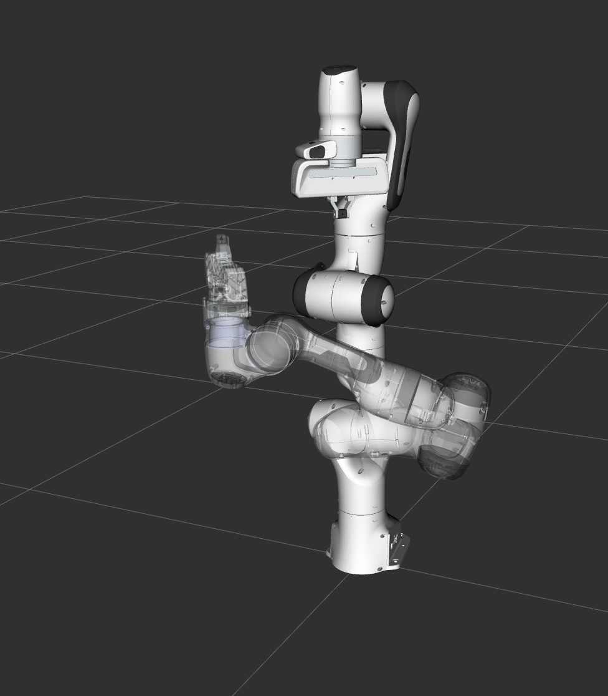

Motion Planning API
==================================
.. image:: motion_planning_api_tutorial_robot_move_arm_1st.png
   :width: 700px

In MoveIt, the motion planners are loaded using a plugin infrastructure. This
allows MoveIt to load motion planners at runtime. In this example, we will
run through the C++ code required to do this.

Getting Started
---------------
If you haven't already done so, make sure you've completed the steps in `Getting Started <../getting_started/getting_started.html>`_.

This tutoral has made use of **xterm** and a simple prompter to help the user progress through each demo step.
To install xterm please run the following command: ::

   sudo apt-get install -y xterm

Running the Demo
----------------
Open two shells. In the first shell start RViz and wait for everything to finish loading: ::

  ros2 launch moveit_resources_panda_moveit_config demo.launch.py

In the second shell, run the launch file: ::

  ros2 launch moveit2_tutorials motion_planning_api_tutorial.launch.py

Expected Output
---------------
In RViz, we should be able to see four trajectories being replayed eventually:

 1. The robot moves its arm to the first pose goal,

    |A|

 2. The robot moves its arm to the joint goal,

    |B|

 3. The robot moves its arm back to the original pose goal,
 4. The robot moves its arm to a new pose goal while maintaining the end-effector level.

    |C|

.. |A| image:: motion_planning_api_tutorial_robot_move_arm_1st.png
               :width: 200px
.. |B| image:: motion_planning_api_tutorial_robot_move_arm_2nd.png
               :width: 200px

The Entire Code
---------------
The entire code can be seen :codedir:`here in the moveit_tutorials GitHub project<motion_planning_api>`.

.. tutorial-formatter:: ./src/motion_planning_api_tutorial.cpp

The Launch File
---------------
The entire launch file is :codedir:`here <motion_planning_api/launch/motion_planning_api_tutorial.launch>` on GitHub. All the code in this tutorial can be compiled and run from the moveit_tutorials package.
