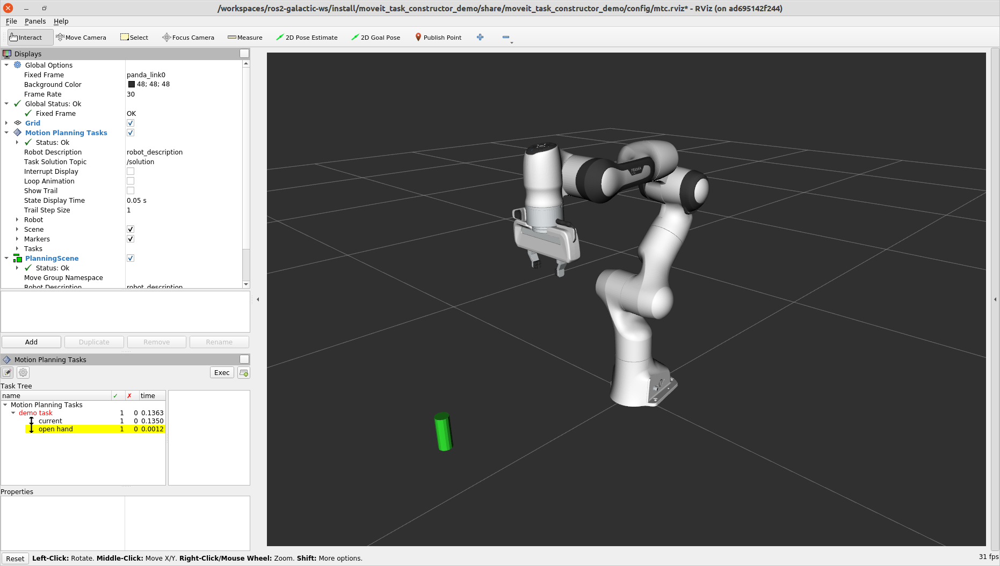

Pick and Place with MoveIt Task Constructor
===========================================
.. raw:: html

    <video width="700px" controls="true" autoplay="true" loop="true">
        <source src="../../../_static/videos/mtc-demo.webm" type="video/webm">
        MoveIt Task Constructor Pick and Place example
    </video>

This tutorial will walk you through creating a package that plans a pick and place operation using `MoveIt Task Constructor <https://github.com/ros-planning/moveit_task_constructor/tree/ros2/>`_. MoveIt Task Constructor provides a way to plan for tasks that consist of multiple different subtasks (known as stages). If you just want to run the tutorial, you can follow the :doc:`Docker Guide </doc/how_to_guides/how_to_setup_docker_containers_in_ubuntu>` to start a container with the completed tutorial. This tutorial is intended for those who have a basic understanding of MoveIt and the MoveIt Task Constructor :ref:`concepts <moveit_task_constructor_concepts>`. To learn more about these, read the  :doc:`MoveIt examples </doc/examples/examples>`, including the example page for :doc:`MoveIt Task Constructor </doc/examples/moveit_task_constructor/moveit_task_constructor_tutorial>`.

Getting Started
---------------
If you haven't already done so, make sure you've completed the steps in :doc:`Getting Started </doc/tutorials/getting_started/getting_started>`.

Download MoveIt Task Constructor
^^^^^^^^^^^^^^^^^^^^^^^^^^^^^^^^

Move into your colcon workspace and pull the MoveIt Task Constructor source: ::

    cd ~/ws_moveit2/src
    git clone https://github.com/ros-planning/moveit_task_constructor.git -b humble

Note: If you are using ROS 2 Humble, you should instead clone the ``humble`` branch of the repository: ::

    git clone https://github.com/ros-planning/moveit_task_constructor.git -b humble

Create a New Package
^^^^^^^^^^^^^^^^^^^^

Create a new package with the following command: ::

    ros2 pkg create --build-type ament_cmake --node-name mtc_tutorial mtc_tutorial

This will create a new folder called ``mtc_tutorial`` with a hello world example in ``src/mtc_node``. Next, add the dependencies to ``package.xml``. It should look similar to this: ::

    <?xml version="1.0"?>
    <?xml-model href="http://download.ros.org/schema/package_format3.xsd" schematypens="http://www.w3.org/2001/XMLSchema"?>
    <package format="3">
    <name>mtc_tutorial</name>
    <version>0.0.0</version>
    <description>TODO: Package description</description>
    <maintainer email="youremail@domain.com">user</maintainer>
    <license>TODO: License declaration</license>

    <buildtool_depend>ament_cmake</buildtool_depend>

    <depend>moveit_task_constructor_core</depend>
    <depend>rclcpp</depend>

    <test_depend>ament_lint_auto</test_depend>
    <test_depend>ament_lint_common</test_depend>

    <export>
        <build_type>ament_cmake</build_type>
    </export>
    </package>

Also, add the dependencies to ``CMakeLists.txt``. The file should look similar to this: ::

    cmake_minimum_required(VERSION 3.8)
    project(mtc_tutorial)

    if(CMAKE_COMPILER_IS_GNUCXX OR CMAKE_CXX_COMPILER_ID MATCHES "Clang")
    add_compile_options(-Wall -Wextra -Wpedantic)
    endif()

    # find dependencies
    find_package(ament_cmake REQUIRED)
    find_package(moveit_task_constructor_core REQUIRED)
    find_package(rclcpp REQUIRED)
    # uncomment the following section in order to fill in
    # further dependencies manually.
    # find_package(<dependency> REQUIRED)

    add_executable(mtc_tutorial src/mtc_tutorial.cpp)
    ament_target_dependencies(mtc_tutorial moveit_task_constructor_core rclcpp)
    target_include_directories(mtc_tutorial PUBLIC
    $<BUILD_INTERFACE:${CMAKE_CURRENT_SOURCE_DIR}/include>
    $<INSTALL_INTERFACE:include>)
    target_compile_features(mtc_tutorial PUBLIC c_std_99 cxx_std_17)  # Require C99 and C++17

    install(TARGETS mtc_tutorial
    DESTINATION lib/${PROJECT_NAME})

    if(BUILD_TESTING)
    find_package(ament_lint_auto REQUIRED)
    # the following line skips the linter which checks for copyrights
    # uncomment the line when a copyright and license is not present in all source files
    #set(ament_cmake_copyright_FOUND TRUE)
    # the following line skips cpplint (only works in a git repo)
    # uncomment the line when this package is not in a git repo
    #set(ament_cmake_cpplint_FOUND TRUE)
    ament_lint_auto_find_test_dependencies()
    endif()

    ament_package()

Setting up a Project with MoveIt Task Constructor
-------------------------------------------------

This section walks through the code required to build a minimal task using MoveIt Task Constructor.

The Code
^^^^^^^^

Open ``mtc_tutorial.cpp`` in your editor of choice, and paste in the following code.

.. code-block:: c++

    #include <rclcpp/rclcpp.hpp>
    #include <moveit/planning_scene/planning_scene.h>
    #include <moveit/planning_scene_interface/planning_scene_interface.h>
    #include <moveit/task_constructor/task.h>
    #include <moveit/task_constructor/solvers.h>
    #include <moveit/task_constructor/stages.h>
    #if __has_include(<tf2_geometry_msgs/tf2_geometry_msgs.hpp>)
    #include <tf2_geometry_msgs/tf2_geometry_msgs.hpp>
    #else
    #include <tf2_geometry_msgs/tf2_geometry_msgs.h>
    #endif
    #if __has_include(<tf2_eigen/tf2_eigen.hpp>)
    #include <tf2_eigen/tf2_eigen.hpp>
    #else
    #include <tf2_eigen/tf2_eigen.h>
    #endif

    static const rclcpp::Logger LOGGER = rclcpp::get_logger("mtc_tutorial");
    namespace mtc = moveit::task_constructor;

    class MTCTaskNode
    {
    public:
      MTCTaskNode(const rclcpp::NodeOptions& options);

      rclcpp::node_interfaces::NodeBaseInterface::SharedPtr getNodeBaseInterface();

      void doTask();

      void setupPlanningScene();

    private:
      // Compose an MTC task from a series of stages.
      mtc::Task createTask();
      mtc::Task task_;
      rclcpp::Node::SharedPtr node_;
    };

    rclcpp::node_interfaces::NodeBaseInterface::SharedPtr MTCTaskNode::getNodeBaseInterface()
    {
      return node_->get_node_base_interface();
    }

    MTCTaskNode::MTCTaskNode(const rclcpp::NodeOptions& options)
      : node_{ std::make_shared<rclcpp::Node>("mtc_node", options) }
    {
    }

    void MTCTaskNode::setupPlanningScene()
    {
      moveit_msgs::msg::CollisionObject object;
      object.id = "object";
      object.header.frame_id = "world";
      object.primitives.resize(1);
      object.primitives[0].type = shape_msgs::msg::SolidPrimitive::CYLINDER;
      object.primitives[0].dimensions = { 0.1, 0.02 };

      geometry_msgs::msg::Pose pose;
      pose.position.x = 0.5;
      pose.position.y = -0.25;
      pose.orientation.w = 1.0;
      object.pose = pose;

      moveit::planning_interface::PlanningSceneInterface psi;
      psi.applyCollisionObject(object);
    }

    void MTCTaskNode::doTask()
    {
      task_ = createTask();

      try
      {
        task_.init();
      }
      catch (mtc::InitStageException& e)
      {
        RCLCPP_ERROR_STREAM(LOGGER, e);
        return;
      }

      if (!task_.plan(5))
      {
        RCLCPP_ERROR_STREAM(LOGGER, "Task planning failed");
        return;
      }
      task_.introspection().publishSolution(*task_.solutions().front());

      auto result = task_.execute(*task_.solutions().front());
      if (result.val != moveit_msgs::msg::MoveItErrorCodes::SUCCESS)
      {
        RCLCPP_ERROR_STREAM(LOGGER, "Task execution failed");
        return;
      }

      return;
    }

    mtc::Task MTCTaskNode::createTask()
    {
      mtc::Task task;
      task.stages()->setName("demo task");
      task.loadRobotModel(node_);

      const auto& arm_group_name = "panda_arm";
      const auto& hand_group_name = "hand";
      const auto& hand_frame = "panda_hand";

      // Set task properties
      task.setProperty("group", arm_group_name);
      task.setProperty("eef", hand_group_name);
      task.setProperty("ik_frame", hand_frame);

    // Disable warnings for this line, as it's a variable that's set but not used in this example
    #pragma GCC diagnostic push
    #pragma GCC diagnostic ignored "-Wunused-but-set-variable"
      mtc::Stage* current_state_ptr = nullptr;  // Forward current_state on to grasp pose generator
    #pragma GCC diagnostic pop

      auto stage_state_current = std::make_unique<mtc::stages::CurrentState>("current");
      current_state_ptr = stage_state_current.get();
      task.add(std::move(stage_state_current));

      auto sampling_planner = std::make_shared<mtc::solvers::PipelinePlanner>(node_);
      auto interpolation_planner = std::make_shared<mtc::solvers::JointInterpolationPlanner>();

      auto cartesian_planner = std::make_shared<mtc::solvers::CartesianPath>();
      cartesian_planner->setMaxVelocityScalingFactor(1.0);
      cartesian_planner->setMaxAccelerationScalingFactor(1.0);
      cartesian_planner->setStepSize(.01);

      auto stage_open_hand =
          std::make_unique<mtc::stages::MoveTo>("open hand", interpolation_planner);
      stage_open_hand->setGroup(hand_group_name);
      stage_open_hand->setGoal("open");
      task.add(std::move(stage_open_hand));

      return task;
    }

    int main(int argc, char** argv)
    {
      rclcpp::init(argc, argv);

      rclcpp::NodeOptions options;
      options.automatically_declare_parameters_from_overrides(true);

      auto mtc_task_node = std::make_shared<MTCTaskNode>(options);
      rclcpp::executors::MultiThreadedExecutor executor;

      auto spin_thread = std::make_unique<std::thread>([&executor, &mtc_task_node]() {
        executor.add_node(mtc_task_node->getNodeBaseInterface());
        executor.spin();
        executor.remove_node(mtc_task_node->getNodeBaseInterface());
      });

      mtc_task_node->setupPlanningScene();
      mtc_task_node->doTask();

      spin_thread->join();
      rclcpp::shutdown();
      return 0;
    }

Code Breakdown
^^^^^^^^^^^^^^

The top of the code includes the ROS and MoveIt Libraries that this package uses.

 * ``rclcpp/rclcpp.hpp`` includes core ROS2 functionality
 * ``moveit/planning_scene/planning_scene.h`` and ``moveit/planning_scene_interface/planning_scene_interface.h`` includes functionality to interface with the robot model and collision objects
 * ``moveit/task_constructor/task.h``, ``moveit/task_constructor/solvers.h``, and ``moveit/task_constructor/stages.h`` include different components of MoveIt Task Constructor that are used in the example
 * ``tf2_geometry_msgs/tf2_geometry_msgs.hpp`` and ``tf2_eigen/tf2_eigen.hpp`` won't be used in this initial example, but they will be used for pose generation when we add more stages to the MoveIt Task Constructor task.

The next line gets a logger for your new node. We also create a namespace alias for ``moveit::task_constructor`` for convenience.

.. code-block:: c++

    #include <rclcpp/rclcpp.hpp>
    #include <moveit/planning_scene/planning_scene.h>
    #include <moveit/planning_scene_interface/planning_scene_interface.h>
    #include <moveit/task_constructor/task.h>
    #include <moveit/task_constructor/solvers.h>
    #include <moveit/task_constructor/stages.h>
    #if __has_include(<tf2_geometry_msgs/tf2_geometry_msgs.hpp>)
    #include <tf2_geometry_msgs/tf2_geometry_msgs.hpp>
    #else
    #include <tf2_geometry_msgs/tf2_geometry_msgs.h>
    #endif
    #if __has_include(<tf2_eigen/tf2_eigen.hpp>)
    #include <tf2_eigen/tf2_eigen.hpp>
    #else
    #include <tf2_eigen/tf2_eigen.h>
    #endif

    static const rclcpp::Logger LOGGER = rclcpp::get_logger("mtc_tutorial");
    namespace mtc = moveit::task_constructor;

We start by defining a class that will contain the main MoveIt Task Constructor functionality.  We also declare the MoveIt Task Constructor task object as a member variable for our class: this isn't strictly necessary for a given application, but it helps save the task for later visualization purposes. We will explore each function individually below.

.. code-block:: c++

    class MTCTaskNode
    {
    public:
      MTCTaskNode(const rclcpp::NodeOptions& options);

      rclcpp::node_interfaces::NodeBaseInterface::SharedPtr getNodeBaseInterface();

      void doTask();

      void setupPlanningScene();

    private:
      // Compose an MTC task from a series of stages.
      mtc::Task createTask();
      mtc::Task task_;
      rclcpp::Node::SharedPtr node_;
    };

These lines define a getter function to get the node base interface, which will be used for the executor later.

.. code-block:: c++

    rclcpp::node_interfaces::NodeBaseInterface::SharedPtr MTCTaskNode::getNodeBaseInterface()
    {
      return node_->get_node_base_interface();
    }

These next lines initialize the node with specified options.

.. code-block:: c++

    MTCTaskNode::MTCTaskNode(const rclcpp::NodeOptions& options)
      : node_{ std::make_shared<rclcpp::Node>("mtc_node", options) }
    {
    }

This class method is used to set up the planning scene that is used in the example. It creates a cylinder with dimensions specified by ``object.primitives[0].dimensions`` and position specified by ``pose.position.z`` and ``pose.position.x``. You can try changing these numbers to resize and move the cylinder around. If you move the cylinder out of the robot's reach, planning will fail.

.. code-block:: c++

    void MTCTaskNode::setupPlanningScene()
    {
      moveit_msgs::msg::CollisionObject object;
      object.id = "object";
      object.header.frame_id = "world";
      object.primitives.resize(1);
      object.primitives[0].type = shape_msgs::msg::SolidPrimitive::CYLINDER;
      object.primitives[0].dimensions = { 0.1, 0.02 };

      geometry_msgs::msg::Pose pose;
      pose.position.x = 0.5;
      pose.position.y = -0.25;
      object.pose = pose;

      moveit::planning_interface::PlanningSceneInterface psi;
      psi.applyCollisionObject(object);
    }

This function interfaces with the MoveIt Task Constructor task object. It first creates a task, which includes setting some properties and adding stages. This will be discussed further in the ``createTask`` function definition. Next, ``task.init()`` initializes the task and ``task.plan(5)`` generates a plan, stopping after 5 successful plans are found. The next line publishes the solution to be visualized in RViz - this line can be removed if you don't care for visualization. Finally, ``task.execute()`` executes the plan. Execution occurs via an action server interface with the RViz plugin.

.. code-block:: c++

    void MTCTaskNode::doTask()
    {
      task_ = createTask();

      try
      {
        task_.init();
      }
      catch (mtc::InitStageException& e)
      {
        RCLCPP_ERROR_STREAM(LOGGER, e);
        return;
      }

      if (!task_.plan(5))
      {
        RCLCPP_ERROR_STREAM(LOGGER, "Task planning failed");
        return;
      }
      task_.introspection().publishSolution(*task_.solutions().front());

      auto result = task_.execute(*task_.solutions().front());
      if (result.val != moveit_msgs::msg::MoveItErrorCodes::SUCCESS)
      {
        RCLCPP_ERROR_STREAM(LOGGER, "Task execution failed");
        return;
      }

      return;
    }

As mentioned above, this function creates a MoveIt Task Constructor object and sets some initial properties. In this case, we set the task name to "demo_task", load the robot model, define the names of some useful frames, and set those frame names as properties of the task with ``task.setProperty(property_name, value)``. The next few code blocks will fill out this function body.

.. code-block:: c++

    mtc::Task MTCTaskNode::createTask()
    {
      moveit::task_constructor::Task task;
      task.stages()->setName("demo task");
      task.loadRobotModel(node_);

      const auto& arm_group_name = "panda_arm";
      const auto& hand_group_name = "hand";
      const auto& hand_frame = "panda_hand";

      // Set task properties
      task.setProperty("group", arm_group_name);
      task.setProperty("eef", hand_group_name);
      task.setProperty("ik_frame", hand_frame);

Now, we add an example stage to the node. The first line sets ``current_state_ptr`` to ``nullptr``; this creates a pointer to a stage such that we can re-use stage information in specific scenarios. This line is not used at this moment, but will be used later when more stages are added to the task. Next, we make a ``current_state`` stage (a generator stage) and add it to our task - this starts the robot off in its current state. Now that we've created the ``CurrentState`` stage, we save a pointer to it in the ``current_state_ptr`` for later use.

.. code-block:: c++

      mtc::Stage* current_state_ptr = nullptr;  // Forward current_state on to grasp pose generator
      auto stage_state_current = std::make_unique<mtc::stages::CurrentState>("current");
      current_state_ptr = stage_state_current.get();
      task.add(std::move(stage_state_current));

In order to plan any robot motions, we need to specify a solver. MoveIt Task Constructor has three options for solvers:

 * ``PipelinePlanner`` uses MoveIt's planning pipeline, which typically defaults to OMPL.
 * ``CartesianPath`` is used to move the end effector in a straight line in Cartesian space.
 * ``JointInterpolation`` is a simple planner that interpolates between the start and goal joint states. It is typically used for simple motions as it computes quickly but doesn't support complex motions.

We also set some properties specific for to the Cartesian planner.

.. code-block:: c++

      auto sampling_planner = std::make_shared<mtc::solvers::PipelinePlanner>(node_);
      auto interpolation_planner = std::make_shared<mtc::solvers::JointInterpolationPlanner>();

      auto cartesian_planner = std::make_shared<mtc::solvers::CartesianPath>();
      cartesian_planner->setMaxVelocityScalingFactor(1.0);
      cartesian_planner->setMaxAccelerationScalingFactor(1.0);
      cartesian_planner->setStepSize(.01);

Now that we added in the planners, we can add a stage that will move the robot. The following lines use a ``MoveTo`` stage (a propagator stage). Since opening the hand is a relatively simple movement, we can use the joint interpolation planner. This stage plans a move to the "open hand" pose, which is a named pose defined in the :moveit_resources_codedir:`SRDF<panda_moveit_config/config/panda.srdf>` for the panda robot. We return the task and finish with the createTask() function.

.. code-block:: c++

      auto stage_open_hand =
          std::make_unique<mtc::stages::MoveTo>("open hand", interpolation_planner);
      stage_open_hand->setGroup(hand_group_name);
      stage_open_hand->setGoal("open");
      task.add(std::move(stage_open_hand));

      return task;
    }

Finally, we have ``main``: the following lines create a node using the class defined above, and calls the class methods to set up and execute a basic MTC task. In this example, we do not cancel the executor once the task has finished executing to keep the node alive to inspect the solutions in RViz.

.. code-block:: c++

    int main(int argc, char** argv)
    {
      rclcpp::init(argc, argv);

      rclcpp::NodeOptions options;
      options.automatically_declare_parameters_from_overrides(true);

      auto mtc_task_node = std::make_shared<MTCTaskNode>(options);
      rclcpp::executors::MultiThreadedExecutor executor;

      auto spin_thread = std::make_unique<std::thread>([&executor, &mtc_task_node]() {
        executor.add_node(mtc_task_node->getNodeBaseInterface());
        executor.spin();
        executor.remove_node(mtc_task_node->getNodeBaseInterface());
      });

      mtc_task_node->setupPlanningScene();
      mtc_task_node->doTask();

      spin_thread->join();
      rclcpp::shutdown();
      return 0;
    }

Running the Demo
----------------

Launch files
^^^^^^^^^^^^

We will need a launch file to launch ``move_group``, ``ros2_control``, ``static_tf``, ``robot_state_publisher``, and ``rviz``. :codedir:`Here <tutorials/pick_and_place_with_moveit_task_constructor/launch/mtc_demo.launch.py>` is the launch file we use in the tutorials package. Put this in the launch directory of your package.

To run the MoveIt Task Constructor node, we need a second launch file to start the ``mtc_tutorial`` executable with the proper parameters. Either load your URDF, SRDF, and OMPL parameters, or use MoveIt Configs Utils to do so. Your launch file should look something like this:

.. code-block:: python

    from launch import LaunchDescription
    from launch_ros.actions import Node
    from moveit_configs_utils import MoveItConfigsBuilder

    def generate_launch_description():
        moveit_config = MoveItConfigsBuilder("moveit_resources_panda").to_dict()

        # MTC Demo node
        pick_place_demo = Node(
            package="mtc_tutorial",
            executable="mtc_tutorial",
            output="screen",
            parameters=[
                moveit_config,
            ],
        )

        return LaunchDescription([pick_place_demo])

Save this file as ``pick_place_demo.launch.py`` in your package's launch directory. Make sure to add the following line to your ``CMakeLists.txt`` so that the launch files are properly installed. ::

   install(DIRECTORY launch DESTINATION share/${PROJECT_NAME})

Now build and source your colcon workspace. ::

    cd ~/ws_moveit2
    colcon build --mixin release
    source ~/ws_moveit2/install/setup.bash

Start by launching your first launch file. If you want to use the one provided by the tutorials: ::

    ros2 launch moveit2_tutorials mtc_demo.launch.py

RViz should load. If you're using your own launch file, before we can see anything, we will need to configure RViz. If you're using the launch file from the tutorials package, this will already be configured for you.

RViz Configuration
^^^^^^^^^^^^^^^^^^

In order to see your robot and the MoveIt Task Constructor solutions in RViz, we'll have to make some changes to the RViz configuration. First, start RViz. The following steps will cover how to set up RViz for MoveIt Task Constructor solution visualization.

1. If the **MotionPlanning** display is active, uncheck it to hide it for now.
2. Under **Global Options**, change the **Fixed Frame** from ``map`` to ``panda_link0`` if not already done.
3. On the bottom left of the window, click the **Add** button.
4. Under ``moveit_task_constructor_visualization`` select **Motion Planning Tasks** and click OK. The **Motion Planning Tasks** display should appear on the bottom left.
5. In the **Displays**, under **Motion Planning Tasks**,  change **Task Solution Topic** to ``/solution``

You should see the panda arm in the main view with Motion Planning Tasks display open in the bottom left and nothing in it. Your MTC task will show up in this panel once you launch the ``mtc_tutorial`` node. If you're using ``mtc_demo.launch.py`` from the tutorials, jump back in here.

Launching the Demo
^^^^^^^^^^^^^^^^^^

Launch your ``mtc_tutorial`` node with  ::

    ros2 launch mtc_tutorial pick_place_demo.launch.py

You should see the arm execute the task with the single stage to open the hand, with the cylinder in green in front of it. It should look something like this:

If you haven't made your own package, but still want to see what this looks like, you can launch this file from the tutorials: ::

    ros2 launch moveit2_tutorials mtc_demo_minimal.launch.py

Adding Stages
-------------

So far, we've walked through creating and executing a simple task, which runs but does not do much. Now, we will start adding the pick-and-place stages to the task. The image below shows an outline of the stages we will use in our task. To understand more about the concepts behind MoveIt Task Constructor and the different stage types, see the :doc:`example page for MoveIt Task Constructor </doc/examples/moveit_task_constructor/moveit_task_constructor_tutorial>`.

We will start adding stages after our existing open hand stage here:

.. code-block:: c++

      auto stage_open_hand =
          std::make_unique<mtc::stages::MoveTo>("open hand", interpolation_planner);
      stage_open_hand->setGroup(hand_group_name);
      stage_open_hand->setGoal("open");
      task.add(std::move(stage_open_hand));
      // Add the next lines of codes to define more stages here

Pick Stages
^^^^^^^^^^^

We need to move the arm to a position where we can pick up our object. This is done with a ``Connect`` stage, which as its name implies, is a Connector stage. This means that it tries to bridge between the results of the stage before and after it. This stage is initialized with a name, ``move_to_pick``, and a ``GroupPlannerVector`` that specifies the planning group and the planner. We then set a timeout for the stage, set the properties for the stage, and add it to our task.

.. code-block:: c++

      auto stage_move_to_pick = std::make_unique<mtc::stages::Connect>(
          "move to pick",
          mtc::stages::Connect::GroupPlannerVector{ { arm_group_name, sampling_planner } });
      stage_move_to_pick->setTimeout(5.0);
      stage_move_to_pick->properties().configureInitFrom(mtc::Stage::PARENT);
      task.add(std::move(stage_move_to_pick));

Next, we create a pointer to a MoveIt Task Constructor stage object, and set it to ``nullptr`` for now. Later, we will use this to save a stage.

.. code-block:: c++

      mtc::Stage* attach_object_stage =
          nullptr;  // Forward attach_object_stage to place pose generator

This next block of code creates a ``SerialContainer``. This is a container that can be added to our task and can hold several substages. In this case, we create a serial container that will contain the stages relevant to the picking action. Instead of adding the stages to the task, we will add the relevant stages to the serial container. We use ``exposeTo`` to declare the task properties from the parent task in the new serial container, and use configureInitFrom() to initialize them. This allows the contained stages to access these properties.

.. code-block:: c++

      {
        auto grasp = std::make_unique<mtc::SerialContainer>("pick object");
        task.properties().exposeTo(grasp->properties(), { "eef", "group", "ik_frame" });
        grasp->properties().configureInitFrom(mtc::Stage::PARENT,
                                              { "eef", "group", "ik_frame" });

We then create a stage to approach the object. This stage is a ``MoveRelative`` stage, which allows us to specify a relative movement from our current position. ``MoveRelative`` is a propagator stage: it receives the solution from its neighbouring stages and propagates it to the next or previous stage. Using ``cartesian_planner`` finds a solution that involves moving the end effector in a straight line. We set the properties, and set the minimum and maximum distance to move. Now we create a ``Vector3Stamped`` message to indicate the direction we want to move - in this case, in the Z direction from the hand frame. Finally, we add this stage to our serial container

.. code-block:: c++

        {
          auto stage =
              std::make_unique<mtc::stages::MoveRelative>("approach object", cartesian_planner);
          stage->properties().set("marker_ns", "approach_object");
          stage->properties().set("link", hand_frame);
          stage->properties().configureInitFrom(mtc::Stage::PARENT, { "group" });
          stage->setMinMaxDistance(0.1, 0.15);

          // Set hand forward direction
          geometry_msgs::msg::Vector3Stamped vec;
          vec.header.frame_id = hand_frame;
          vec.vector.z = 1.0;
          stage->setDirection(vec);
          grasp->insert(std::move(stage));
        }

Now, create a stage to generate the grasp pose. This is a generator stage, so it computes its results without regard to the stages before and after it. The first stage, ``CurrentState`` is a generator stage as well - to connect the first stage and this stage, a connecting stage must be used, which we already created above. This code sets the stage properties, sets the pose before grasping, the angle delta, and the monitored stage. Angle delta is a property of the ``GenerateGraspPose`` stage that is used to determine the number of poses to generate; when generating solutions, MoveIt Task Constructor will try to grasp the object from many different orientations, with the difference between the orientations specified by the angle delta. The smaller the delta, the closer together the grasp orientations will be. When defining the current stage, we set ``current_state_ptr``, which is now used to forward information about the object pose and shape to the inverse kinematic solver. This stage won't be directly added to the serial container like previously, as we still need to do inverse kinematics on the poses it generates.

.. code-block:: c++

        {
          // Sample grasp pose
          auto stage = std::make_unique<mtc::stages::GenerateGraspPose>("generate grasp pose");
          stage->properties().configureInitFrom(mtc::Stage::PARENT);
          stage->properties().set("marker_ns", "grasp_pose");
          stage->setPreGraspPose("open");
          stage->setObject("object");
          stage->setAngleDelta(M_PI / 12);
          stage->setMonitoredStage(current_state_ptr);  // Hook into current state

Before we compute inverse kinematics for the poses generated above, we first need to define the frame. This can be done with a ``PoseStamped`` message from ``geometry_msgs`` or in this case, we define the transform using Eigen transformation matrix and the name of the relevant link. Here, we define the transformation matrix.

.. code-block:: c++

          Eigen::Isometry3d grasp_frame_transform;
          Eigen::Quaterniond q = Eigen::AngleAxisd(M_PI / 2, Eigen::Vector3d::UnitX()) *
                                Eigen::AngleAxisd(M_PI / 2, Eigen::Vector3d::UnitY()) *
                                Eigen::AngleAxisd(M_PI / 2, Eigen::Vector3d::UnitZ());
          grasp_frame_transform.linear() = q.matrix();
          grasp_frame_transform.translation().z() = 0.1;

Now, we create the ``ComputeIK`` stage, and give it the name ``generate pose IK`` as well as the ``generate grasp pose`` stage defined above. Some robots have multiple inverse kinematics solutions for a given pose - we set the limit on the amount of solutions to solve for up to 8. We also set the minimum solution distance, which is a threshold on how different solutions must be: if the joint positions in a solution are too similar to a previous solution, it will be marked as invalid. Next, we configure some additional properties, and add the ``ComputeIK`` stage to the serial container.

.. code-block:: c++

          // Compute IK
          auto wrapper =
              std::make_unique<mtc::stages::ComputeIK>("grasp pose IK", std::move(stage));
          wrapper->setMaxIKSolutions(8);
          wrapper->setMinSolutionDistance(1.0);
          wrapper->setIKFrame(grasp_frame_transform, hand_frame);
          wrapper->properties().configureInitFrom(mtc::Stage::PARENT, { "eef", "group" });
          wrapper->properties().configureInitFrom(mtc::Stage::INTERFACE, { "target_pose" });
          grasp->insert(std::move(wrapper));
        }

In order to pick up the object, we must allow collision between the hand and the object. This can be done with a ``ModifyPlanningScene`` stage. The ``allowCollisions`` function lets us specify which collisions to disable.
``allowCollisions`` can be used with a container of names, so we can use ``getLinkModelNamesWithCollisionGeometry`` to get all the names of links with collision geometry in the hand group.

.. code-block:: c++

        {
          auto stage =
              std::make_unique<mtc::stages::ModifyPlanningScene>("allow collision (hand,object)");
          stage->allowCollisions("object",
                                task.getRobotModel()
                                    ->getJointModelGroup(hand_group_name)
                                    ->getLinkModelNamesWithCollisionGeometry(),
                                true);
          grasp->insert(std::move(stage));
        }

With collisions allowed, we now can close the hand. This is done with a ``MoveTo`` stage, similarly to the ``open hand`` stage from above, except moving to the ``close`` position as defined in the SRDF.

.. code-block:: c++

        {
          auto stage = std::make_unique<mtc::stages::MoveTo>("close hand", interpolation_planner);
          stage->setGroup(hand_group_name);
          stage->setGoal("close");
          grasp->insert(std::move(stage));
        }

We now use a ``ModifyPlanningScene`` stage again, this time to attach the object to the hand using ``attachObject``. Similarly to what we did with the ``current_state_ptr``, we get a pointer to this stage for later use when generating the place pose for the object.

.. code-block:: c++

        {
          auto stage = std::make_unique<mtc::stages::ModifyPlanningScene>("attach object");
          stage->attachObject("object", hand_frame);
          attach_object_stage = stage.get();
          grasp->insert(std::move(stage));
        }

Next, we lift the object with a ``MoveRelative`` stage, similarly to the ``approach_object`` stage.

.. code-block:: c++

        {
          auto stage =
              std::make_unique<mtc::stages::MoveRelative>("lift object", cartesian_planner);
          stage->properties().configureInitFrom(mtc::Stage::PARENT, { "group" });
          stage->setMinMaxDistance(0.1, 0.3);
          stage->setIKFrame(hand_frame);
          stage->properties().set("marker_ns", "lift_object");

          // Set upward direction
          geometry_msgs::msg::Vector3Stamped vec;
          vec.header.frame_id = "world";
          vec.vector.z = 1.0;
          stage->setDirection(vec);
          grasp->insert(std::move(stage));
        }

With this, we have all the stages needed to pick the object. Now, we add the serial container (with all its substages) to the task. If you build the package as-is, you can see the robot plan to pick up the object.

.. code-block:: c++

        task.add(std::move(grasp));
      }

Place Stages
^^^^^^^^^^^^

Now that the stages that define the pick are complete, we move on to defining the stages for placing the object. We start with a ``Connect`` stage to connect the two, as we will soon be using a generator stage to generate the pose for placing the object.

.. code-block:: c++

      {
        auto stage_move_to_place = std::make_unique<mtc::stages::Connect>(
            "move to place",
            mtc::stages::Connect::GroupPlannerVector{ { arm_group_name, sampling_planner },
                                                      { hand_group_name, sampling_planner } });
        stage_move_to_place->setTimeout(5.0);
        stage_move_to_place->properties().configureInitFrom(mtc::Stage::PARENT);
        task.add(std::move(stage_move_to_place));
      }

We also create a serial container for the place stages. This is done similarly to the pick serial container. The next stages will be added to the serial container rather than the task.

.. code-block:: c++

      {
        auto place = std::make_unique<mtc::SerialContainer>("place object");
        task.properties().exposeTo(place->properties(), { "eef", "group", "ik_frame" });
        place->properties().configureInitFrom(mtc::Stage::PARENT,
                                              { "eef", "group", "ik_frame" });

This next stage generates the poses used to place the object and compute the inverse kinematics for those poses - it is somewhat similar to the ``generate grasp pose`` stage from the pick serial container.
We start by creating a stage to generate the poses and inheriting the task properties.
We specify the pose where we want to place the object with a ``PoseStamped`` message from ``geometry_msgs`` - in this case, we choose ``y = 0.5`` in the ``"object"`` frame.
We then pass the target pose to the stage with ``setPose``.
Next, we use ``setMonitoredStage`` and pass it the pointer to the ``attach_object`` stage from earlier.
This allows the stage to know how the object is attached.
We then create a ``ComputeIK`` stage and pass it our ``GeneratePlacePose`` stage - the rest follows the same logic as above with the pick stages.

.. code-block:: c++

        {
          // Sample place pose
          auto stage = std::make_unique<mtc::stages::GeneratePlacePose>("generate place pose");
          stage->properties().configureInitFrom(mtc::Stage::PARENT);
          stage->properties().set("marker_ns", "place_pose");
          stage->setObject("object");

          geometry_msgs::msg::PoseStamped target_pose_msg;
          target_pose_msg.header.frame_id = "object";
          target_pose_msg.pose.position.y = 0.5;
          target_pose_msg.pose.orientation.w = 1.0;
          stage->setPose(target_pose_msg);
          stage->setMonitoredStage(attach_object_stage);  // Hook into attach_object_stage

          // Compute IK
          auto wrapper =
              std::make_unique<mtc::stages::ComputeIK>("place pose IK", std::move(stage));
          wrapper->setMaxIKSolutions(2);
          wrapper->setMinSolutionDistance(1.0);
          wrapper->setIKFrame("object");
          wrapper->properties().configureInitFrom(mtc::Stage::PARENT, { "eef", "group" });
          wrapper->properties().configureInitFrom(mtc::Stage::INTERFACE, { "target_pose" });
          place->insert(std::move(wrapper));
        }

Now that we're ready to place the object, we open the hand with ``MoveTo`` stage and the joint interpolation planner.

.. code-block:: c++

        {
          auto stage = std::make_unique<mtc::stages::MoveTo>("open hand", interpolation_planner);
          stage->setGroup(hand_group_name);
          stage->setGoal("open");
          place->insert(std::move(stage));
        }

We also can re-enable collisions with the object now that we no longer need to hold it. This is done using ``allowCollisions`` almost exactly the same way as disabling collisions, except setting the last argument to ``false`` rather than``true``.

.. code-block:: c++

        {
          auto stage =
              std::make_unique<mtc::stages::ModifyPlanningScene>("forbid collision (hand,object)");
          stage->allowCollisions("object",
                                task.getRobotModel()
                                    ->getJointModelGroup(hand_group_name)
                                    ->getLinkModelNamesWithCollisionGeometry(),
                                false);
          place->insert(std::move(stage));
        }

Now, we can detach the object using ``detachObject``.

.. code-block:: c++

        {
          auto stage = std::make_unique<mtc::stages::ModifyPlanningScene>("detach object");
          stage->detachObject("object", hand_frame);
          place->insert(std::move(stage));
        }

We retreat from the object using a ``MoveRelative`` stage, which is done similarly to the ``approach object`` and ``lift object`` stages.

.. code-block:: c++

        {
          auto stage = std::make_unique<mtc::stages::MoveRelative>("retreat", cartesian_planner);
          stage->properties().configureInitFrom(mtc::Stage::PARENT, { "group" });
          stage->setMinMaxDistance(0.1, 0.3);
          stage->setIKFrame(hand_frame);
          stage->properties().set("marker_ns", "retreat");

          // Set retreat direction
          geometry_msgs::msg::Vector3Stamped vec;
          vec.header.frame_id = "world";
          vec.vector.x = -0.5;
          stage->setDirection(vec);
          place->insert(std::move(stage));
        }

We finish our place serial container and add it to the task.

.. code-block:: c++

        task.add(std::move(place));
      }

The final step is to return home: we use a ``MoveTo`` stage and pass it the goal pose of ``ready``, which is a pose defined in the panda SRDF.

.. code-block:: c++

      {
        auto stage = std::make_unique<mtc::stages::MoveTo>("return home", interpolation_planner);
        stage->properties().configureInitFrom(mtc::Stage::PARENT, { "group" });
        stage->setGoal("ready");
        task.add(std::move(stage));
      }

All these stages should be added above these lines.

.. code-block:: c++

      // Stages all added to the task above this line

      return task;
    }

Congratulations! You've now defined a pick and place task using MoveIt Task Constructor!

Visualizing with RViz
---------------------

The task with each comprising stage is shown in the Motion Planning Tasks pane. Click on a stage and additional information about the stage will show up to the right. The right pane shows different solutions as well as their associated costs. Depending on the stage type and the robot configuration, there may only be one solution shown.

Click one of the solution costs to see an animation of the robot following the plan for that stage. Click the "Exec" button in the upper-right portion of the pane to execute the motion.

To run the complete MoveIt Task Constructor example included with the MoveIt tutorials: ::

    ros2 launch moveit2_tutorials mtc_demo.launch.py

And in a second terminal: ::

    ros2 launch moveit2_tutorials pick_place_demo.launch.py

Debugging from terminal
^^^^^^^^^^^^^^^^^^^^^^^

When running MTC, it prints a diagram like this to terminal:

.. code-block:: bash

    [demo_node-1]     1  - ←   1 →   -  0 / initial_state
    [demo_node-1]     -  0 →   0 →   -  0 / move_to_home

This example^ shows two stages. The first stage ("initial_state") is a ``CurrentState`` type of stage, which initializes a PlanningScene and captures any collision objects that are present at that moment. A pointer to this stage can be used to retrieve the state of the robot. Since CurrentState inherits from  ``Generator``, it propagates solutions both forward and backward. This is denoted by the arrows in both directions. The first ``1`` indicates that one solution was successfully propagated backwards to the previous stage. The second ``1``, between the arrows, indicates that one solution was generated. The ``0`` indicates that a solution was not propagated forward successfully to the next stage, because the next stage failed.

The second stage ("move_to_home") is a ``MoveTo`` type of stage. It inherits its propagation direction from the previous stage, so both arrows point forward. The ``0``'s indicate that this stage failed completely. From left to right, the ``0``'s mean:

- The stage did not receive a solution from the previous stage
- The stage did not generate a solution
- The stage did not propagate a solution forward to the next stage

In this case, we could tell that "move_to_home" was the root cause of the failure. The problem was a home state that was in collision. Defining a new, collision-free home position fixed the issue.

Various hints
^^^^^^^^^^^^^

Information about individual stages can be retrieved from the task. For example, here we retrieve the unique ID for a stage: ::

    uint32_t const unique_stage_id = task_.stages()->findChild(stage_name)->introspectionId();

A CurrentState type stage does not just retrieve the current state of the robot. It also initializes a PlanningScene object, capturing any collision objects that are present at that moment.

MTC stages can be propagated in forward and backward order. You can easily check which direction a stage propagates by the arrow in the RViz GUI. When propagating backwards, the logic of many operations is reversed. For example, to allow collisions with an object in a ``ModifyPlanningScene`` stage, you would call ``allowCollisions(false)`` rather than ``allowCollisions(true)``. There is a discussion to be read `here. <https://github.com/ros-planning/moveit_task_constructor/issues/349>`_
