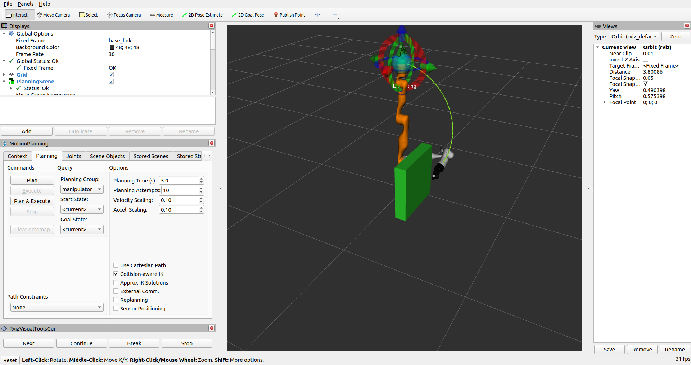

Planning Around Objects
=======================

This tutorial will introduce you to inserting objects into the planning scene and planning around them.

Prerequisites
-------------

If you haven't already done so, make sure you've completed the steps in :doc:`Visualizing in RViz </doc/tutorials/visualizing_in_rviz/visualizing_in_rviz>`.
This project assumes you are starting with the ``hello_moveit`` project, where the previous tutorial left off. If you just want to run the tutorial, you can follow the :doc:`Docker Guide </doc/how_to_guides/how_to_setup_docker_containers_in_ubuntu>` to start a container with the completed tutorial.

Steps
-----

1 Add include for Planning Scene Interface
^^^^^^^^^^^^^^^^^^^^^^^^^^^^^^^^^^^^^^^^^^

At the top of your source file, add this to the list of includes:

.. code-block:: C++

  #include <moveit/planning_scene_interface/planning_scene_interface.h>

2 Change the Target Pose
^^^^^^^^^^^^^^^^^^^^^^^^

First, update the target pose with the following change to make the robot plan to a different location:

.. code-block:: C++

    // Set a target Pose
    auto const target_pose = [] {
      geometry_msgs::msg::Pose msg;
      msg.orientation.w = 1.0;
      msg.position.x = 0.28;
      msg.position.y = 0.4;  // <---- This value was changed
      msg.position.z = 0.5;
      return msg;
    }();
    move_group_interface.setPoseTarget(target_pose);

3 Create a Collision Object
^^^^^^^^^^^^^^^^^^^^^^^^^^^

In the next block of code, we create a collision object.
The first thing to notice is that it is being placed in the coordinate frame of the robot.
If we had a perception system that reported the location of obstacles in our scene, then this is the sort of message it would build.
Because this is just an example, we are creating it manually.
One thing to notice at the end of this block of code is that we set the operation on this message to ``ADD``.
This results in the object getting added to the collision scene.
Place this code block between setting the target pose from the previous step and creating a plan.

.. code-block:: C++

    // Create collision object for the robot to avoid
    auto const collision_object = [frame_id =
                                     move_group_interface.getPlanningFrame()] {
      moveit_msgs::msg::CollisionObject collision_object;
      collision_object.header.frame_id = frame_id;
      collision_object.id = "box1";
      shape_msgs::msg::SolidPrimitive primitive;

      // Define the size of the box in meters
      primitive.type = primitive.BOX;
      primitive.dimensions.resize(3);
      primitive.dimensions[primitive.BOX_X] = 0.5;
      primitive.dimensions[primitive.BOX_Y] = 0.1;
      primitive.dimensions[primitive.BOX_Z] = 0.5;

      // Define the pose of the box (relative to the frame_id)
      geometry_msgs::msg::Pose box_pose;
      box_pose.orientation.w = 1.0;  // We can leave out the x, y, and z components of the quaternion since they are initialized to 0
      box_pose.position.x = 0.2;
      box_pose.position.y = 0.2;
      box_pose.position.z = 0.25;

      collision_object.primitives.push_back(primitive);
      collision_object.primitive_poses.push_back(box_pose);
      collision_object.operation = collision_object.ADD;

      return collision_object;
    }();

4 Add the Object to the Planning Scene
^^^^^^^^^^^^^^^^^^^^^^^^^^^^^^^^^^^^^^

Finally, we need to add this object to the collision scene.
To do this, we use an object called the ``PlanningSceneInterface`` that uses ROS interfaces to communicate changes to the planning scene to ``MoveGroup``.
This code block should directly follow the code block that creates the collision object.

.. code-block:: C++

    // Add the collision object to the scene
    moveit::planning_interface::PlanningSceneInterface planning_scene_interface;
    planning_scene_interface.applyCollisionObject(collision_object);

5 Run the Program and Observe the Change
^^^^^^^^^^^^^^^^^^^^^^^^^^^^^^^^^^^^^^^^

Just as we did in the last tutorial, start RViz using the ``demo.launch.py`` script and run our program. If you're using one of the Docker tutorial containers, you can specify a different RViz configuration that already has the RvizVisualToolsGui panel added using: ::

   ros2 launch moveit2_tutorials demo.launch.py rviz_config:=kinova_hello_moveit.rviz

Summary
-------

- You extended the program you wrote with MoveIt to plan around an object in the scene.
- :codedir:`Here is a copy of the full hello_moveit.cpp source<tutorials/planning_around_objects/hello_moveit.cpp>`.

Further Reading
---------------

- :doc:`Examples of using the Planning Scene for collision and constraint checking </doc/examples/planning_scene/planning_scene_tutorial>`.
- :doc:`Examples of using the Planning Scene ROS API </doc/examples/planning_scene_ros_api/planning_scene_ros_api_tutorial>`.
- :doc:`Example of visualizing collision objects </doc/examples/visualizing_collisions/visualizing_collisions_tutorial>`.
- :doc:`Example of subframes used for planning with objects </doc/examples/subframes/subframes_tutorial>`.

Next Step
---------

In the next tutorial :doc:`Pick and Place with MoveIt Task Constructor </doc/tutorials/pick_and_place_with_moveit_task_constructor/pick_and_place_with_moveit_task_constructor>`, you will be introduced to a higher layer tool designed to solve harder motion plans.
In this next tutorial, you will create a program to pick and place an object.
