MoveIt Quickstart in RViz
==========================
.. image:: rviz_plugin_head.png
   :width: 700px

This tutorial will teach you how to create motion plans in MoveIt using RViz and the MoveIt Display plugin. Rviz is the primary visualizer in ROS and a very useful tool for debugging robotics. The MoveIt Display plugin allows you to setup virtual environments (planning scenes), create start and goal states for the robot interactively, test various motion planners, and visualize the output. Let's get started!

Getting Started
---------------
If you haven't already done so, make sure you've completed the steps in :doc:`Getting Started </doc/tutorials/getting_started/getting_started>` or our :doc:`Docker Guide </doc/how_to_guides/how_to_setup_docker_containers_in_ubuntu>`. As of Sep 26, 2022, ensure you have enabled Cyclone DDS as described there.

Step 1: Launch the Demo and Configure the Plugin
------------------------------------------------

* Launch the demo: ::

   ros2 launch moveit2_tutorials demo.launch.py

* If you are doing this for the first time, you should see an empty world in RViz and will have to add the Motion Planning Plugin:

  * You should see an empty world in RViz:

  |A|

  * In the RViz Displays Tab, press *Add*:

  |B|

  * From the moveit_ros_visualization folder, choose "MotionPlanning" as the DisplayType. Press "Ok".

  |C|

  * You should now see the Kinova robot in RViz:

  |D|

.. |A| image:: rviz_empty.png
               :width: 700px

.. |B| image:: rviz_click_add.png
               :width: 405px

.. |C| image:: rviz_plugin_motion_planning_add.png
               :width: 400px

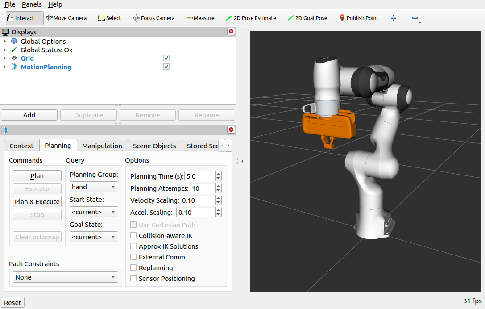

* Once you have the Motion Planning Plugin loaded, we can configure it. In the "Global Options" tab of the "Displays" subwindow, set the **Fixed Frame** field to ``/base_link``

* Now, you can start configuring the Plugin for your robot (the Kinova Gen 3 in this case). Click on "MotionPlanning" within "Displays".

  * Make sure the **Robot Description** field is set to ``robot_description``.

  * Make sure the **Planning Scene Topic** field is set to ``/monitored_planning_scene``.
    Click on topic name to expose topic-name drop-down.

  * Make sure the **Trajectory Topic** under **Planned Path** is set to ``/display_planned_path``.

  * In **Planning Request**, change the **Planning Group** to ``manipulator``. You can also see this in the MotionPlanning panel in the bottom left.

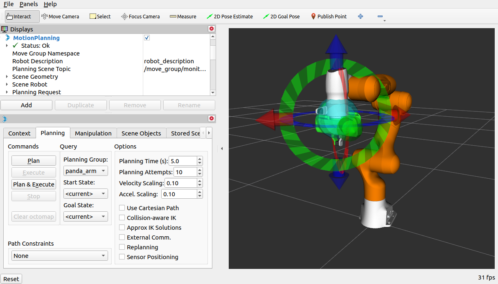

Step 2: Play with the Visualized Robots
---------------------------------------
There are four different overlapping visualizations:

#. The robot's configuration in the ``/monitored_planning_scene`` planning environment (active by default).

#. The planned path for the robot (active by default).

#. Green: The start state for motion planning (disabled by default).

#. Orange: The goal state for motion planning (active by default).

The display states for each of these visualizations can be toggled on and off using checkboxes:

#. The planning scene robot using the **Show Robot Visual** checkbox in the **Scene Robot** tree menu.

#. The planned path using the **Show Robot Visual** checkbox in the **Planned Path** tree menu.

#. The start state using the **Query Start State** checkbox in the **Planning Request** tree menu.

#. The goal state using the **Query Goal State** checkbox in the **Planning Request** tree menu.

* Play with all these checkboxes to switch on and off different visualizations.

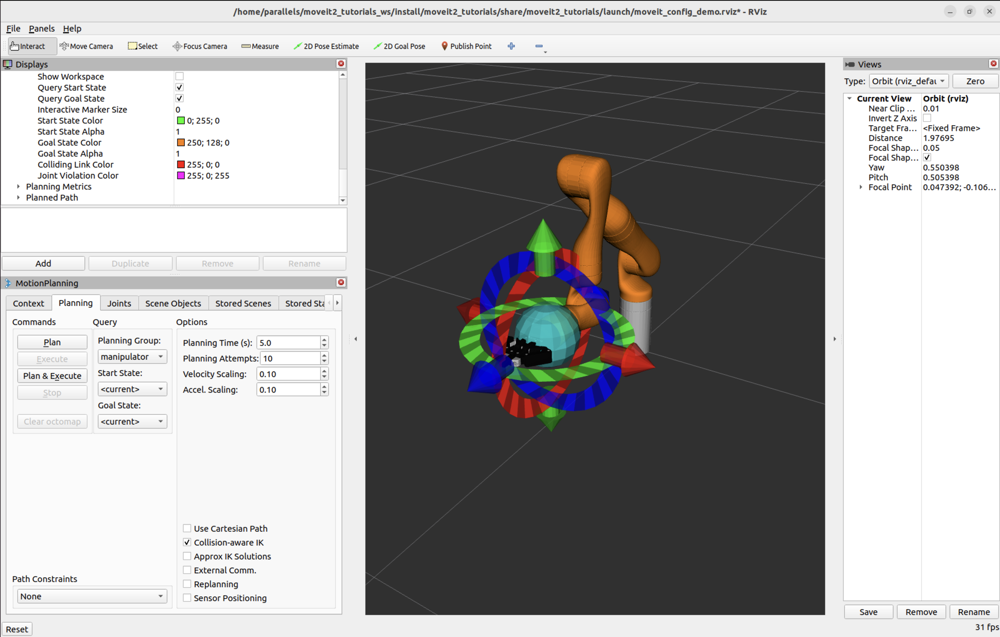

Step 3: Interact with the Kinova Gen 3
--------------------------------------

For the next steps we will want only the scene robot, start state and goal state:

#. Check the **Show Robot Visual** checkbox in the **Planned Path** tree menu

#. Un-check the **Show Robot Visual** checkbox in the **Scene Robot** tree menu

#. Check the **Query Goal State** checkbox in the **Planning Request** tree menu.

#. Check the **Query Start State** checkbox in the **Planning Request** tree menu.

There should now be two interactive markers. One marker corresponding to the orange colored arm will be used to set the "Goal State" for motion planning and the other marker corresponding to a green colored arm are used to set the "Start State" for motion planning. If you don't see the interactive markers press **Interact** in the top menu of RViz (Note: some tools may be hidden, press **"+"** in the top menu to add the **Interact** tool as shown below).

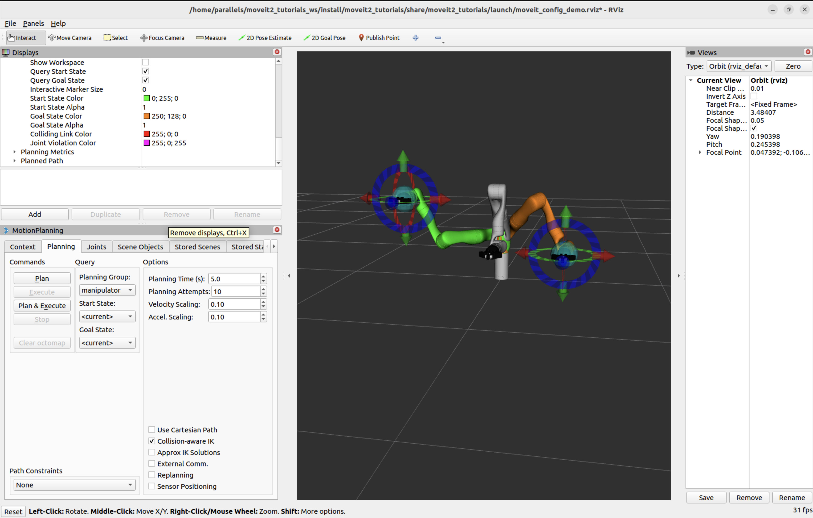

You should now be able to use these markers to drag the arm around and change its orientation. Try it!

Moving into collision
+++++++++++++++++++++

For this section, hide the planned path and the goal state:

#. Un-check the **Show Robot Visual** checkbox in the **Planned Path** tree menu

#. Un-check the **Query Goal State** checkbox in the **Planning Request** tree menu.

Now, only the Start State (the green colored arm) should be visible.  Try to move the arm into a configuration where two of its links are in collision with each other.  (If you find this difficult, make sure the "Use Collision-Aware IK" checkbox under the Planning tab of the MotionPlanning plugin is un-checked.)  Once you do this, the links that are in collision will turn red.

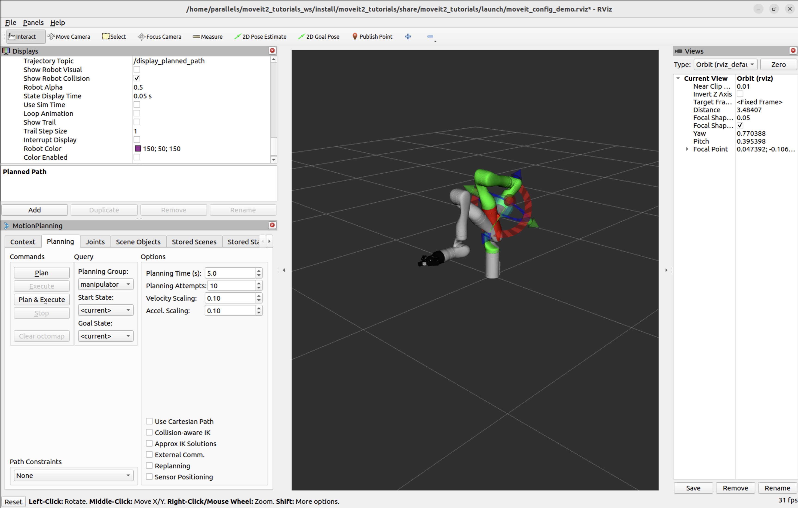

Now, check the "Use Collision-Aware IK" checkbox, and try again to move two of the links into collision with each other.  When the checkbox is ticked, the IK solver will keep attempting to find a collision-free solution for the desired end-effector pose. When it is not checked, the solver will allow collisions to happen in the solution. The links in collision will always still be visualized in red, regardless of the state of the checkbox.

.. image:: rviz_plugin_collision_aware_ik_checkbox.png
   :width: 700px

Moving out of Reachable Workspace
+++++++++++++++++++++++++++++++++
Note what happens when you try to move an end-effector out of its reachable workspace.

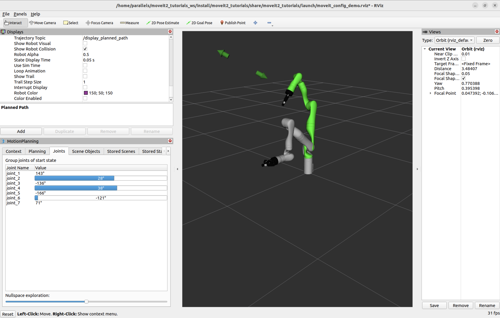

Before moving onto the next section, re-enable the planned path and the goal state:

#. Check the **Show Robot Visual** checkbox in the **Planned Path** tree menu

#. Check the **Query Goal State** checkbox in the **Planning Request** tree menu.

Moving Joints or in Null Space
++++++++++++++++++++++++++++++
You can use the **Joints** tab to move single joints and the redundant joints of 7-DOF robots. Try moving the "null space exploration" slider as shown in the animation below.

.. raw:: html

    <video width="700px" controls="true" autoplay="true" loop="true">
        <source src="../../../_static/videos/rviz_joints_nullspace.webm" type="video/webm">
        The joints moving while the end effector stays still
    </video>

Step 4: Use Motion Planning with the Kinova Gen 3
-------------------------------------------------

* Now, you can start motion planning with the Kinova Gen 3 in the MoveIt RViz Plugin.

  * Move the Start State to a desired location.

  * Move the Goal State to another desired location.

  * Make sure both states are not in collision with the robot itself.

  * Un-check the **Show Trail** checkbox in the **Planned Path** tree menu.

* In the **MotionPlanning** window under the **Planning** tab, press the **Plan** button.

* Check the **Show Trail** checkbox in the **Planned Path** tree menu. You should see the arm's path represented by a series of manipulator poses.

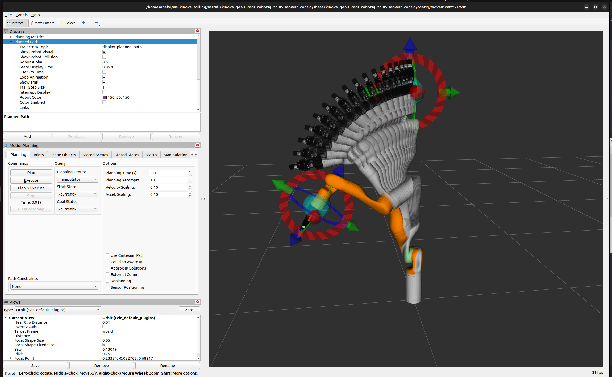

Introspecting Trajectory Waypoints
++++++++++++++++++++++++++++++++++

You can visually introspect trajectories point by point in RViz.

* From "*Panels*" menu, select "*Trajectory - Trajectory Slider*". You'll see a new Slider panel on RViz.

* Set your goal pose, then run *Plan*.

* Play with the "*Slider*" panel, e.g. move the slider, push "*Play*" button.

Note: Once you placed your end-effector to a new goal, be sure to run *Plan* before running *Play* -- otherwise you'll see the waypoints for the previous goal if available.

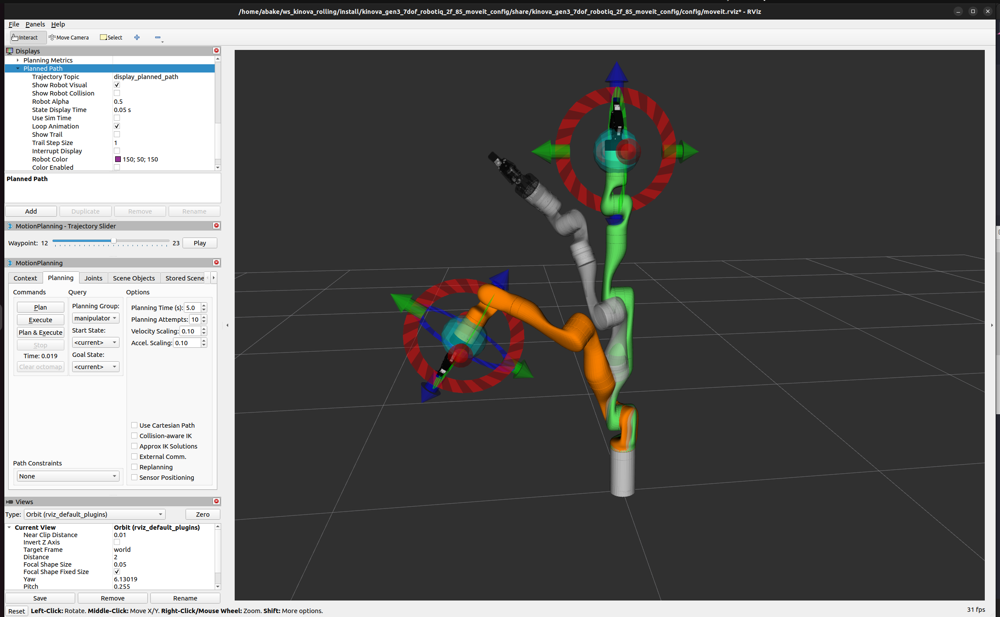

Plan Cartesian motions
++++++++++++++++++++++

If the "Use Cartesian Path" checkbox is activated, the robot will attempt to move the end effector linearly in cartesian space.

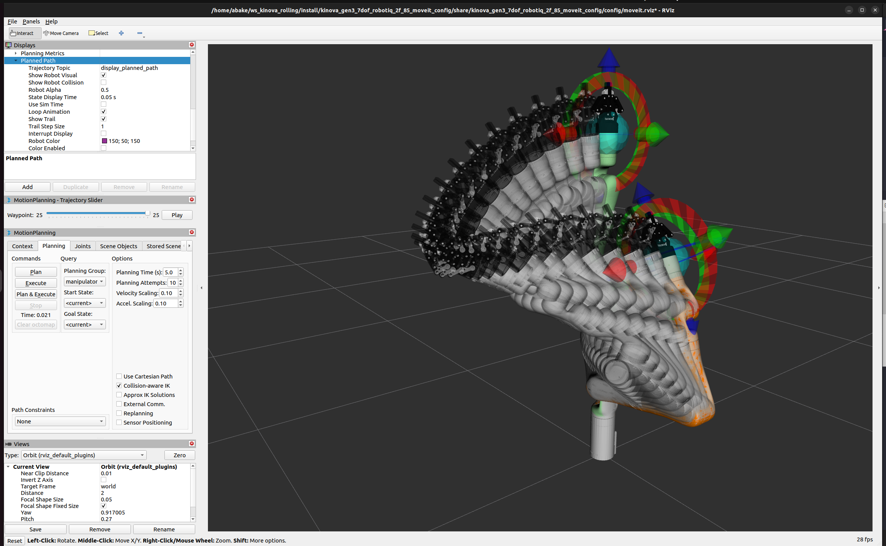

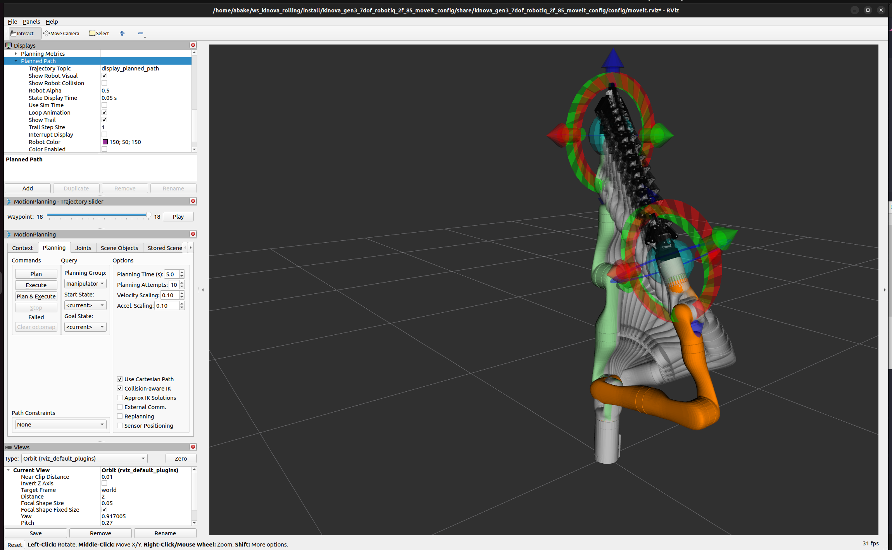

Executing Trajectories, Adjusting Speed
+++++++++++++++++++++++++++++++++++++++

Clicking "Plan & Execute" or "Execute" after a successful plan will send the trajectory to the robot - in this tutorial, since you used ``kinova_demo.launch``, the robot is only simulated.

Initially, the default velocity and acceleration are scaled to 10% (``0.1``) of the robot's maximum. You can change these scaling factors in the Planning tab shown below, or change these default values in the ``moveit_config`` of your robot (in ``joint_limits.yaml``).

.. image:: rviz_plugin_collision_aware_ik_checkbox.png
   :width: 700px

Next Steps
----------

RViz Visual Tools
+++++++++++++++++
Many of the tutorials use ``moveit_visual_tools`` to step through a demo. Before continuing on to the next tutorials it is a good idea to enable the **RvizVisualToolsGui**.

From "*Panels*" menu, select "*Add New Panels*". From the menu, select "*RvizVisualToolsGui*" and click OK. You'll see the new panel added to RViz.

.. image:: rviz_add_rviz_visual_tools.png
   :width: 400px

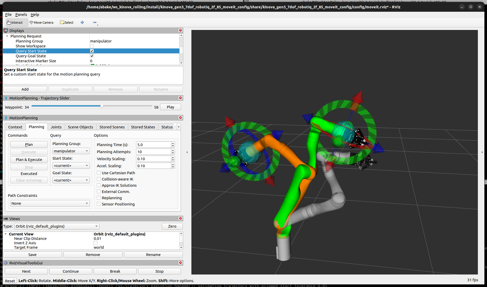

Saving Your Configuration
+++++++++++++++++++++++++
RViz enables you to save your configuration under ``File->Save Config``. You should do this before continuing on to the next tutorials. If you choose to save your configuration under a new name, you can use ``File->Save Config As`` and refer to your configuration file using: ::

   ros2 launch moveit2_tutorials demo.launch.py rviz_config:=your_rviz_config.rviz

Replace ``your_rviz_config.rviz`` with the name of the file you saved to ``moveit2_tutorials/doc/tutorials/quickstart_in_rviz/launch/`` and build the workspace so it can be found.

Next Tutorial
+++++++++++++

In :doc:`Your First MoveIt Project </doc/tutorials/your_first_project/your_first_project>`, you will create a C++ program using MoveIt to plan and execute moves.
