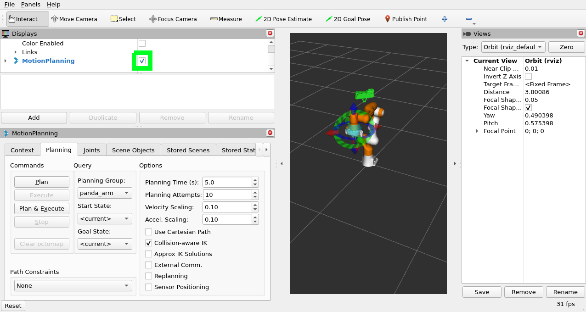
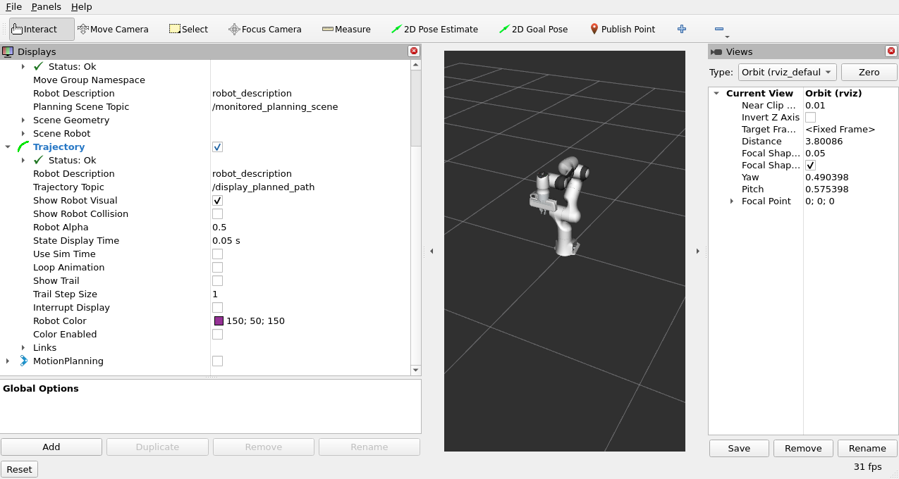
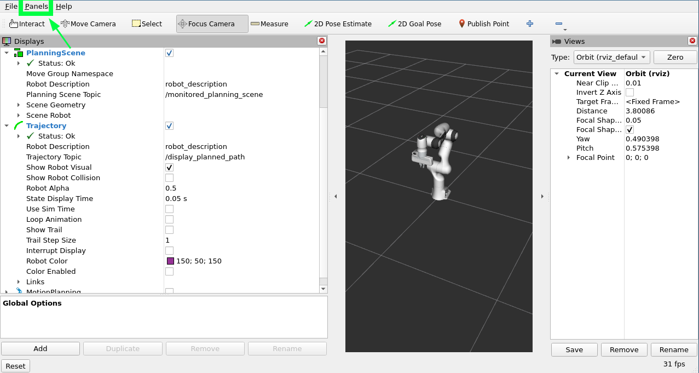
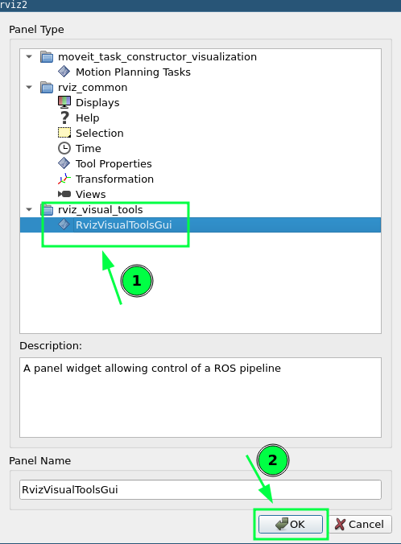
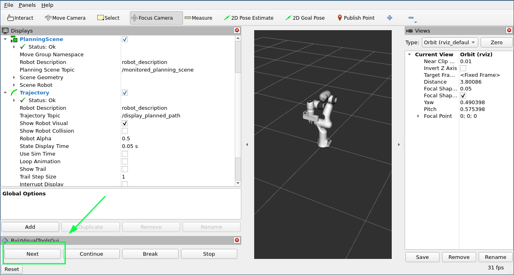
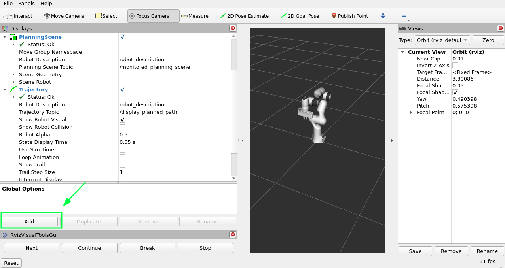
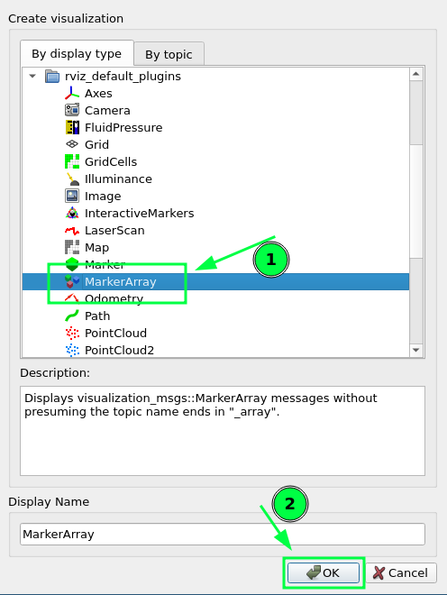
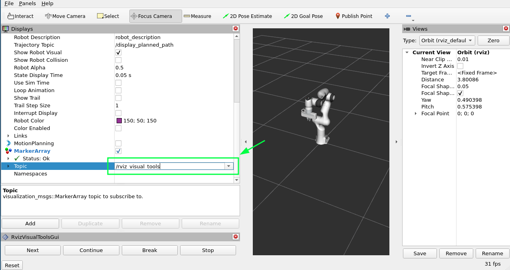
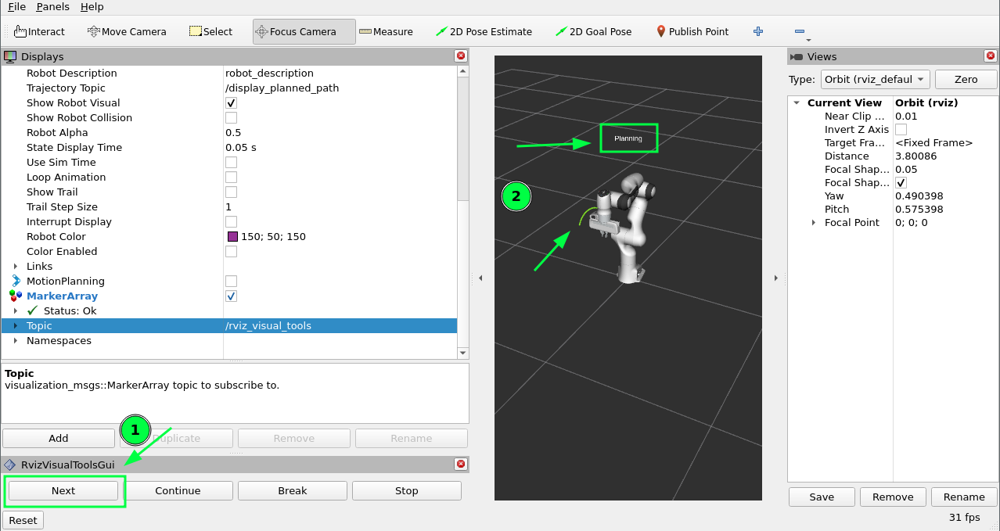
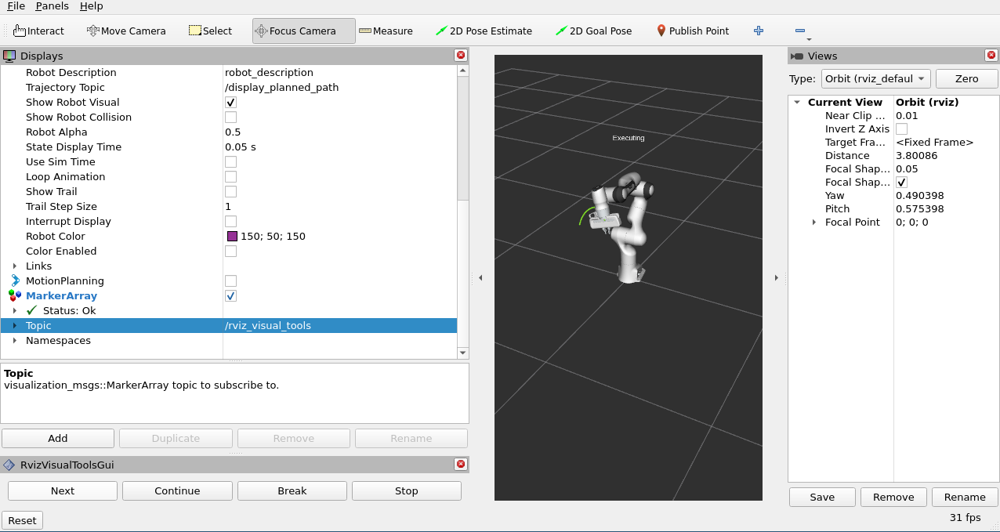

Visualizing In RViz
===================

This tutorial will introduce you to a tool that can help you more easily understand what your MoveIt application is doing by rendering visualizations in RViz.

Prerequisites
-------------

If you haven't already done so, make sure you've completed the steps in :doc:`Your First Project </doc/tutorials/your_first_project/your_first_project>`.
This project assumes you are starting with the ``hello_moveit`` project, where the previous tutorial left off.

Steps
-----

1 Add the dependency moveit_visual_tools
^^^^^^^^^^^^^^^^^^^^^^^^^^^^^^^^^^^^^^^^

Add this line to your ``package.xml`` in the ``hello_moveit`` project after the other ``<depend>`` statements:

.. code-block:: xml

  <depend>moveit_visual_tools</depend>

Then in your ``CMakeLists.txt`` add this line to the section of ``find_package`` statements:

.. code-block:: cmake

  find_package(moveit_visual_tools REQUIRED)

Further down in the file extend the ``ament_target_dependencies`` macro call to include the new dependency like this:

.. code-block:: cmake

  ament_target_dependencies(
    hello_moveit
    "moveit_ros_planning_interface"
    "moveit_visual_tools"
    "rclcpp"
  )

To verify that you added the dependency correctly, add the required include to your source file ``hello_moveit.cpp``:

.. code-block:: C++

  #include <moveit_visual_tools/moveit_visual_tools.h>

To test that this all worked, open a terminal in the workspace directory (remembering to source your ROS install in opt) and then build with colcon:

.. code-block:: bash

  cd ~/ws_moveit
  colcon build --mixin debug

2 Create a ROS executor and spin the node on a thread
^^^^^^^^^^^^^^^^^^^^^^^^^^^^^^^^^^^^^^^^^^^^^^^^^^^^^

Before we can initialize MoveItVisualTools, we need to have a executor spinning on our ROS node.
This is necessary because of how MoveItVisualTools interacts with ROS services and topics. First, add the threading library to your includes at the top.

.. code-block:: C++

  #include <thread>  // <---- add this to the set of includes at the top

By creating and naming loggers, we are able to keep our program logs organized.

  .. code-block:: C++

    // Create a ROS logger
    auto const logger = rclcpp::get_logger("hello_moveit");

Next, add your executor before creating the MoveIt MoveGroup Interface.

.. code-block:: C++

    // Spin up a SingleThreadedExecutor for MoveItVisualTools to interact with ROS
    rclcpp::executors::SingleThreadedExecutor executor;
    executor.add_node(node);
    auto spinner = std::thread([&executor]() { executor.spin(); });

    // Create the MoveIt MoveGroup Interface

  ...

Finally, make sure to join the thread before exiting.

.. code-block:: C++

    // Shutdown ROS
    rclcpp::shutdown();  // <--- This will cause the spin function in the thread to return
    spinner.join();  // <--- Join the thread before exiting
    return 0;

After making these changes, rebuild your workspace to make sure you don't have any syntax errors.

3 Create and Initialize MoveItVisualTools
^^^^^^^^^^^^^^^^^^^^^^^^^^^^^^^^^^^^^^^^^

Next, we will construct and initialize MoveItVisualTools after the construction of MoveGroupInterface.

.. code-block:: C++

    // Create the MoveIt MoveGroup Interface
    using moveit::planning_interface::MoveGroupInterface;
    auto move_group_interface = MoveGroupInterface(node, "manipulator");

    // Construct and initialize MoveItVisualTools
    auto moveit_visual_tools = moveit_visual_tools::MoveItVisualTools{
        node, "base_link", rviz_visual_tools::RVIZ_MARKER_TOPIC,
        move_group_interface.getRobotModel()};
    moveit_visual_tools.deleteAllMarkers();
    moveit_visual_tools.loadRemoteControl();

We pass the following into the constructor: the ROS node, the base link of the robot, the marker topic to use (more on this later), and the robot model (which we get from the move_group_interface).
Next, we make a call to delete all the markers. This clears any rendered state out of RViz that we have left over from previous runs.
Lastly, we load remote control.
Remote control is a really simple plugin that lets us have a button in RViz to interact with our program.

4 Write closures for visualizations
^^^^^^^^^^^^^^^^^^^^^^^^^^^^^^^^^^^

After we've constructed and initialized, we now create some closures (function objects that have access to variables in our current scope) that we can use later in our program to help render visualizations in RViz.

.. code-block:: C++

    // Create closures for visualization
    auto const draw_title = [&moveit_visual_tools](auto text) {
      auto const text_pose = [] {
        auto msg = Eigen::Isometry3d::Identity();
        msg.translation().z() = 1.0;  // Place text 1m above the base link
        return msg;
      }();
      moveit_visual_tools.publishText(text_pose, text, rviz_visual_tools::WHITE,
                                      rviz_visual_tools::XLARGE);
    };
    auto const prompt = [&moveit_visual_tools](auto text) {
      moveit_visual_tools.prompt(text);
    };
    auto const draw_trajectory_tool_path =
        [&moveit_visual_tools,
         jmg = move_group_interface.getRobotModel()->getJointModelGroup(
             "manipulator")](auto const trajectory) {
          moveit_visual_tools.publishTrajectoryLine(trajectory, jmg);
        };

Each of the three closures capture ``moveit_visual_tools`` by reference and the last one captures a pointer to the joint model group object we are planning with.
Each of these call a function on ``moveit_visual_tools`` that changes something in RViz.

* The first one, ``draw_title`` adds text one meter above the base of the robot. This is a useful way to show the state of your program from a high level.
* The second one calls a function called ``prompt``. This function blocks your program until the user presses the ``next`` button in RViz. This is helpful for stepping through a program when debugging.
* The last one draws the tool path of a trajectory that we have planned. This is often helpful for understanding a planned trajectory from the perspective of the tool.

You might be asking yourself why we would create lambdas like this, and the reason is simply to make the code that comes later easier to read and understand.
As your write software, it is often helpful to break up your functionality into named functions which can be easily reused and tested on their own.
You will see in the next section how we use these functions we created.

5 Visualize the steps of your program
^^^^^^^^^^^^^^^^^^^^^^^^^^^^^^^^^^^^^

Now we'll augment the code in the middle of your program.
Update your code for planning and executing to include these new features:

.. code-block:: C++

    // Set a target Pose
    auto const target_pose = [] {
      geometry_msgs::msg::Pose msg;
      msg.orientation.w = 1.0;
      msg.position.x = 0.28;
      msg.position.y = -0.2;
      msg.position.z = 0.5;
      return msg;
    }();
    move_group_interface.setPoseTarget(target_pose);

    // Create a plan to that target pose
    prompt("Press 'Next' in the RvizVisualToolsGui window to plan");
    draw_title("Planning");
    moveit_visual_tools.trigger();
    auto const [success, plan] = [&move_group_interface] {
      moveit::planning_interface::MoveGroupInterface::Plan msg;
      auto const ok = static_cast<bool>(move_group_interface.plan(msg));
      return std::make_pair(ok, msg);
    }();

    // Execute the plan
    if (success) {
      draw_trajectory_tool_path(plan.trajectory);
      moveit_visual_tools.trigger();
      prompt("Press 'Next' in the RvizVisualToolsGui window to execute");
      draw_title("Executing");
      moveit_visual_tools.trigger();
      move_group_interface.execute(plan);
    } else {
      draw_title("Planning Failed!");
      moveit_visual_tools.trigger();
      RCLCPP_ERROR(logger, "Planning failed!");
    }

One thing you'll quickly notice is that we have to call a method called ``trigger`` on ``moveit_visual_tools`` after each call to change something rendered in RViz.
The reason for this is that messages sent to RViz are batched up and sent when you call ``trigger`` to reduce bandwidth of the marker topics.

Lastly, build your project again to make sure all the code additions are correct.

.. code-block:: bash

  cd ~/ws_moveit
  source /opt/ros/rolling/setup.bash
  colcon build --mixin debug

6 Enable visualizations in RViz
^^^^^^^^^^^^^^^^^^^^^^^^^^^^^^^

Open a new terminal, source the workspace, and then start the demo launch file that opens RViz.

.. code-block:: bash

  cd ~/ws_moveit
  source install/setup.bash
  ros2 launch moveit2_tutorials demo.launch.py

Uncheck "MotionPlanning" in the "Displays" tab to hide it.
We aren't going to be using the "MotionPlanning" plugin for this next part.

To add the buttons to interact with the prompts we added to our program open the dialog with the "Panels/Add New Panel" menu:

Then select ``RvizVisualToolsGui`` and click OK.
This will create a new panel on the bottom left with a ``Next`` button we'll use later.

Finally, we need to add a ``Marker Array`` to render the visualizations we've added.
Click on the "Add" Button in the "Displays" panel.

Select ``Marker Array`` and click ``OK``.

Scroll to the bottom of the items in the Displays panel and edit the topic that the new Marker Array is using to ``/rviz_visual_tools``.

You are now ready to run your new program with visualizations.

7 Run the Program
^^^^^^^^^^^^^^^^^

In a new terminal, go to the workspace, source the workspace, and run ``hello_moveit``:

.. code:: bash

  cd ~/ws_moveit
  source install/setup.bash
  ros2 run hello_moveit hello_moveit

You'll notice that your program has stopped with a log that looks like this:

.. code::

  [INFO] [1652822889.492940200] [hello_moveit.remote_control]: Waiting to continue: Press 'Next' in the RvizVisualToolsGui window to plan

Click the ``Next`` button in RViz and see your application advance.

You'll see after you clicked the next button, your application planned, added a title above the robot, and drew a line representing the tool path.
To continue, press ``Next`` again to see your robot execute the plan.

Summary
-------

You extended the program you wrote with MoveIt to interact with the Gui in RViz, allowing you to step through your program with a button, render some text above the robot, and display the tool path that you planned.

Further Reading
---------------

- MoveItVisualTools has many more useful features for visualizing robot motions. `You can read more about it here <https://github.com/moveit/moveit_visual_tools/tree/ros2>`_.
- There are also more examples of using ``MoveItVisualTools`` in :doc:`MoveItCpp Tutorial </doc/examples/moveit_cpp/moveitcpp_tutorial>`.
- :codedir:`Here is a copy of the full hello_moveit.cpp source<tutorials/visualizing_in_rviz/hello_moveit.cpp>`.

Next Step
---------

In the next tutorial :doc:`Planning Around Objects </doc/tutorials/planning_around_objects/planning_around_objects>`, you will expand on the program you built here to add to the collision environment and see the robot plan with these changes.
