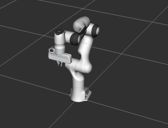
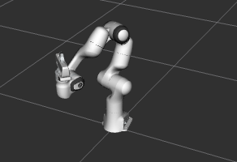

Your First C++ MoveIt Project
=============================

This tutorial will step you through writing your first C++ application with MoveIt.

Warning: Most features in MoveIt will not work properly since additional parameters are required for full Move Group functionality. For a full setup, please continue with the :doc:`Move Group C++ Interface Tutorial </doc/examples/move_group_interface/move_group_interface_tutorial>`.

Prerequisites
-------------

If you haven't already done so, make sure you've completed the steps in :doc:`Getting Started </doc/tutorials/getting_started/getting_started>`.

This tutorial assumes you understand the basics of ROS 2.
To prepare yourself for this please complete the `Official ROS 2 Tutorials <https://docs.ros.org/en/{DISTRO}/Tutorials.html>`_ up until "Writing a simple publisher and Subscriber (C++)".

Steps
-----

1 Create a package
^^^^^^^^^^^^^^^^^^

Open a terminal and `source your ROS 2 installation <https://docs.ros.org/en/{DISTRO}/Tutorials/Configuring-ROS2-Environment.html>`_ so that ``ros2`` commands will work.

Navigate to your ``ws_moveit`` directory you created in the :doc:`Getting Started Tutorial </doc/tutorials/getting_started/getting_started>`.

Change directory into the ``src`` directory, as that is where we put our source code.

Create a new package with the ROS 2 command line tools:

.. code-block:: bash

  ros2 pkg create \
   --build-type ament_cmake \
   --dependencies moveit_ros_planning_interface rclcpp \
   --node-name hello_moveit hello_moveit

The output of this will show that it created some files in a new directory.

Note that we added ``moveit_ros_planning_interface`` and ``rclcpp`` as dependencies.
This will create the necessary changes in the ``package.xml`` and ``CMakeLists.txt`` files so that we can depend on these two packages.

Open the new source file created for you at ``ws_moveit/src/hello_moveit/src/hello_moveit.cpp`` in your favorite editor.

2 Create a ROS Node and Executor
^^^^^^^^^^^^^^^^^^^^^^^^^^^^^^^^

This first block of code is a bit of boilerplate but you should be used to seeing this from the ROS 2 tutorials.

.. code-block:: C++

  #include <memory>

  #include <rclcpp/rclcpp.hpp>
  #include <moveit/move_group_interface/move_group_interface.h>

  int main(int argc, char * argv[])
  {
    // Initialize ROS and create the Node
    rclcpp::init(argc, argv);
    auto const node = std::make_shared<rclcpp::Node>(
      "hello_moveit",
      rclcpp::NodeOptions().automatically_declare_parameters_from_overrides(true)
    );

    // Create a ROS logger
    auto const logger = rclcpp::get_logger("hello_moveit");

    // Next step goes here

    // Shutdown ROS
    rclcpp::shutdown();
    return 0;
  }

2.1 Build and Run
~~~~~~~~~~~~~~~~~

We will build and run the program to see that everything is right before we move on.

Change the directory back to the workspace directory ``ws_moveit`` and run this command:

.. code-block:: bash

  colcon build --mixin debug

After this succeeds, **open a new terminal**, then source the workspace environment script in that new terminal so that we can run our program.

.. code-block:: bash

  cd ~/ws_moveit
  source install/setup.bash

Run your program and see the output.

.. code-block:: bash

  ros2 run hello_moveit hello_moveit

The program should run and exit without error.

2.2 Examine the code
~~~~~~~~~~~~~~~~~~~~

The headers included at the top are just some standard C++ headers and the headers for ROS and MoveIt that we will use later.

After that, we have the normal call to initialize rclcpp, and then we create our Node.

.. code-block:: C++

  auto const node = std::make_shared<rclcpp::Node>(
    "hello_moveit",
    rclcpp::NodeOptions().automatically_declare_parameters_from_overrides(true)
  );

The first argument is a string that ROS will use to name a unique node.
The second is needed for MoveIt because of how we use ROS Parameters.

Next, we `create a logger <https://docs.ros.org/en/humble/Tutorials/Demos/Logging-and-logger-configuration.html>`_ named "hello_moveit" to keep our log outputs organized and configurable.

.. code-block:: C++

  // Create a ROS logger
  auto const logger = rclcpp::get_logger("hello_moveit");

Lastly, we have the code to shutdown ROS.

.. code-block:: C++

  // Shutdown ROS
  rclcpp::shutdown();
  return 0;

3 Plan and Execute using MoveGroupInterface
^^^^^^^^^^^^^^^^^^^^^^^^^^^^^^^^^^^^^^^^^^^

In place of the comment that says "Next step goes here", add this code:

.. code-block:: C++

  // Create the MoveIt MoveGroup Interface
  using moveit::planning_interface::MoveGroupInterface;
  auto move_group_interface = MoveGroupInterface(node, "manipulator");

  // Set a target Pose
  auto const target_pose = []{
    geometry_msgs::msg::Pose msg;
    msg.orientation.w = 1.0;
    msg.position.x = 0.28;
    msg.position.y = -0.2;
    msg.position.z = 0.5;
    return msg;
  }();
  move_group_interface.setPoseTarget(target_pose);

  // Create a plan to that target pose
  auto const [success, plan] = [&move_group_interface]{
    moveit::planning_interface::MoveGroupInterface::Plan msg;
    auto const ok = static_cast<bool>(move_group_interface.plan(msg));
    return std::make_pair(ok, msg);
  }();

  // Execute the plan
  if(success) {
    move_group_interface.execute(plan);
  } else {
    RCLCPP_ERROR(logger, "Planning failed!");
  }

3.1 Build and Run
~~~~~~~~~~~~~~~~~

Just like before, we need to build the code before we can run it.

In the workspace directory, ``ws_moveit``, run this command:

.. code-block:: bash

  colcon build --mixin debug

After this succeeds, we need to reuse the demo launch file from the previous tutorial to start RViz and the MoveGroup node.
In a separate terminal, source the workspace and then execute this:

.. code-block:: bash

  ros2 launch moveit2_tutorials demo.launch.py

Then in the ``Displays`` window under ``MotionPlanning/Planning Request``, uncheck the box ``Query Goal State``.

In a third terminal, source the workspace and run your program.

.. code-block:: bash

  ros2 run hello_moveit hello_moveit

This should cause the robot in RViz to move and end up in this pose:

Note that if you run the node ``hello_moveit`` without launching the demo launch file first, it will wait for 10 seconds and then print this error and exit.

.. code-block:: bash

  [ERROR] [1644181704.350825487] [hello_moveit]: Could not find parameter robot_description and did not receive robot_description via std_msgs::msg::String subscription within 10.000000 seconds.

This is because the ``demo.launch.py`` launch is starting the ``MoveGroup`` node that provides the robot description.
When ``MoveGroupInterface`` is constructed, it looks for a node publishing a topic with the robot description.
If it fails to find that within 10 seconds, it prints this error and terminates the program.

3.2 Examine the code
~~~~~~~~~~~~~~~~~~~~

The first thing we do is create the ``MoveGroupInterface``.
This object will be used to interact with ``move_group``, which allows us to plan and execute trajectories.
Note that this is the only mutable object that we create in this program.
Another thing to take note of is the second argument to the ``MoveGroupInterface`` object we are creating here: ``"manipulator"``.
That is the group of joints as defined in the robot description that we are going to operate on with this ``MoveGroupInterface``.

.. code-block:: C++

  using moveit::planning_interface::MoveGroupInterface;
  auto move_group_interface = MoveGroupInterface(node, "manipulator");

Then, we set our target pose and plan. Note that only the target pose is set (via ``setPoseTarget``).
The starting pose is implicitly the position published by the joint state publisher, which could be changed using the
``MoveGroupInterface::setStartState*`` family of functions (but is not in this tutorial).

One more thing to note about this next section is the use of lambdas for constructing the message type ``target_pose`` and planning.
This is a pattern you'll find in modern C++ codebases that enables writing in a more declarative style.
For more information about this pattern, there are a couple of links at the end of this tutorial.

.. code-block:: C++

  // Set a target Pose
  auto const target_pose = []{
    geometry_msgs::msg::Pose msg;
    msg.orientation.w = 1.0;
    msg.position.x = 0.28;
    msg.position.y = -0.2;
    msg.position.z = 0.5;
    return msg;
  }();
  move_group_interface.setPoseTarget(target_pose);

  // Create a plan to that target pose
  auto const [success, plan] = [&move_group_interface]{
    moveit::planning_interface::MoveGroupInterface::Plan msg;
    auto const ok = static_cast<bool>(move_group_interface.plan(msg));
    return std::make_pair(ok, msg);
  }();

Finally, we execute our plan if planning is successful, otherwise, we log an error:

.. code-block:: C++

  // Execute the plan
  if(success) {
    move_group_interface.execute(plan);
  } else {
    RCLCPP_ERROR(logger, "Planning failed!");
  }

Summary
-------

* You created a ROS 2 package and wrote your first program using MoveIt.
* You learned about using the MoveGroupInterface to plan and execute moves.
* :codedir:`Here is a copy of the full hello_moveit.cpp source at the end of this tutorial<tutorials/your_first_project/kinova_hello_moveit.cpp>`.

Further Reading
---------------

- We used lambdas to be able to initialize objects as constants.
  This is known as a technique called IIFE.
  `Read more about this pattern from C++ Stories <https://www.cppstories.com/2016/11/iife-for-complex-initialization/>`_.
- We also declared everything we could as const.
  `Read more about the usefulness of const here <https://www.cppstories.com/2016/12/please-declare-your-variables-as-const/>`_.

Next Step
---------

In the next tutorial :doc:`Visualizing in RViz </doc/tutorials/visualizing_in_rviz/visualizing_in_rviz>`, you will expand on the program you built here to create visual markers that make it easier to understand what MoveIt is doing.
